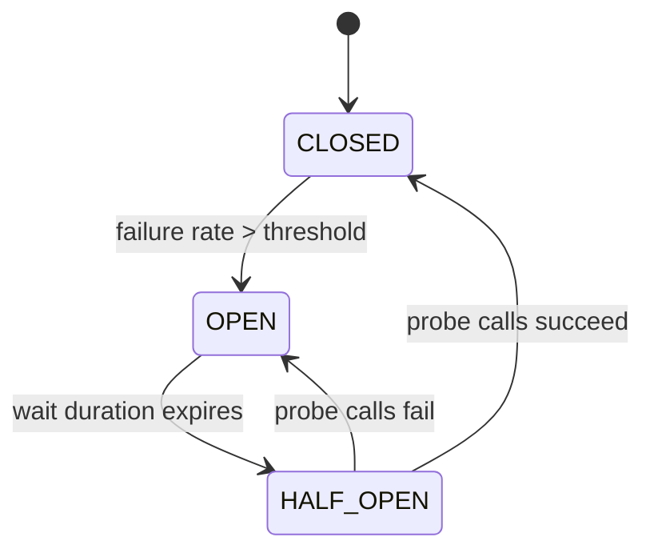
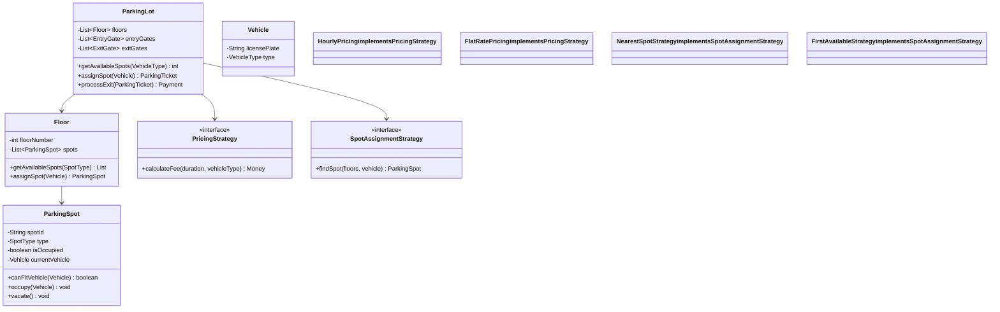
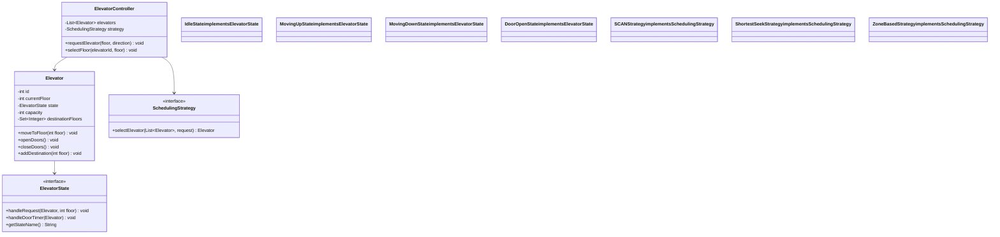
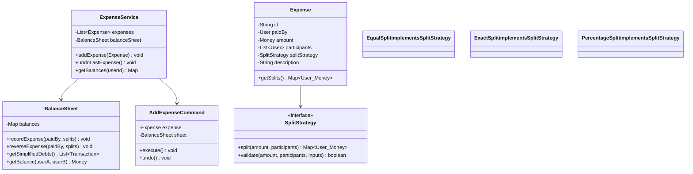
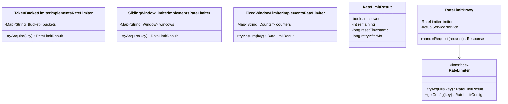
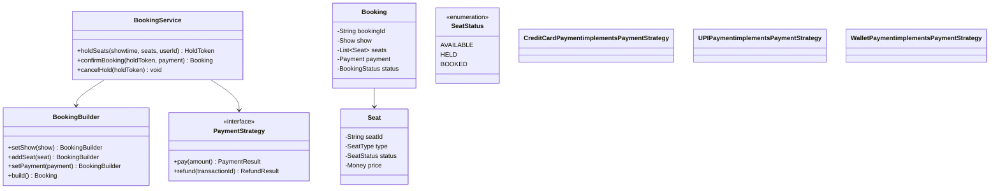

# Low Level Design Notes: Design Patterns
Comprehensive notes covering all GoF patterns plus modern patterns. Every pattern includes: **internal mechanics, SOLID connections, explicit differentiation from confused patterns, interview Q&A, production examples, and tradeoff analysis**.

> **Prerequisites:** [SOLID Principles](./SOLID/readme.md) | [OOPs Foundations](./OOPs/) | [Anti-Patterns](./Anti-Pattern/)

---

## Table of Contents

- [Quick Reference Matrix](#quick-reference-matrix)
- **Part 1: Creational Patterns**
  - [Singleton](#singleton) | [Factory Method](#factory-method) | [Abstract Factory](#abstract-factory) | [Builder](#builder) | [Prototype](#prototype)
- **Part 2: Structural Patterns**
  - [Adapter](#adapter) | [Bridge](#bridge) | [Decorator](#decorator) | [Proxy](#proxy) | [Composite](#composite) | [Facade](#facade) | [Flyweight](#flyweight)
- **Part 3: Behavioral Patterns**
  - [Strategy](#strategy) | [Observer](#observer) | [State](#state) | [Command](#command) | [Template Method](#template-method) | [Chain of Responsibility](#chain-of-responsibility) | [Mediator](#mediator) | [Memento](#memento) | [Iterator](#iterator) | [Visitor](#visitor) | [Null Object](#null-object)
- **Part 4: Modern / Infrastructure Patterns**
  - [Circuit Breaker](#circuit-breaker) | [Saga](#saga) | [Event Sourcing](#event-sourcing) | [CQRS](#cqrs) | [Repository](#repository-pattern) | [Specification](#specification-pattern)
- [Part 5: Pattern Relationships & Decision Guide](#part-5-pattern-relationships--decision-guide)
- [Part 6: Interview Power Tips](#part-6-interview-power-tips)
- [Part 7: Interview Scenario Walkthroughs](#part-7-interview-scenario-walkthroughs)
- [Part 8: Deep Confusion Resolvers](#part-8-deep-confusion-resolvers)
- [Part 9: Expert Interview Tips](#part-9-expert-interview-tips)
- [Part 10: Mixed Interview Questions (Staff-Level)](#part-10-mixed-interview-questions-staff-level)
- [Part 11: Concurrency Patterns](#part-11-concurrency-patterns)
- [Part 12: LLD Design Problem Walkthroughs](#part-12-lld-design-problem-walkthroughs)

---

## Quick Reference Matrix

| Pattern | Category | One-Line Purpose | Core Mechanism | SOLID Principle | Confused With | Killer Example | Key Tradeoff | Modern Alternative | Freq |
|---------|----------|-----------------|---------------|----------------|---------------|---------------|-------------|-------------------|------|
| [Singleton](#singleton) | Creational | One instance, global access | Private ctor + static accessor | — | Service Locator | Spring bean scope | Global access ↔ Hidden coupling, testability | DI container scoping | Very High |
| [Factory Method](#factory-method) | Creational | Delegate instantiation to subclasses | Inheritance + polymorphic create | OCP, DIP | Abstract Factory, Static Factory | `Collection.iterator()` | Extensibility ↔ Parallel class hierarchies | Lambda/Supplier | Very High |
| [Abstract Factory](#abstract-factory) | Creational | Create families of related objects | Composition of factory methods | OCP, DIP | Factory Method | Cross-platform UI widgets | Family consistency ↔ Costly to add new product | Config-based factory map | High |
| [Builder](#builder) | Creational | Construct complex objects step-by-step | Fluent method chaining | SRP | Factory | `HttpRequest.newBuilder()` | Readable construction ↔ Verbose boilerplate | Kotlin DSL, records | Very High |
| [Prototype](#prototype) | Creational | Clone existing objects | Clone/copy method | — | Factory | Game engine prefabs | Cheap duplication ↔ Deep vs shallow copy | `copy()`, serialize-deserialize | Medium |
| [Adapter](#adapter) | Structural | Make incompatible interfaces work together | Wraps adaptee, implements target | DIP, OCP | Bridge, Facade | `Arrays.asList()` | Integration ↔ One more layer to maintain | — | Very High |
| [Bridge](#bridge) | Structural | Separate abstraction from implementation | Two hierarchies + composition | OCP, SRP | Strategy, Adapter | JDBC Driver/Connection | M+N classes ↔ Upfront design complexity | — | Medium |
| [Composite](#composite) | Structural | Treat individual and group objects uniformly | Recursive tree + shared interface | OCP, LSP | Decorator | File system (File + Directory) | Uniform API ↔ Type safety loss | — | High |
| [Decorator](#decorator) | Structural | Add behavior dynamically without subclassing | Wraps same interface, delegates | OCP, SRP | Proxy, Chain of Resp | Java I/O streams | Flexible composition ↔ Many small objects, order matters | AOP, annotations | Very High |
| [Facade](#facade) | Structural | Simplified interface to a complex subsystem | Delegates to subsystem classes | — | Adapter, Mediator | `JdbcTemplate` | Simplicity ↔ Hides power-user access | — | High |
| [Flyweight](#flyweight) | Structural | Share state to support large numbers of objects | Intrinsic (shared) + extrinsic (passed) | — | Singleton, Cache | `Integer.valueOf(127)` | Memory savings ↔ Complexity of state separation | Object pooling | Medium |
| [Proxy](#proxy) | Structural | Controlled access to another object | Same interface, controls delegation | SRP | Decorator | Spring `@Transactional` | Transparent indirection ↔ Hidden latency | Dynamic proxy, AOP | High |
| [Chain of Responsibility](#chain-of-responsibility) | Behavioral | Pass request along a chain of handlers | Linked handlers, pass-or-handle | OCP, SRP | Decorator | Express.js middleware | Decoupled handlers ↔ No guarantee of handling | Middleware pipelines | High |
| [Command](#command) | Behavioral | Encapsulate a request as an object | Action as first-class object | SRP, OCP | Strategy | DB migrations (`up`/`down`) | Undo/queue/log ↔ Indirection overhead | Lambdas, CQRS | High |
| [Iterator](#iterator) | Behavioral | Sequential access without exposing internals | Cursor + hasNext/next | SRP | — | Java enhanced for-loop | Uniform traversal ↔ Sequential only | Streams, generators | Medium |
| [Mediator](#mediator) | Behavioral | Centralize complex communication | Central hub, N connections | SRP | Observer, Facade | Redux store | Decoupled components ↔ God mediator risk | Event bus | Medium |
| [Memento](#memento) | Behavioral | Capture and restore object state | Opaque state snapshot | — | Command | Game save/checkpoint | Simple undo ↔ Memory cost of snapshots | Event sourcing | Medium |
| [Observer](#observer) | Behavioral | Notify dependents of state changes | Subject maintains subscriber list | OCP | Mediator, Pub/Sub | DOM `addEventListener` | Loose coupling ↔ Cascade/leak risks | Reactive Streams (RxJava) | Very High |
| [State](#state) | Behavioral | Alter behavior when internal state changes | Context delegates to state object | OCP, SRP | Strategy | TCP connection states | Clean state logic ↔ Class explosion per state | State machine libs (XState) | High |
| [Strategy](#strategy) | Behavioral | Swap algorithms at runtime | Context delegates to strategy | OCP, DIP | State, Template Method | `Comparator<T>` | Runtime flexibility ↔ Client must know strategies | Lambdas/functions | Very High |
| [Template Method](#template-method) | Behavioral | Define algorithm skeleton, defer steps | Inheritance + hook methods | OCP, DIP | Strategy | JUnit setUp/test/tearDown | Fixed structure ↔ Fragile base class | Strategy + composition | High |
| [Visitor](#visitor) | Behavioral | Add operations without modifying elements | Double dispatch (accept + visit) | OCP, SRP | Strategy | Compiler AST visitors | Easy new ops ↔ Hard new element types | Pattern matching | Medium |
| [Null Object](#null-object) | Behavioral | Provide safe do-nothing default | Interface with no-op implementation | LSP, OCP | Strategy, Optional | `Collections.emptyList()`, SLF4J `NOPLogger` | No null checks ↔ May hide bugs | Kotlin null safety, Optional | Medium |

---

## Part 1: Creational Patterns

> Creational patterns abstract the instantiation process — they help make a system independent of how objects are created, composed, and represented.

---

### Singleton

> 📁 [Code](./design-patterns/Singleton/) | 📐 [Diagram](./design-patterns/Singleton/singleton.excalidraw)

**Definition:** The Singleton pattern ensures that a class has only one instance and provides a global point of access to that instance. It encapsulates the instantiation logic within the class itself, restricting construction to a single object throughout the application lifecycle.

**In Simple Terms:** Imagine a country can have only one president at a time. No matter who asks "who is the president?", everyone gets the same answer — the same person. Singleton works the same way: no matter how many times you ask for the object, you always get the exact same one.

**The Core Problem:** In any application, certain resources are inherently unique — a thread pool, a connection pool, a configuration registry, the file system handle. If multiple instances are accidentally created, they either conflict with each other (two connection pools exhausting DB connections), waste memory, or produce inconsistent behavior (two config objects with different values). The core problem is: **how do you guarantee exactly one instance exists and prevent accidental duplication, while still providing easy access from anywhere in the application?** Before Singleton, developers relied on global variables (unsafe, no lazy init, no encapsulation) or convention ("just don't create two" — error-prone). Singleton encapsulates the uniqueness constraint inside the class itself.

**Intent:** Ensure a class has exactly one instance and provide a global point of access to it.

**Core Mechanism:**
- Private constructor prevents external instantiation
- Static field holds the single instance
- Static accessor method returns that instance (creating it on first call if lazy)
- In multithreaded environments: double-checked locking with `volatile`, enum-based, or eager initialization

**Internal Mechanics (Why it works):**
```
1. Client calls Singleton.getInstance()
2. First call: instance == null → synchronized block → create instance → store in static field
3. Subsequent calls: instance != null → return immediately (no synchronization cost)
4. Double-checked locking: outer null check avoids synchronization overhead for 99% of calls
5. `volatile` prevents instruction reordering — ensures instance is fully constructed before visible to other threads
```

**The `volatile` keyword here prevents this:** Without it, the JVM may reorder the constructor's memory writes. Another thread could see a non-null reference to a partially constructed object (fields not yet initialized). `volatile` establishes a happens-before relationship guaranteeing full construction before publication.

**SOLID Connection:** Singleton violates SRP (the class manages its own lifecycle AND its core business) and DIP (clients depend on the concrete class, not an abstraction). This is why DI containers replaced manual Singleton.

**Differentiation from Similar Patterns:**

| vs. Pattern | Key Difference |
|---|---|
| **vs. Static Class** | Singleton can implement interfaces, be lazily loaded, passed as parameter, mocked. Static class cannot. |
| **vs. Service Locator** | Both provide global access. Service Locator is a registry holding many services. Singleton is one specific instance. Service Locator is a bigger anti-pattern. |
| **vs. DI Singleton Scope** | Same goal (one instance), different mechanism. DI singleton is container-managed → testable, injectable. Manual Singleton is self-managed → hidden dependency. |
| **vs. Flyweight** | Both share instances. Flyweight has many shared instances (pool). Singleton has exactly one. |

**Implementation Variants:**

| Approach | Thread-Safe? | Lazy? | Reflection-Safe? | Serialization-Safe? |
|---|---|---|---|---|
| Eager init (static field) | ✅ | ❌ | ❌ | ❌ |
| Double-checked locking | ✅ | ✅ | ❌ | ❌ |
| Bill Pugh (inner class) | ✅ | ✅ | ❌ | ❌ |
| **Enum (recommended)** | ✅ | ✅ (JVM lazy loads classes) | ✅ | ✅ |

**Interview Q&A:**

**Q: "How do you break a Singleton?"**
A: (1) Reflection — set constructor accessible, call it. (2) Serialization — deserialize creates new instance. (3) Cloning — `clone()` creates a copy. (4) Multiple classloaders — each loader creates its own instance.

**Q: "Why is Singleton considered an anti-pattern?"**
A: Hidden coupling (any class can access it without declaring the dependency), untestable (can't substitute a mock easily), shared mutable state (concurrency hazard), violates SRP and DIP. Modern solution: let DI container manage singleton scope — same one-instance guarantee without the downsides.

**Q: "When IS Singleton justified?"**
A: When the class literally represents a system-level unique resource (Runtime, Logger coordination point, thread pool) AND you can't use a DI container. In practice: almost never in application code, sometimes in infrastructure/framework code.

**Q: "In a multi-tenant SaaS, how do you handle per-tenant configuration if config is a Singleton?"**
A: The Singleton holds a map/registry of per-tenant configs, keyed by tenant ID from the request context (ThreadLocal or request-scoped bean). The Singleton itself is one instance, but it resolves tenant-specific config via a context key. Alternatively, use request-scoped beans in Spring — a new config instance per request. The point: Singleton doesn't mean "one value for everyone" — it means "one manager instance that can serve many tenants."

**Q: "How do you unit test a class that depends on a Singleton without PowerMock?"**
A: (1) Hide the Singleton behind an interface — the class depends on `ConfigService` interface, not `ConfigServiceImpl.getInstance()`. (2) Inject via constructor — test passes a mock. (3) Use DI container (Spring) — singleton scope is testable because you replace the bean in test context. (4) If stuck with legacy: add a `@VisibleForTesting static void resetInstance()` method. The real fix: refactor to dependency injection.

**Q: "Singleton in a distributed system — what breaks?"**
A: Each JVM/container has its own Singleton instance. If Singleton holds state (like a counter or cache), instances diverge across nodes. Solutions: (1) Externalize state to shared store (Redis, DB). (2) Use distributed locks (Redisson) for coordination. (3) Accept eventual consistency with TTL-based sync. This is why "Singleton" in microservices usually means "one per pod" not "one globally."

**When to use:**
- Shared resource that's expensive to create (connection pools, thread pools)
- Configuration that must be consistent across the app (but `@ConfigurationProperties` is better)
- Logger coordination (but SLF4J `LoggerFactory` is already one)
- Registry or service locator (carefully)

**When to avoid:**
- When testability matters (singletons are global state — hard to mock/reset between tests)
- When you confuse "I only need one" with "the system must enforce only one"
- In distributed systems (singleton per-JVM ≠ singleton per-cluster)
- When it introduces hidden coupling (anything can access global state)

**Real-world examples:**
- Java: `Runtime.getRuntime()`, Spring beans (default singleton scope)
- Python: module-level instances (modules are naturally singletons)
- Spring's `ApplicationContext` — one per application, globally accessible

**Production war story:** "At Bentley, our configuration service uses Spring singleton scope — the container manages the lifecycle. We never use manual Singleton because it makes unit testing impossible without PowerMock hacks."

<details>
<summary><strong>Code Examples — All Singleton Variants (from Low-Level-Design-Course/Lecture 10)</strong></summary>

```java
// 1. No Singleton — demonstrates the problem (multiple instances created)
public class NoSingleton {
    public NoSingleton() {
        System.out.println("Singleton Constructor called. New Object created.");
    }

    public static void main(String[] args) {
        NoSingleton s1 = new NoSingleton();
        NoSingleton s2 = new NoSingleton();
        System.out.println(s1 == s2); // false — two different objects!
    }
}

// 2. Simple Singleton (Lazy Init — NOT thread-safe)
public class SimpleSingleton {
    private static SimpleSingleton instance = null;

    private SimpleSingleton() {
        System.out.println("Singleton Constructor called");
    }

    public static SimpleSingleton getInstance() {
        if (instance == null) {
            instance = new SimpleSingleton();
        }
        return instance;
    }

    public static void main(String[] args) {
        SimpleSingleton s1 = SimpleSingleton.getInstance();
        SimpleSingleton s2 = SimpleSingleton.getInstance();
        System.out.println(s1 == s2); // true
    }
}

// 3. Thread-Safe with Synchronized Block (correct but SLOW — lock on every call)
public class ThreadSafeLockingSingleton {
    private static ThreadSafeLockingSingleton instance = null;

    private ThreadSafeLockingSingleton() {
        System.out.println("Singleton Constructor Called!");
    }

    public static ThreadSafeLockingSingleton getInstance() {
        synchronized (ThreadSafeLockingSingleton.class) { // Lock for thread safety
            if (instance == null) {
                instance = new ThreadSafeLockingSingleton();
            }
            return instance;
        }
    }

    public static void main(String[] args) {
        ThreadSafeLockingSingleton s1 = ThreadSafeLockingSingleton.getInstance();
        ThreadSafeLockingSingleton s2 = ThreadSafeLockingSingleton.getInstance();
        System.out.println(s1 == s2); // true
    }
}

// 4. Double-Checked Locking (RECOMMENDED for lazy init — fast + thread-safe)
public class ThreadSafeDoubleLockingSingleton {
    private static ThreadSafeDoubleLockingSingleton instance = null;

    private ThreadSafeDoubleLockingSingleton() {
        System.out.println("Singleton Constructor Called!");
    }

    public static ThreadSafeDoubleLockingSingleton getInstance() {
        if (instance == null) { // First check (no locking — fast path for 99% of calls)
            synchronized (ThreadSafeDoubleLockingSingleton.class) { // Lock only if needed
                if (instance == null) { // Second check (after acquiring lock)
                    instance = new ThreadSafeDoubleLockingSingleton();
                }
            }
        }
        return instance;
    }

    public static void main(String[] args) {
        ThreadSafeDoubleLockingSingleton s1 = ThreadSafeDoubleLockingSingleton.getInstance();
        ThreadSafeDoubleLockingSingleton s2 = ThreadSafeDoubleLockingSingleton.getInstance();
        System.out.println(s1 == s2); // true
    }
}

// 5. Eager Initialization (simplest thread-safe — instance created at class load)
public class ThreadSafeEagerSingleton {
    private static ThreadSafeEagerSingleton instance = new ThreadSafeEagerSingleton();

    private ThreadSafeEagerSingleton() {
        System.out.println("Singleton Constructor Called!");
    }

    public static ThreadSafeEagerSingleton getInstance() {
        return instance;
    }

    public static void main(String[] args) {
        ThreadSafeEagerSingleton s1 = ThreadSafeEagerSingleton.getInstance();
        ThreadSafeEagerSingleton s2 = ThreadSafeEagerSingleton.getInstance();
        System.out.println(s1 == s2); // true
    }
}
```

</details>

---

### Factory Method

> 📁 [Code](./design-patterns/Factory%20Design%20Pattern/) | 📐 [Diagram](./design-patterns/Factory%20Design%20Pattern/factorydesign.excalidraw)

**Definition:** The Factory Method pattern defines an interface for creating an object, but lets subclasses alter the type of objects that will be created. It delegates the responsibility of instantiation to derived classes through polymorphism, decoupling the client from concrete product classes.

**In Simple Terms:** Think of a pizza store franchise. The headquarters defines HOW to run a store (take order, bake, box, deliver), but each city’s branch decides WHICH type of pizza to make. New York makes thin-crust, Chicago makes deep-dish — same process, different products created by different "factories."

**Intent:** Define an interface for creating an object, but let subclasses decide which class to instantiate.

**Core Mechanism:**
- A base class declares an abstract/virtual creation method returning a product interface
- Subclasses override this method to return different concrete product types
- Client code works with the base class and product interface — never knows the concrete types
- The "decision" of WHAT to create is pushed into the subclass via polymorphism

**Internal Mechanics (Why it works):**
```
Client → calls Creator.someOperation()
  → someOperation() internally calls this.createProduct() (factory method)
  → At runtime, `this` is a ConcreteCreator subclass
  → Polymorphism routes to ConcreteCreator.createProduct()
  → Returns ConcreteProduct (client sees only Product interface)
```

The indirection through inheritance means adding new products requires ONLY a new creator subclass — zero changes to existing code (OCP).

**SOLID Connection:**
- **OCP:** New product types added by creating new subclasses, not modifying existing code
- **DIP:** High-level code depends on abstract `Product` interface, not concrete implementations
- **SRP:** Object creation logic is separated from object usage logic

**Differentiation from Similar Patterns:**

| vs. Pattern | Key Difference |
|---|---|
| **vs. Simple Factory (static method)** | Simple Factory uses a static method with if-else/switch — violates OCP (must modify factory for new types). Factory Method uses polymorphism — add new subclass for new types. |
| **vs. Abstract Factory** | Factory Method creates ONE product via inheritance. Abstract Factory creates a FAMILY of related products via composition of multiple factory methods. |
| **vs. Builder** | Factory Method selects WHICH type to create. Builder handles HOW to construct a complex object step-by-step. |
| **vs. Prototype** | Factory Method creates new instances via `new`. Prototype creates copies of existing instances via `clone()`. |

**The Three Factories — Clear Differentiation:**

```java
// 1. Simple Factory (NOT a GoF pattern — just a helper method)
class NotificationFactory {
    static Notification create(String type) {
        return switch (type) {  // Violates OCP — must modify for new types
            case "email" -> new EmailNotification();
            case "sms" -> new SmsNotification();
            default -> throw new IllegalArgumentException();
        };
    }
}

// 2. Factory Method (GoF — inheritance-based polymorphic creation)
abstract class NotificationService {
    abstract Notification createNotification(); // Subclass decides
    
    public void send(String message) {
        Notification n = createNotification(); // Factory method call
        n.setMessage(message);
        n.deliver();
    }
}
class EmailNotificationService extends NotificationService {
    Notification createNotification() { return new EmailNotification(); }
}
// Adding SMS: create SmsNotificationService — NO changes to existing code

// 3. Abstract Factory (GoF — family of related products)
interface NotificationFactory {
    Notification createNotification();
    Template createTemplate();     // Family: notification + template
    Formatter createFormatter();   // All must be compatible
}
class EmailFactory implements NotificationFactory {
    public Notification createNotification() { return new EmailNotification(); }
    public Template createTemplate() { return new HtmlTemplate(); }
    public Formatter createFormatter() { return new HtmlFormatter(); }
}
```

**Interview Q&A:**

**Q: "When would you use Factory Method over just calling `new`?"**
A: When the exact type to instantiate isn't known at compile time — it depends on configuration, user input, or context. Also when you want to follow OCP: adding new types shouldn't require modifying existing creation code. And for testability — factory methods can be overridden in test subclasses to return mocks.

**Q: "Give a real example of Factory Method in Java standard library."**
A: `Collection.iterator()` — each collection type (ArrayList, HashSet, TreeMap) overrides the factory method to return its specific iterator implementation. The client code (`for (Item i : collection)`) never knows which iterator type it's using.

**Q: "How does Spring use Factory Method?"**
A: `BeanFactory.getBean()` is a factory method. `FactoryBean<T>.getObject()` is user-defined Factory Method — you tell Spring HOW to create a complex bean. `@Bean` methods in `@Configuration` classes are factory methods that Spring calls to create beans.

**Q: "Your factory switch/if-else has grown to 50 cases. How do you refactor?"**
A: Three approaches: (1) **Registry pattern** — `Map<String, Supplier<Product>>` populated at startup (config-driven or `@PostConstruct` scanning). Adding a new type = adding one entry. (2) **ServiceLoader/classpath scanning** — products auto-register via SPI or `@Component`. Zero factory modification. (3) **Convention-based** — class name = `type + "Product"`, use reflection. Prefer (1) for explicit control, (2) for plugin architectures.

**Q: "How do you test code that uses a Factory Method — do you test the factory or the products?"**
A: Both, separately. Test the factory: given input X, does it return the correct product TYPE? (contract test). Test products: does each product behave correctly? (unit test). For integration: test the combination. In test code, subclass the factory to return mocks/stubs — this is the testability benefit of Factory Method over hardcoded `new`.

**Q: "Factory Method vs ServiceLoader vs Spring @Conditional — when to use each?"**
A: Factory Method: in-process, compile-time hierarchy, small number of known variants. ServiceLoader: plugin discovery at runtime, no framework dependency, classpath-based. Spring @Conditional: framework-managed, profile/property-driven, runtime environment decisions. Use Factory Method for domain logic branching, ServiceLoader for extensibility points, @Conditional for deployment configuration.

**When to use:**
- Framework/library design — let users extend by subclassing (you provide the skeleton, they provide the product creation)
- When a class can't anticipate which type to create (decided by subclass/configuration)
- When you want to localize "which class gets created" knowledge in one place
- When testing requires substitutable creation (override factory in test to return mock)

**When to avoid:**
- Simple creation with no variation — just use `new`
- Only one product type — factory with one option is pointless overhead
- When it leads to parallel class hierarchies that are expensive to maintain

**Real-world examples:**
- Java: `Collection.iterator()`, `NumberFormat.getInstance()`, `Calendar.getInstance()`
- SLF4J: `LoggerFactory.getLogger()` — returns Log4j, Logback, etc. based on classpath
- Spring: `BeanFactory`, `@Bean` methods, `FactoryBean<T>`
- JDBC: `Connection.createStatement()` — each driver returns its own Statement implementation

<details>
<summary><strong>Code Example — Factory Method (Burger Restaurant — from Low-Level-Design-Course/Lecture 09)</strong></summary>

```java
// Product Interface and subclasses
interface Burger {
    void prepare();
}

class BasicBurger implements Burger {
    public void prepare() {
        System.out.println("Preparing Basic Burger with bun, patty, and ketchup!");
    }
}

class StandardBurger implements Burger {
    public void prepare() {
        System.out.println("Preparing Standard Burger with bun, patty, cheese, and lettuce!");
    }
}

class PremiumBurger implements Burger {
    public void prepare() {
        System.out.println("Preparing Premium Burger with gourmet bun, premium patty, cheese, lettuce, and secret sauce!");
    }
}

class BasicWheatBurger implements Burger {
    public void prepare() {
        System.out.println("Preparing Basic Wheat Burger with bun, patty, and ketchup!");
    }
}

class StandardWheatBurger implements Burger {
    public void prepare() {
        System.out.println("Preparing Standard Wheat Burger with bun, patty, cheese, and lettuce!");
    }
}

class PremiumWheatBurger implements Burger {
    public void prepare() {
        System.out.println("Preparing Premium Wheat Burger with gourmet bun, premium patty, cheese, lettuce, and secret sauce!");
    }
}

// Factory Interface and Concrete Factories
// Each factory subclass DECIDES which family of burgers to create — OCP satisfied
interface BurgerFactory {
    Burger createBurger(String type);
}

class SinghBurger implements BurgerFactory {
    public Burger createBurger(String type) {
        if (type.equalsIgnoreCase("basic")) {
            return new BasicBurger();
        } else if (type.equalsIgnoreCase("standard")) {
            return new StandardBurger();
        } else if (type.equalsIgnoreCase("premium")) {
            return new PremiumBurger();
        } else {
            System.out.println("Invalid burger type!");
            return null;
        }
    }
}

class KingBurger implements BurgerFactory {
    public Burger createBurger(String type) {
        if (type.equalsIgnoreCase("basic")) {
            return new BasicWheatBurger();
        } else if (type.equalsIgnoreCase("standard")) {
            return new StandardWheatBurger();
        } else if (type.equalsIgnoreCase("premium")) {
            return new PremiumWheatBurger();
        } else {
            System.out.println("Invalid burger type!");
            return null;
        }
    }
}

// Client code — works with factory interface, doesn't know concrete types
public class FactoryMethod {
    public static void main(String[] args) {
        String type = "basic";

        BurgerFactory myFactory = new SinghBurger(); // Can swap to KingBurger without changing client
        Burger burger = myFactory.createBurger(type);

        if (burger != null) {
            burger.prepare();
        }
    }
}
```

</details>

---

### Abstract Factory

> 📁 [Code](./design-patterns/Factory%20Design%20Pattern/AbstractFactory.java) | 📐 [Diagram](./design-patterns/Factory%20Design%20Pattern/factorydesign.excalidraw)

**Definition:** The Abstract Factory pattern provides an interface for creating families of related or dependent objects without specifying their concrete classes. It enforces that products from the same family are used together, ensuring compatibility among created objects.

**In Simple Terms:** Imagine furnishing a room — you pick either a "Modern" catalog or a "Victorian" catalog. Once you pick a catalog, ALL your furniture (sofa, table, chair) comes from that same style. You can't accidentally mix a modern sofa with a Victorian table. Abstract Factory is that catalog — it gives you a complete matching set.

**The Core Problem:** When your system uses MULTIPLE related objects that MUST be compatible with each other (UI widgets from the same toolkit, cloud services from the same provider, database objects from the same vendor), nothing prevents a developer from accidentally mixing incompatible products — creating an AWS S3 client but a GCP PubSub queue. The bug is silent until runtime. **How do you guarantee that related objects always come from the same family, making cross-family mixing a compile-time error rather than a runtime surprise?** Abstract Factory solves this by bundling all creation methods for a family into one factory — pick the factory, and ALL products are guaranteed compatible.

**Intent:** Provide an interface for creating families of related objects without specifying their concrete classes.

**Core Mechanism:**
- Abstract factory interface declares creation methods for EACH product type in the family
- Concrete factories implement ALL methods → guarantees products from the same family work together
- Clients use only the factory interface and product interfaces — fully decoupled from concrete implementations
- The "family" constraint is the key differentiator from independent Factory Methods

**Internal Mechanics:**
```
Client receives AbstractFactory (doesn't know if it's AwsFactory or GcpFactory)
  → client.createStorage() → returns S3Storage or GcsStorage (client sees only Storage interface)
  → client.createQueue()   → returns SqsQueue or PubSubQueue (client sees only Queue interface)
  → Guarantee: S3Storage + SqsQueue are compatible (same AWS family)
```

**SOLID Connection:**
- **OCP:** New families added by creating a new concrete factory — existing code unchanged
- **DIP:** Client depends on AbstractFactory and abstract product interfaces, never concrete classes
- **LSP:** Any concrete factory is substitutable wherever AbstractFactory is expected

**Differentiation from Similar Patterns:**

| vs. Pattern | Key Difference |
|---|---|
| **vs. Factory Method** | Factory Method: ONE creation method, ONE product type, inheritance-based. Abstract Factory: MULTIPLE creation methods for a FAMILY of related products, composition-based. |
| **vs. Builder** | Abstract Factory creates a family of distinct products. Builder constructs ONE complex product step-by-step. |
| **vs. Bridge** | Both have two hierarchies. Bridge separates abstraction/implementation of the SAME concept. Abstract Factory creates families of DIFFERENT products that must be compatible. |

**The "Family Constraint" — Why This Pattern Exists:**

Without Abstract Factory (mixing products):
```java
Storage storage = new S3Storage();        // AWS
Queue queue = new PubSubQueue();          // GCP  ← WRONG: incompatible family!
Notification notif = new AzureNotification(); // Azure ← BROKEN: mixed providers
```

With Abstract Factory (family guaranteed):
```java
CloudFactory factory = getFactory("aws"); // Returns AwsFactory
Storage storage = factory.createStorage(); // S3
Queue queue = factory.createQueue();       // SQS
// Guaranteed: all products from same family, tested together, compatible
```

**Interview Q&A:**

**Q: "What's the biggest weakness of Abstract Factory?"**
A: Adding a NEW product type to the family is expensive — you must modify the abstract factory interface AND every concrete factory. For N factories, that's N+1 changes. Design the product set carefully upfront. If products are likely to grow, consider a different approach (config-based selection, service locator).

**Q: "Real-world example in enterprise code?"**
A: Cross-cloud abstraction: `AwsServiceFactory` creates S3Client + SQS + SNS. `GcpServiceFactory` creates GCS + PubSub + FCM. Your application code uses only `CloudServiceFactory` — switching clouds requires changing one line (which factory to inject). Also: Spring profiles achieving similar effect with `@Profile("aws")` on different `@Configuration` classes.

**Q: "When does Abstract Factory emerge naturally?"**
A: When you notice your tests need to swap an entire "stack" (switch from production services to test doubles). If you're mocking 5 related services in every test, they form a family — wrap them in a TestServiceFactory.

**Q: "How do you handle adding a new product to an existing family without breaking all factories?"**
A: (1) Default methods in the factory interface (Java 8+): `default Formatter createFormatter() { return new DefaultFormatter(); }` — existing factories inherit the default. (2) Separate interfaces per product with a registry. (3) Accept that N+1 changes is the cost of consistency — the compiler tells you exactly what to fix. The real question is: "does this new product NEED to be family-consistent?" If not, it doesn't belong in the abstract factory.

**Q: "Abstract Factory vs Spring @Profile — when is each appropriate?"**
A: @Profile is simpler when families are environment-driven (dev/staging/prod) and decided at startup. Abstract Factory is better when family selection happens at runtime (user picks AWS vs GCP in the UI), or when families need to coexist in the same JVM (multi-tenant: tenant A on AWS, tenant B on GCP). @Profile = one family per deployment. Abstract Factory = multiple families per deployment.

**Q: "How do you test Abstract Factory implementations?"**
A: Three layers: (1) Test each concrete factory returns the right product types (contract test). (2) Test products from the same factory work together (integration test within a family). (3) Test your application code works with ANY factory (swap factory in test context → verify behavior is identical). The beauty: swapping the factory in tests IS the Abstract Factory's purpose.

**When to use:**
- System must work with multiple product families (cloud providers, UI themes, database vendors)
- Products in a family MUST be used together — mixing is a bug
- You want to enforce consistency at compile time
- Library that hides implementation details, exposing only interfaces

**When to avoid:**
- Only one product family exists (use Factory Method)
- Products from different families can be mixed safely
- Product families unlikely to grow — overhead isn't justified
- When Spring's `@Profile` or conditional beans achieve the same result more simply

**Real-world examples:**
- JDBC: `DriverManager` + `ConnectionFactory` produces Driver-specific Connection/Statement/ResultSet families
- AWS/GCP/Azure SDK abstraction layers
- Java AWT/Swing: `LookAndFeel` produces platform-consistent widgets
- Test infrastructure: `TestServiceFactory` producing mocks vs `ProductionServiceFactory` producing real services

<details>
<summary><strong>Code Example — Abstract Factory (Burger + GarlicBread Meal — from Low-Level-Design-Course/Lecture 09)</strong></summary>

```java
// --- Product 1 --> Burger ---
interface Burger {
    void prepare();
}

class BasicBurger implements Burger {
    public void prepare() {
        System.out.println("Preparing Basic Burger with bun, patty, and ketchup!");
    }
}

class StandardBurger implements Burger {
    public void prepare() {
        System.out.println("Preparing Standard Burger with bun, patty, cheese, and lettuce!");
    }
}

class PremiumBurger implements Burger {
    public void prepare() {
        System.out.println("Preparing Premium Burger with gourmet bun, premium patty, cheese, lettuce, and secret sauce!");
    }
}

class BasicWheatBurger implements Burger {
    public void prepare() {
        System.out.println("Preparing Basic Wheat Burger with bun, patty, and ketchup!");
    }
}

class StandardWheatBurger implements Burger {
    public void prepare() {
        System.out.println("Preparing Standard Wheat Burger with bun, patty, cheese, and lettuce!");
    }
}

class PremiumWheatBurger implements Burger {
    public void prepare() {
        System.out.println("Preparing Premium Wheat Burger with gourmet bun, premium patty, cheese, lettuce, and secret sauce!");
    }
}

// --- Product 2 --> GarlicBread ---
interface GarlicBread {
    void prepare();
}

class BasicGarlicBread implements GarlicBread {
    public void prepare() {
        System.out.println("Preparing Basic Garlic Bread with butter and garlic!");
    }
}

class CheeseGarlicBread implements GarlicBread {
    public void prepare() {
        System.out.println("Preparing Cheese Garlic Bread with extra cheese and butter!");
    }
}

class BasicWheatGarlicBread implements GarlicBread {
    public void prepare() {
        System.out.println("Preparing Basic Wheat Garlic Bread with butter and garlic!");
    }
}

class CheeseWheatGarlicBread implements GarlicBread {
    public void prepare() {
        System.out.println("Preparing Cheese Wheat Garlic Bread with extra cheese and butter!");
    }
}

// --- Abstract Factory --- creates FAMILY of related products (burger + garlic bread)
interface MealFactory {
    Burger createBurger(String type);
    GarlicBread createGarlicBread(String type);
}

// --- Concrete Factory 1: SinghBurger (regular buns) ---
class SinghBurger implements MealFactory {
    public Burger createBurger(String type) {
        if (type.equalsIgnoreCase("basic")) return new BasicBurger();
        else if (type.equalsIgnoreCase("standard")) return new StandardBurger();
        else if (type.equalsIgnoreCase("premium")) return new PremiumBurger();
        else { System.out.println("Invalid burger type!"); return null; }
    }

    public GarlicBread createGarlicBread(String type) {
        if (type.equalsIgnoreCase("basic")) return new BasicGarlicBread();
        else if (type.equalsIgnoreCase("cheese")) return new CheeseGarlicBread();
        else { System.out.println("Invalid Garlic bread type!"); return null; }
    }
}

// --- Concrete Factory 2: KingBurger (wheat buns) ---
class KingBurger implements MealFactory {
    public Burger createBurger(String type) {
        if (type.equalsIgnoreCase("basic")) return new BasicWheatBurger();
        else if (type.equalsIgnoreCase("standard")) return new StandardWheatBurger();
        else if (type.equalsIgnoreCase("premium")) return new PremiumWheatBurger();
        else { System.out.println("Invalid burger type!"); return null; }
    }

    public GarlicBread createGarlicBread(String type) {
        if (type.equalsIgnoreCase("basic")) return new BasicWheatGarlicBread();
        else if (type.equalsIgnoreCase("cheese")) return new CheeseWheatGarlicBread();
        else { System.out.println("Invalid Garlic bread type!"); return null; }
    }
}

// Client: uses the abstract factory — guaranteed consistent family
public class AbstractFactory {
    public static void main(String[] args) {
        String burgerType = "basic";
        String garlicBreadType = "cheese";

        // Switching family = changing ONE line (SinghBurger → KingBurger)
        MealFactory mealFactory = new SinghBurger();

        Burger burger = mealFactory.createBurger(burgerType);
        GarlicBread garlicBread = mealFactory.createGarlicBread(garlicBreadType);

        if (burger != null) burger.prepare();
        if (garlicBread != null) garlicBread.prepare();
    }
}
```

</details>

---

### Builder

> 📁 [Code](./design-patterns/Builder/) | 📐 [Diagram](./design-patterns/Builder/BuilderDesignPattern.excalidraw)

**Definition:** The Builder pattern separates the construction of a complex object from its representation, allowing the same construction process to create various representations. It provides a step-by-step approach to building composite objects, isolating the construction logic from the final product.

**In Simple Terms:** Think of ordering a custom burger. You don’t shout all 10 ingredients at once — you go step by step: "add lettuce, add cheese, no onions, extra sauce." At the end you say "done" and get your custom burger. Builder lets you construct complex objects one piece at a time, and only finalize when you’re ready.


**The Core Problem:** Complex objects have many fields — some required, some optional, some with dependencies on each other. Constructors with 10+ parameters are unreadable. Multiple constructors (telescoping) explode combinatorially. Setters break immutability and allow partially-constructed objects to escape. **How do you construct complex objects readably, enforce that required fields are set, allow flexible optional configuration, AND guarantee the final object is valid and immutable?** Builder separates the mutable construction phase (accumulate options) from the immutable result (validate and freeze), giving you readable named methods, flexible ordering, and compile-time or runtime safety.

**Intent:** Separate the construction of a complex object from its representation so that the same construction process can create different representations.

**Core Mechanism:**
- Mutable builder accumulates configuration via fluent setters (each returns `this`)
- Final `build()` method validates accumulated state and constructs the immutable product
- Product's constructor is private — only accessible from builder (enforces controlled construction)
- Optional: Director class orchestrates builder steps for predefined configurations

**Internal Mechanics:**
```
Client code:
  new Builder()          → creates mutable accumulator
  .field1(value1)        → stores value, returns this (chaining)
  .field2(value2)        → stores value, returns this
  .build()               → validates all state → calls private Product constructor → returns immutable product

Key insight: Builder is MUTABLE during construction, Product is IMMUTABLE after construction.
This solves the "telescoping constructor" problem (10+ constructor params) AND the
"valid intermediate state" problem (you can't create an incomplete Product).
```

**Types of Builder Pattern:**

There are three distinct variants of the Builder pattern, each solving a slightly different problem:

**1. Normal Builder (Fluent Builder)**

The most common variant. The client chains setter methods in any order and calls `build()` at the end. No external orchestrator — the client decides what to set and in what order.

```java
// Client has full freedom — set any field, any order
HttpRequest request = HttpRequest.newBuilder()
    .uri("https://api.example.com")
    .header("Authorization", "Bearer token")
    .timeout(Duration.ofSeconds(30))
    .build();
```

**When to use:** Objects with many optional parameters, configuration objects, test data factories. This is 90% of builder usage in production.

**2. Director Builder**

Adds a Director class that encapsulates predefined construction recipes. The Director knows WHICH steps to call and in WHAT order — the client just picks a recipe. Useful when the same builder can produce different configurations based on predefined "profiles."

```java
// Director encapsulates construction recipes
class HttpRequestDirector {
    public HttpRequest createAuthenticatedGet(String url, String token) {
        return HttpRequest.newBuilder()
            .uri(url)
            .method("GET")
            .header("Authorization", "Bearer " + token)
            .header("Accept", "application/json")
            .timeout(Duration.ofSeconds(10))
            .build();
    }

    public HttpRequest createFileUpload(String url, byte[] data) {
        return HttpRequest.newBuilder()
            .uri(url)
            .method("POST")
            .header("Content-Type", "multipart/form-data")
            .body(data)
            .timeout(Duration.ofSeconds(60))
            .build();
    }
}

// Client doesn't need to know which fields to set
HttpRequest req = director.createAuthenticatedGet("/api/users", myToken);
```

**When to use:** When you have reusable construction recipes, when clients shouldn't decide step order, when the same builder needs to produce multiple standard configurations (like document converters: same steps → HTML, PDF, or Markdown output).

**3. Step Builder (Staged Builder / Wizard Builder)**

Enforces a SPECIFIC ORDER of construction steps at compile time using separate interfaces for each step. Each step returns the NEXT step's interface — so the client CANNOT skip steps or call them out of order. This provides the strongest compile-time safety.

```java
// Each step returns the interface for the NEXT step — order enforced by types
interface UrlStep {
    MethodStep url(String url);       // Must set URL first
}
interface MethodStep {
    HeaderStep method(String method); // Then method
}
interface HeaderStep {
    HeaderStep header(String k, String v); // Headers are optional/repeatable
    BuildStep noHeaders();                  // Skip to build
}
interface BuildStep {
    HttpRequest build();              // Only available after required steps
}

// Usage: compiler FORCES this order
HttpRequest req = HttpRequest.stepBuilder()
    .url("https://api.example.com")   // Returns MethodStep
    .method("GET")                     // Returns HeaderStep
    .header("Auth", "Bearer x")        // Returns HeaderStep (chainable)
    .build();                          // Only available after required steps

// COMPILE ERROR: can't call .method() before .url()
// COMPILE ERROR: can't call .build() before .method()
```

**When to use:** When construction has MANDATORY steps in a FIXED ORDER, when skipping steps would be a bug (e.g., database connection: host → port → credentials → connect), when you want compile-time enforcement rather than runtime validation in `build()`.

**Comparison of the Three Types:**

| Aspect | Normal Builder | Director Builder | Step Builder |
|---|---|---|---|
| Order enforced? | ❌ Any order | ✅ Director decides | ✅ Compiler enforces |
| Required fields checked | At runtime (`build()`) | By Director logic | At compile time (can't skip) |
| Client flexibility | Maximum | Pick a recipe | Must follow sequence |
| Complexity | Low | Medium | High (many interfaces) |
| Best for | Optional config | Reusable recipes | Mandatory ordered steps |
| Real example | Lombok `@Builder` | `DocumentBuilder` presets | JOOQ query builder |

**SOLID Connection:**
- **SRP:** Construction logic separated from the product's domain logic
- Builder encapsulates "how to put it together" — product encapsulates "what it does"
- **SRP:** Construction logic separated from the product's domain logic
- Builder encapsulates "how to put it together" — product encapsulates "what it does"

**Differentiation from Similar Patterns:**

| vs. Pattern | Key Difference |
|---|---|
| **vs. Factory** | Factory decides WHICH class to instantiate. Builder decides HOW to construct a specific class with many configuration options. |
| **vs. Prototype** | Builder creates from scratch step-by-step. Prototype copies an existing configured instance. |
| **vs. Telescoping Constructor** | Constructor with 10 params: unreadable, error-prone (was that the 6th or 7th param?). Builder: named methods, any order, required/optional distinction. |

**Interview Q&A:**

**Q: "When is Builder overkill?"**
A: When the object has 1-3 mandatory params and no optional configuration. Just use a constructor. Also when Java Records or Kotlin data classes give you what you need (named params + immutability) without builder ceremony.

**Q: "Where should validation live — in setters or in build()?"**
A: In `build()`. Rationale: (1) Intermediate builder state may be temporarily invalid during construction. (2) Cross-field validation (e.g., "if auth is OAuth, then clientId is required") can only be checked when all fields are set. (3) Individual setter validation prevents valid construction orders.

**Q: "How does Lombok's @Builder work?"**
A: Annotation processor generates the builder class at compile time. Same pattern — just eliminates boilerplate. Important: you can customize it with `@Builder.Default` for defaults and `@Singular` for collections.

**Q: "Builder in your production code?"**
A: "At Bentley, we use Builder for our circuit-breaker configuration: `CircuitBreakerConfig.builder().failureThreshold(50).waitDuration(30s).slidingWindowSize(10).build()`. It has 12+ configuration options — most with sensible defaults, some required. Builder makes this readable and validates that required fields are set."

**Q: "Builder in a concurrent environment — is build() thread-safe?"**
A: Builder itself is NOT thread-safe by design — it's a mutable accumulator meant to be used by a single thread. The product it creates should be immutable. If you need thread-safe construction: (1) Don't share builders across threads (create per-thread). (2) The PRODUCT is thread-safe because it's immutable. (3) If builder is shared (unusual), synchronize `build()` and all setters — but this is a design smell. Builders are short-lived local objects.

**Q: "How do you enforce required fields at compile time without Step Builder complexity?"**
A: Three pragmatic approaches: (1) **Constructor + builder for optionals**: required fields in builder's constructor, optional fields via fluent setters. `Builder(requiredA, requiredB).optionalC(c).build()`. (2) **Lombok `@Builder` with `@NonNull`** — throws at build time if missing. (3) **Sealed class + records** (Java 17+): sealed interface with record-based variants enforcing different required field sets. In practice, option (1) handles 90% of cases.

**Q: "Your test code creates test objects with builders everywhere. How do you reduce test boilerplate?"**
A: **Object Mother / Test Data Builder pattern**: create factory methods that return pre-configured builders. `TestUsers.admin()` returns a builder pre-filled with admin defaults — tests only override what they care about. Example: `User user = TestUsers.admin().withEmail("test@test.com").build()`. Centralizes defaults, tests stay focused on what's relevant to the test case.

**When to use:**
- Objects with 4+ parameters (especially mix of required/optional)
- Immutable objects with many fields
- DSL-like APIs: query builders, config builders, request builders
- Test data factories: `TestUser.builder().withRole(ADMIN).withAge(25).build()`
- When object construction has validation rules across multiple fields

**When to avoid:**
- Simple objects with 1-3 parameters
- Mutable objects where you can just set properties
- When Java Records / Kotlin data classes suffice

**Real-world examples:**
- `HttpRequest.newBuilder()`, `StringBuilder`, Protobuf message builders
- Lombok `@Builder`, Immutables library
- OkHttp `Request.Builder()`, Retrofit `Retrofit.Builder()`
- Spring's `WebClient.builder()`, `RestClient.builder()`

<details>
<summary><strong>Code Example — Builder (HttpRequest with Director — from Low-Level-Design-Course/Lecture 28)</strong></summary>

```java
import java.util.*;

// Immutable Product — can only be built via the Builder
public class HttpRequest {
    private String url;
    private String method;
    private Map<String, String> headers;
    private Map<String, String> queryParams;
    private String body;
    private int timeout; // in seconds

    // Private constructor — only accessible by the Builder
    HttpRequest() {
        headers = new HashMap<>();
        queryParams = new HashMap<>();
        body = "";
    }

    public void execute() {
        System.out.println("Executing " + method + " request to " + url);
        if (!queryParams.isEmpty()) {
            System.out.println("Query Parameters:");
            for (Map.Entry<String, String> param : queryParams.entrySet()) {
                System.out.println("  " + param.getKey() + "=" + param.getValue());
            }
        }
        System.out.println("Headers:");
        for (Map.Entry<String, String> header : headers.entrySet()) {
            System.out.println("  " + header.getKey() + ": " + header.getValue());
        }
        if (body != null && !body.isEmpty()) {
            System.out.println("Body: " + body);
        }
        System.out.println("Timeout: " + timeout + " seconds");
        System.out.println("Request executed successfully!");
    }

    // Nested Builder class — fluent method chaining
    public static class HttpRequestBuilder {
        private HttpRequest req;

        public HttpRequestBuilder() { req = new HttpRequest(); }

        public HttpRequestBuilder withUrl(String u) { req.url = u; return this; }
        public HttpRequestBuilder withMethod(String method) { req.method = method; return this; }
        public HttpRequestBuilder withHeader(String key, String value) {
            req.headers.put(key, value); return this;
        }
        public HttpRequestBuilder withQueryParams(String key, String value) {
            req.queryParams.put(key, value); return this;
        }
        public HttpRequestBuilder withBody(String body) { req.body = body; return this; }
        public HttpRequestBuilder withTimeout(int timeout) { req.timeout = timeout; return this; }

        public HttpRequest build() {
            if (req.url == null || req.url.isEmpty()) {
                throw new RuntimeException("URL cannot be empty");
            }
            return req;
        }
    }
}

// Director — encapsulates predefined construction recipes
public class HttpRequestDirector {
    public static HttpRequest createGetRequest(String url) {
        return new HttpRequest.HttpRequestBuilder()
                .withUrl(url)
                .withMethod("GET")
                .build();
    }

    public static HttpRequest createJsonPostRequest(String url, String jsonBody) {
        return new HttpRequest.HttpRequestBuilder()
            .withUrl(url)
            .withMethod("POST")
            .withHeader("Content-Type", "application/json")
            .withHeader("Accept", "application/json")
            .withBody(jsonBody)
            .build();
    }
}

// Client usage
public class Main {
    public static void main(String[] args) {
        // Direct builder usage — full control
        HttpRequest normalRequest = new HttpRequest.HttpRequestBuilder()
            .withUrl("https://api.example.com")
            .withMethod("POST")
            .withHeader("Content-Type", "application/json")
            .withHeader("Accept", "application/json")
            .withQueryParams("key", "12345")
            .withBody("{\"name\": \"Aditya\"}")
            .withTimeout(60)
            .build();
        normalRequest.execute();

        // Via Director — pre-configured templates
        HttpRequest getRequest = HttpRequestDirector.createGetRequest("https://api.example.com/users");
        getRequest.execute();

        HttpRequest postRequest = HttpRequestDirector.createJsonPostRequest(
            "https://api.example.com/users",
            "{\"name\": \"Aditya\", \"email\": \"aditya@example.com\"}");
        postRequest.execute();
    }
}
```

</details>

---

### Prototype

> 📁 [Code](./design-patterns/Prototype%20Design%20Pattern/) | 📐 [Diagram](./design-patterns/Prototype%20Design%20Pattern/Prototype.excalidraw)

**Definition:** The Prototype pattern specifies the kinds of objects to create using a prototypical instance, and creates new objects by copying this prototype. It avoids the cost of creating objects from scratch when a similar object already exists.

**In Simple Terms:** Instead of filling out a job application form from scratch every time, you photocopy a filled-out template and just change the details that differ. Prototype works the same way — clone an existing fully-configured object and tweak what’s different, rather than building from nothing.


**The Core Problem:** Some objects are expensive to create from scratch — they require database queries, file parsing, network calls, or complex computation just to reach their initial configured state. If you need 100 similar objects, paying that initialization cost 100 times is wasteful. Additionally, sometimes you need to create objects but don't know their concrete class (you only have a base interface reference). **How do you create new instances efficiently when initialization is expensive AND decouple creation from knowing the concrete type?** Prototype solves both: clone an existing configured instance (skip expensive init) through the base interface (no `new ConcreteClass()` needed). The prototype IS the factory.

**Intent:** Create new objects by copying existing ones rather than constructing from scratch.

**Core Mechanism:**
- Objects implement a `clone()`/`copy()` method
- Client requests a copy without knowing the concrete class
- Optional: Prototype Registry holds pre-configured templates by name/key
- On request: clone the appropriate prototype, customize the copy if needed

**Internal Mechanics:**
```
1. Registry holds: {"orc" → preconfigured Orc instance, "dragon" → preconfigured Dragon instance}
2. Client: registry.spawn("orc")
3. Registry: finds prototype, calls prototype.clone()
4. clone() creates a new object with same state (shallow or deep copy)
5. Client gets fresh copy — can customize without affecting the prototype
```

**Deep vs. Shallow Copy — The Critical Decision:**

| Type | What it copies | Nested objects | When to use |
|---|---|---|---|
| **Shallow** | Primitive fields copied. Reference fields share same objects. | Shared (mutations affect both copies) | When nested objects are immutable or shared state is intentional |
| **Deep** | Everything recursively duplicated. Completely independent copy. | Independent | When you need full isolation between copies |

```java
// Shallow: orc1.inventory == orc2.inventory (same list!)
// Deep: orc1.inventory and orc2.inventory are independent lists

// Java's clone() is SHALLOW by default. Deep copy requires:
// 1. Manual: recursively clone nested objects
// 2. Serialization: serialize → deserialize (heavy but reliable)
// 3. Copy constructor: explicit deep copy logic
```

**SOLID Connection:** Minimal direct SOLID connection. Prototype is primarily about efficiency and decoupling from concrete classes.

**Differentiation from Similar Patterns:**

| vs. Pattern | Key Difference |
|---|---|
| **vs. Factory Method** | Factory creates new instances from scratch. Prototype copies existing configured instances. Use Prototype when creation is expensive or initial state matters. |
| **vs. Builder** | Builder constructs step-by-step (knows how to build from nothing). Prototype duplicates (starts from existing complete object). |
| **vs. Singleton** | Singleton ensures one instance. Prototype creates many instances (copies). |
| **vs. Flyweight** | Flyweight shares one instance across contexts (read-only). Prototype gives each client their own copy (can modify independently). |

**Interview Q&A:**

**Q: "When is Prototype better than Factory?"**
A: When object creation is expensive (e.g., requires DB query, network call, or complex computation to determine initial state). Clone is cheap — just memory copy. Also when you need objects with specific initial configurations that are tedious to recreate via constructors. Game development (enemy templates, level prefabs) is the classic case.

**Q: "How does JavaScript's prototype chain differ from GoF Prototype?"**
A: JS prototype chain is about INHERITANCE (objects delegate property lookups to their prototype). GoF Prototype is about CLONING (creating independent copies). Despite sharing the name, they solve different problems. JS `Object.create(proto)` creates a new object that INHERITS from proto (shared, not copied).

**Q: "How would you implement deep copy in Java?"**
A: Three options: (1) Manual `clone()` overriding with recursive deep copy of each field. (2) Serialize → deserialize (implements Serializable, then `ObjectOutputStream` → `ObjectInputStream`). (3) Copy constructor that explicitly deep-copies everything. Option 2 is most reliable but slowest. Option 3 is clearest and preferred in production.

**Q: "Prototype with circular references — how do you handle it?"**
A: Circular references break naive recursive deep copy (infinite loop). Solutions: (1) Maintain a `Map<Object, Object>` of already-cloned objects — if you encounter one you've already copied, return the existing copy. (2) Serialization-based copy handles cycles automatically (ObjectOutputStream tracks back-references). (3) Design your object graph to avoid cycles (use IDs instead of direct references). This is a real production issue — ORMs like Hibernate create circular references (parent→child→parent).

**Q: "How does Prototype relate to immutable objects and copy-on-write?"**
A: Immutable objects don't need Prototype — since they can't be modified, just share the reference. Copy-on-write is lazy Prototype: multiple clients share the SAME object until one modifies it, triggering a copy. Java's `CopyOnWriteArrayList` uses this. Key insight: Prototype is most valuable for MUTABLE objects that need independent copies. For immutable objects, sharing IS the optimization.

**Q: "When would you choose Prototype Registry over a Factory?"**
A: When the "template" objects require expensive initialization that you want to do ONCE (load from DB, parse config, compute state). Factory creates from scratch each time. Prototype Registry holds pre-built templates and just clones — O(copy) vs O(construction). Classic example: game entity templates where a "Dragon" prototype has 50 configured attributes loaded from a data file — cloning is trivial, re-parsing the file each time is expensive.

**When to use:**
- Object creation is expensive (configuration, DB load, computation)
- Need many objects with similar/identical initial state
- Runtime type isn't known — can only work with the base interface
- Game development: prefabs, templates, asset instancing

**When to avoid:**
- Objects are cheap to create from scratch
- Deep vs. shallow copy semantics are unclear (circular references!)
- Objects hold non-cloneable resources (file handles, DB connections)

<details>
<summary><strong>Code Example — Prototype (Document Template Registry)</strong></summary>

```java
import java.util.*;

// Prototype interface
interface DocumentPrototype {
    DocumentPrototype deepClone();
    void customize(String title);
    void print();
}

// Concrete prototype — complex object that's expensive to setup from scratch
class Report implements DocumentPrototype {
    private String title;
    private List<String> sections;
    private Map<String, String> metadata;
    
    public Report(String title, List<String> sections, Map<String, String> metadata) {
        this.title = title;
        this.sections = new ArrayList<>(sections);
        this.metadata = new HashMap<>(metadata);
        // Imagine: expensive template loading, formatting setup, etc.
        System.out.println("  [Heavy initialization for: " + title + "]");
    }
    
    // Deep clone — independent copy
    @Override
    public Report deepClone() {
        return new Report(this.title, new ArrayList<>(this.sections), new HashMap<>(this.metadata));
    }
    
    @Override
    public void customize(String newTitle) { this.title = newTitle; }
    
    @Override
    public void print() { 
        System.out.println("Report: " + title + " | Sections: " + sections);
    }
}

// Prototype Registry
class DocumentRegistry {
    private Map<String, DocumentPrototype> templates = new HashMap<>();
    
    public void register(String key, DocumentPrototype prototype) {
        templates.put(key, prototype);
    }
    
    public DocumentPrototype create(String key) {
        DocumentPrototype proto = templates.get(key);
        if (proto == null) throw new IllegalArgumentException("Unknown template: " + key);
        return proto.deepClone(); // Clone, not reuse
    }
}

public class PrototypeDemo {
    public static void main(String[] args) {
        // Setup registry once (expensive initialization happens here)
        DocumentRegistry registry = new DocumentRegistry();
        registry.register("quarterly-report", new Report(
            "Q Report Template",
            Arrays.asList("Summary", "Metrics", "Forecast"),
            Map.of("format", "PDF", "department", "Engineering")));
        
        // Create instances via cloning (cheap)
        DocumentPrototype q1 = registry.create("quarterly-report");
        q1.customize("Q1 2026 Engineering Report");
        
        DocumentPrototype q2 = registry.create("quarterly-report");
        q2.customize("Q2 2026 Engineering Report");
        
        q1.print(); // Q1 2026 Engineering Report
        q2.print(); // Q2 2026 Engineering Report (independent)
    }
}
```

</details>

---

## Part 2: Structural Patterns

> Structural patterns deal with composing classes and objects to form larger structures while keeping them flexible and efficient.

---

### Adapter

> 📁 [Code](./design-patterns/Adapter/AdapterPattern.java) | 📐 [Diagram](./design-patterns/Adapter/adapterdesign.excalidraw)

**Definition:** The Adapter pattern converts the interface of a class into another interface that clients expect. It allows classes with incompatible interfaces to collaborate by wrapping one object’s interface to match what another object expects.

**In Simple Terms:** When you travel abroad, your laptop charger doesn’t fit the wall socket. You use a power adapter — it doesn’t change how your charger works or how the socket works, it just makes them compatible. The Adapter pattern is that plug converter for code.


**The Core Problem:** You have existing code that works perfectly, and a new component/library/service whose interface doesn't match what your code expects. You can't modify either side — the existing code is stable (or you don't own it), and the third-party library has its own API. **How do you make two incompatible interfaces work together without modifying either one?** Adapter wraps the incompatible class, implementing the interface your code expects while internally translating calls to the third-party's actual API. It's a permanent translator between two worlds that were designed independently.

**Intent:** Convert the interface of a class into another interface clients expect. Makes incompatible interfaces work together.

**Core Mechanism:**
- Target interface: what the client expects
- Adaptee: existing class with incompatible interface
- Adapter: wraps the adaptee, implements the target, translates calls
- Client → calls Adapter (Target interface) → Adapter translates → calls Adaptee

**Internal Mechanics:**
```
Without Adapter:
  Client expects: paymentGateway.charge(amount, currency)
  Stripe offers:  stripeClient.createCharge(amountInCents, cur, idempotencyKey)
  → Incompatible! Client can't use Stripe directly.

With Adapter:
  Client → StripeAdapter.charge(49.99, "USD")
    → adapter converts: 49.99 → 4999 cents, generates idempotency key
    → adapter calls: stripeClient.createCharge(4999, "USD", "uuid-123")
  Client is happy. Stripe is happy. They never knew about each other.
```

**Class Adapter vs. Object Adapter:**

| Type | Mechanism | Pros | Cons |
|---|---|---|---|
| Class Adapter | Multiple inheritance (adapter extends BOTH target + adaptee) | No extra object, can override adaptee methods | Requires multiple inheritance (not available in Java/C#), tight coupling |
| **Object Adapter** (preferred) | Composition (adapter HAS-A adaptee reference) | Works everywhere, loose coupling, can adapt subclasses too | One more object in memory |

**SOLID Connection:**
- **DIP (primary):** Your domain defines the interface it needs (high-level policy). The adapter makes third-party code (low-level detail) conform to it. Dependencies point INWARD.
- **OCP:** New adapters can be added without modifying existing code. Switch from Stripe to PayPal? New adapter, same interface.
- **SRP:** Translation logic isolated in the adapter class, not spread through business code.

**Differentiation from Similar Patterns:**

| vs. Pattern | Key Difference |
|---|---|
| **vs. Facade** | Adapter wraps ONE class to change its interface. Facade wraps a SUBSYSTEM (many classes) to simplify it. Adapter preserves functionality; Facade intentionally reduces it. |
| **vs. Bridge** | Adapter makes two EXISTING incompatible things work together (retrofit). Bridge is designed upfront to separate two hierarchies. Adapter is reactive; Bridge is proactive. |
| **vs. Proxy** | Adapter changes the interface. Proxy keeps the SAME interface but controls access. |
| **vs. Decorator** | Adapter changes the interface (adaptee.foo → target.bar). Decorator keeps the SAME interface and adds behavior. |

**Interview Q&A:**

**Q: "How does Adapter relate to Dependency Inversion Principle?"**
A: My domain defines `PaymentGateway` interface (high-level policy). Stripe's SDK is a third-party detail. The `StripePaymentAdapter` implements my interface by wrapping Stripe's API. My domain never depends on Stripe directly — dependencies point toward the domain. If I switch to Adyen, I write `AdyenPaymentAdapter` and nothing in my domain changes.

**Q: "When do you create an adapter vs. directly using the third-party API?"**
A: Adapter when: (1) I might switch providers (payment gateways, cloud SDKs). (2) I want to test without hitting the real service (mock my interface, not their SDK). (3) Their API is verbose/awkward and I want a clean domain-aligned API. Don't adapt when: single integration you'll never change and mocking isn't needed.

**Q: "Example of Adapter in Spring?"**
A: `HandlerAdapter` in Spring MVC. DispatcherServlet works with the `HandlerAdapter` interface. There are adapters for `@Controller` methods, `HttpRequestHandler`, plain `Controller` interface, etc. Each adapts a different handler type to the same dispatch mechanism.

**Q: "The third-party SDK changes API every quarter. How do you design your adapter layer for minimum migration pain?"**
A: (1) **Anti-corruption layer**: adapter maps to YOUR domain model, not a thin wrapper. When the SDK changes, only the adapter internals change — your domain types stay stable. (2) **Version the adapter**: `StripeV3Adapter`, `StripeV4Adapter` — deploy side by side, switch via config. (3) **Contract tests**: define expected behavior as interface tests — run against every adapter version. (4) **Minimize surface area**: only adapt the methods you actually use (ISP applied to adapters).

**Q: "Class Adapter (inheritance) vs Object Adapter (composition) — when would you use each?"**
A: Object Adapter (composition) in 99% of cases — Java doesn't support multiple inheritance, it's more flexible, and you can adapt subclasses too. Class Adapter only in languages with multiple inheritance (C++, mixins) when you need to override adaptee methods. In Java: if you need to modify adaptee behavior, use Object Adapter + override via subclassing the adaptee separately.

**Q: "How do you handle adapter-specific exceptions?"**
A: Translate them. Stripe throws `StripePaymentDeclinedException`, your domain expects `PaymentFailedException`. The adapter catches vendor exceptions and re-throws domain exceptions with relevant context. This prevents vendor-specific exception types from leaking into your domain. Include the original exception as the cause for debugging. This is part of the anti-corruption layer responsibility.

**When to use:**
- Integrating third-party libraries/SDKs
- Wrapping legacy code behind a modern interface
- Making independently designed classes work together
- Infrastructure boundary: your domain interface ↔ external system

**When to avoid:**
- Interfaces are already compatible
- You control both sides — just refactor the interface
- The adaptee changes frequently (adapter becomes maintenance burden)

<details>
<summary><strong>Code Example — Adapter (XML to JSON Report — from Low-Level-Design-Course/Lecture 16)</strong></summary>

```java
// 1. Target interface expected by the client
interface IReports {
    String getJsonData(String data);
}

// 2. Adaptee: provides XML data from a raw input (3rd-party / legacy)
class XmlDataProvider {
    // Expect data in "name:id" format (e.g. "Alice:42")
    String getXmlData(String data) {
        int sep = data.indexOf(':');
        String name = data.substring(0, sep);
        String id   = data.substring(sep + 1);
        return "<user>"
                + "<name>" + name + "</name>"
                + "<id>"   + id   + "</id>"
                + "</user>";
    }
}

// 3. Adapter: implements target IReports by converting XML → JSON
class XmlDataProviderAdapter implements IReports {
    private XmlDataProvider xmlProvider;

    public XmlDataProviderAdapter(XmlDataProvider provider) {
        this.xmlProvider = provider;
    }

    public String getJsonData(String data) {
        // Get XML from the adaptee
        String xml = xmlProvider.getXmlData(data);

        // Parse out <name> and <id> values
        int startName = xml.indexOf("<name>") + 6;
        int endName   = xml.indexOf("</name>");
        String name   = xml.substring(startName, endName);

        int startId = xml.indexOf("<id>") + 4;
        int endId   = xml.indexOf("</id>");
        String id   = xml.substring(startId, endId);

        // Build and return JSON
        return "{\"name\":\"" + name + "\", \"id\":" + id + "}";
    }
}

// 4. Client code works only with IReports (target interface)
class Client {
    public void getReport(IReports report, String rawData) {
        System.out.println("Processed JSON: " + report.getJsonData(rawData));
    }
}

public class AdapterPattern {
    public static void main(String[] args) {
        // Create the adaptee (legacy XML provider)
        XmlDataProvider xmlProv = new XmlDataProvider();

        // Wrap in adapter so client can use it as JSON
        IReports adapter = new XmlDataProviderAdapter(xmlProv);

        // Client doesn't know about XML — only sees IReports
        Client client = new Client();
        client.getReport(adapter, "Alice:42");
        // → Processed JSON: {"name":"Alice", "id":42}
    }
}
```

</details>

---

### Bridge

> 📁 [Code](./design-patterns/Bridge/BridgePattern.java) | 📐 [Diagram](./design-patterns/Bridge/BridgeDesignPattern.excalidraw)

**Definition:** The Bridge pattern decouples an abstraction from its implementation so that the two can vary independently. It splits a large class or a set of closely related classes into two separate hierarchies — abstraction and implementation — which can be developed independently of each other.

**In Simple Terms:** Think of a TV remote (abstraction) and the TV itself (implementation). Any remote can work with any TV — a basic remote or a smart remote can control a Sony or Samsung TV. You can change the remote without changing the TV, and vice versa. Bridge separates the "what" from the "how" so both sides can evolve freely.


**The Core Problem:** You have a concept with TWO independently varying dimensions — for example, shapes × renderers, or notifications × channels. Using inheritance to combine them creates M×N classes (CircleOpenGL, CircleDirectX, SquareOpenGL, SquareDirectX...). Adding one shape adds N classes. Adding one renderer adds M classes. The hierarchy explodes. **How do you prevent class explosion when two orthogonal dimensions of variation exist?** Bridge separates the two dimensions into independent hierarchies connected by composition — M + N classes instead of M × N, and each dimension evolves independently.

**Intent:** Decouple an abstraction from its implementation so that the two can vary independently.

**Core Mechanism:**
- Split one monolithic hierarchy into TWO separate hierarchies:
  - **Abstraction** (what the client uses — the "what")
  - **Implementation** (how it's done — the "how")
- Connect them via COMPOSITION (abstraction holds reference to implementation)
- Both hierarchies can evolve independently

**Internal Mechanics — The Class Explosion Problem:**

Without Bridge (M × N classes):
```
Shapes × Renderers = class explosion:
  CircleOpenGL, CircleDirectX, CircleSVG,
  SquareOpenGL, SquareDirectX, SquareSVG,
  TriangleOpenGL, TriangleDirectX, TriangleSVG
  = 9 classes (3 shapes × 3 renderers)
  
Adding 1 shape: +3 classes. Adding 1 renderer: +3 classes.
```

With Bridge (M + N classes):
```
Shapes: Circle, Square, Triangle (each holds reference to Renderer)
Renderers: OpenGLRenderer, DirectXRenderer, SVGRenderer

= 6 classes (3 + 3)
Adding 1 shape: +1 class. Adding 1 renderer: +1 class.
```

**SOLID Connection:**
- **OCP:** Both hierarchies extend independently without modifying existing code
- **SRP:** Abstraction handles domain logic. Implementation handles platform/mechanism details.
- **DIP:** Abstraction depends on implementation interface, not concrete implementation

**Differentiation from Similar Patterns:**

| vs. Pattern | Key Difference |
|---|---|
| **vs. Strategy** | Structurally identical (context delegates to an object). Bridge: BOTH sides have hierarchies. Strategy: only the "how" varies; context is stable. Bridge is about decoupling two evolving dimensions. Strategy is about swapping algorithms. |
| **vs. Adapter** | Adapter retrofits incompatible interfaces AFTER they exist. Bridge is designed UPFRONT to separate two concerns. Adapter = reactive fix. Bridge = proactive design. |
| **vs. Abstract Factory** | Abstract Factory creates families of products. Bridge separates abstraction from implementation of ONE concept. They sometimes work together (factory selects the implementation for the bridge). |

**Interview Q&A:**

**Q: "Give a real example of Bridge pattern."**
A: JDBC is the canonical example. The `java.sql` interfaces (Connection, Statement, ResultSet) are the abstraction. Each database driver (MySQL Connector, PostgreSQL JDBC, Oracle) is the implementation. Your application code uses the abstraction; the driver provides the implementation. Both evolve independently — new SQL features in the interface, new database versions in drivers.

**Q: "How do you decide between Bridge and Strategy?"**
A: Ask: "Do BOTH sides have multiple variants that evolve independently?" If yes → Bridge. "Does only the algorithm/behavior vary while the context is stable?" If yes → Strategy. Example: Notifications (urgent/reminder) × Channels (email/SMS/push) → both sides vary → Bridge. Sorting with different comparators → only algorithm varies → Strategy.

**Q: "When is Bridge premature?"**
A: When you have only ONE implementation. Bridge is justified when you can show at least 2 variants on each dimension. "What if we need another renderer someday?" is speculation. Wait until the second dimension actually emerges, then refactor.

**Q: "How do you identify that you need Bridge during code review?"**
A: Code smell: class names with TWO varying dimensions concatenated — `EmailUrgentNotification`, `SmsUrgentNotification`, `EmailReminderNotification`, `SmsReminderNotification`. If you see M×N class explosion and both dimensions are growing, that's Bridge. Another signal: two inheritance hierarchies that keep changing together. The refactoring is: extract one dimension into a composed interface.

**Q: "Bridge vs Dependency Injection — isn't DI already achieving the same decoupling?"**
A: DI and Bridge complement each other. DI is the MECHANISM (how the implementation reference gets into the abstraction — constructor injection). Bridge is the DESIGN DECISION (recognizing two independent hierarchies that should be separated). You'd use DI to inject the implementation into the bridge abstraction. Without Bridge's design decision, DI just injects a monolithic dependency.

**Q: "How do you test Bridge pattern code?"**
A: Test each hierarchy independently. (1) Test abstractions with mock implementations — verify the abstraction correctly delegates. (2) Test implementations in isolation — verify they behave correctly without the abstraction wrapper. (3) Integration tests with specific abstraction×implementation combinations. The beauty: M+N tests cover the same space as M×N tests would in an inheritance-based design.

**When to use:**
- Two orthogonal dimensions of variation (platform × feature, channel × message type)
- Want to switch implementation at runtime
- M × N class explosion from combining variations via inheritance
- Cross-platform code where the "what" (domain logic) and "how" (platform specifics) must be decoupled

**When to avoid:**
- Only one dimension varies (use Strategy)
- The two dimensions are tightly coupled and change together
- Only one implementation exists on one side (premature abstraction)

<details>
<summary><strong>Code Example — Bridge (Car × Engine — from Low-Level-Design-Course/Lecture 25)</strong></summary>

```java
// Implementation Hierarchy: Engine interface (the "HOW")
interface Engine {
    void start();
}

// Concrete Implementors
class PetrolEngine implements Engine {
    @Override
    public void start() {
        System.out.println("Petrol engine starting with ignition!");
    }
}

class DieselEngine implements Engine {
    @Override
    public void start() {
        System.out.println("Diesel engine roaring to life!");
    }
}

class ElectricEngine implements Engine {
    @Override
    public void start() {
        System.out.println("Electric engine powering up silently!");
    }
}

// Abstraction Hierarchy: Car (the "WHAT")
abstract class Car {
    protected Engine engine; // Bridge to implementation

    public Car(Engine e) {
        this.engine = e;
    }

    public abstract void drive();
}

// Refined Abstraction: Sedan
class Sedan extends Car {
    public Sedan(Engine e) { super(e); }

    @Override
    public void drive() {
        engine.start();
        System.out.println("Driving a Sedan on the highway.");
    }
}

// Refined Abstraction: SUV
class SUV extends Car {
    public SUV(Engine e) { super(e); }

    @Override
    public void drive() {
        engine.start();
        System.out.println("Driving an SUV off-road.");
    }
}

// Without Bridge: Sedan × Engine = SedanPetrol, SedanDiesel, SedanElectric,
//                 SUV × Engine = SUVPetrol, SUVDiesel, SUVElectric = 6 classes
// With Bridge: 2 Cars + 3 Engines = 5 classes. M + N instead of M × N.
public class BridgePattern {
    public static void main(String[] args) {
        Engine petrolEng = new PetrolEngine();
        Engine dieselEng = new DieselEngine();
        Engine electricEng = new ElectricEngine();

        Car mySedan = new Sedan(petrolEng);     // Petrol + Sedan
        Car mySUV = new SUV(electricEng);       // Electric + SUV
        Car yourSUV = new SUV(dieselEng);       // Diesel + SUV

        mySedan.drive();
        mySUV.drive();
        yourSUV.drive();
    }
}
```

</details>

---

### Decorator

> 📁 [Code](./design-patterns/Decorator/DecoratorPattern.java) | 📐 [Diagram](./design-patterns/Decorator/decorator.excalidraw)

**Definition:** The Decorator pattern attaches additional responsibilities to an object dynamically. It provides a flexible alternative to subclassing for extending functionality by wrapping the original object with decorator objects that add behavior before or after delegating to the wrapped component.

**In Simple Terms:** Think of a plain coffee. You can add milk (one decorator), add sugar (another decorator), add whipped cream (yet another). Each addition wraps the previous one, and you can stack them in any combination. You never modify the original coffee — you just keep wrapping it with extras.


**The Core Problem:** You want to add behavior to individual objects (not entire classes) at runtime — logging, caching, compression, encryption — in flexible combinations. Inheritance can't do this: it applies to ALL instances of a class, is fixed at compile time, and combinatorial explosions occur (BufferedCompressedEncryptedStream = separate class for each combination). **How do you add responsibilities to objects dynamically, in any combination, without modifying existing classes?** Decorator wraps objects in layers — each layer implements the same interface and adds one behavior before/after delegating to the wrapped object. Stack freely: any order, any combination.

**Intent:** Attach additional responsibilities to an object dynamically. Flexible alternative to subclassing for extending functionality.

**Core Mechanism:**
- Decorator implements the SAME interface as the component it wraps
- Holds a reference to the wrapped component (HAS-A)
- Delegates all calls to the wrapped component + adds behavior before/after
- Decorators can be stacked: `D3(D2(D1(Component)))` — each adds one layer

**Internal Mechanics — The Onion Model:**
```
Call chain: client → Decorator3 → Decorator2 → Decorator1 → RealComponent

LoggingDecorator.execute(request)
  → log("entering")
  → CachingDecorator.execute(request)      [delegated to next layer]
    → check cache → miss
    → RetryDecorator.execute(request)       [delegated to next layer]
      → try:
        → RealService.execute(request)      [actual work]
        → return result
      → catch: retry 2 more times
    → store in cache
    → return cached result
  → log("exiting, took Xms")
  → return result
```

Each decorator adds ONE responsibility. Composed freely. Order matters (logging outside retry ≠ logging inside retry).

**SOLID Connection:**
- **OCP (primary):** Add new behavior by creating new decorator class — never modify existing classes. `RetryDecorator`, `LoggingDecorator`, `CachingDecorator` — each is a new class, not a modification.
- **SRP:** Each decorator has one job. `LoggingDecorator` only logs. `CachingDecorator` only caches. Compare to a monolithic service with logging+caching+retry baked in.
- **LSP:** Decorators are substitutable for the component (same interface).

**Differentiation from Similar Patterns:**

| vs. Pattern | Key Difference |
|---|---|
| **vs. Proxy** | Same structure. Different INTENT. Decorator ADDS behavior (enrichment). Proxy CONTROLS ACCESS (lazy load, auth check, rate limit). Decorator is transparent enhancement. Proxy may prevent the call entirely. |
| **vs. Chain of Responsibility** | Similar pipeline structure. Decorator wraps the same component (onion layers). CoR passes to the NEXT handler in a chain (linear). Decorator always delegates to the same wrapped object. |
| **vs. Inheritance** | Inheritance: behavior added at compile time, applies to ALL instances of the class. Decorator: behavior added at runtime, applies to THIS specific instance. Decorator composes freely; inheritance is fixed. |
| **vs. Strategy** | Strategy swaps the entire algorithm. Decorator AUGMENTS existing behavior without replacing it. |

**Interview Q&A:**

**Q: "Why does Java I/O use Decorator instead of inheritance?"**
A: Because features (buffering, encoding, compression, encryption) need to be combined freely. With inheritance: `BufferedCompressedEncryptedFileInputStream` — one class per combination = exponential class explosion. With Decorator: `new BufferedInputStream(new GZIPInputStream(new FileInputStream(file)))` — compose exactly what you need. M features = M classes, not 2^M.

**Q: "How does Spring use Decorator pattern?"**
A: Spring's `@Transactional`, `@Cacheable`, `@Retryable` are decorator-like (via AOP proxy). The proxy wraps your bean and adds behavior before/after method calls. Under the hood it's a Decorator — same interface, delegation + added behavior. Also: `HttpServletRequestWrapper` — decorates the request to add custom attributes/behavior.

**Q: "What happens when decorator order matters?"**
A: `Retry(Cache(Service))` — retries the cached result (wrong: retries won't help if cache returns stale data). `Cache(Retry(Service))` — caches the retried result (correct: cache stores the successfully retried response). In production, I define the composition order in configuration and document WHY that order was chosen.

**Q: "When does Decorator become a problem?"**
A: (1) Debugging: stack traces show 5 layers of decorators — hard to find the real code. (2) Identity: `decoratedObj != originalObj` breaks equals/identity checks. (3) Large interfaces: if the interface has 20 methods, each decorator must delegate all 20, even if it only adds behavior to 1.

**Q: "Decorator order matters in your middleware stack. How do you prevent mis-ordering in a team of 15 engineers?"**
A: (1) **Builder/DSL for composition**: `Pipeline.builder().first(auth).then(rateLimit).then(logging).then(handler).build()` — order is explicit and code-reviewed. (2) **Priority/order annotation**: `@Order(1) AuthDecorator`, `@Order(2) RateLimitDecorator` — framework enforces sequence. (3) **Documentation + integration tests**: test that auth runs before business logic, not after. (4) **Make ordering impossible to get wrong**: split into "pre-processing" and "post-processing" phases.

**Q: "Decorator with a 30-method interface — how to avoid boilerplate?"**
A: (1) **Abstract base decorator** that delegates all methods — concrete decorators override only the 1-2 they care about. (2) **Java dynamic proxy**: `Proxy.newProxyInstance()` intercepts all calls, decorator adds behavior to the ones it targets, passes rest through. (3) **AOP**: Spring `@Around` advice — zero delegation code, the framework handles it. (4) **Default methods** (Java 8+): define delegation in the interface itself. In practice, if the interface is that large, consider ISP — split it.

**Q: "How do you test the decorator chain — unit test each decorator or the composed stack?"**
A: Both. (1) **Unit test each decorator in isolation**: wrap a mock component, verify the decorator adds its specific behavior (e.g., CachingDecorator returns cached value on second call). (2) **Integration test the composed stack**: verify the full pipeline behaves correctly end-to-end. (3) **Contract tests**: verify each decorator correctly delegates to the wrapped component (doesn't swallow calls). The key assertion: removing any single decorator should only remove ITS behavior, not break others.

**When to use:**
- Adding cross-cutting concerns: logging, caching, retry, metrics, auth
- When combinations of features are needed (not all features for all instances)
- Middleware pipelines
- When subclassing is impossible (final class) or impractical (too many combinations)

**When to avoid:**
- When order of decorators matters and is hard to enforce
- When identity comparison is needed
- When the component interface is very large (lots of passthrough delegation)
- When a single subclass suffices (one enhancement, always applied)

<details>
<summary><strong>Code Example — Decorator (Mario Power-Ups — from Low-Level-Design-Course/Lecture 13)</strong></summary>

```java
// Component Interface: defines a common interface for Mario and all power-up decorators.
interface Character {
    String getAbilities();
}

// Concrete Component: Basic Mario character with no power-ups.
class Mario implements Character {
    public String getAbilities() {
        return "Mario";
    }
}

// Abstract Decorator: CharacterDecorator "is-a" Character and "has-a" Character.
abstract class CharacterDecorator implements Character {
    protected Character character;  // Wrapped component

    public CharacterDecorator(Character c) {
        this.character = c;
    }
}

// Concrete Decorator: Height-Increasing Power-Up.
class HeightUp extends CharacterDecorator {
    public HeightUp(Character c) { super(c); }

    public String getAbilities() {
        return character.getAbilities() + " with HeightUp";
    }
}

// Concrete Decorator: Gun Shooting Power-Up.
class GunPowerUp extends CharacterDecorator {
    public GunPowerUp(Character c) { super(c); }

    public String getAbilities() {
        return character.getAbilities() + " with Gun";
    }
}

// Concrete Decorator: Star Power-Up (temporary ability).
class StarPowerUp extends CharacterDecorator {
    public StarPowerUp(Character c) { super(c); }

    public String getAbilities() {
        return character.getAbilities() + " with Star Power (Limited Time)";
    }
}

// Decorators can be STACKED freely — each adds ONE responsibility
public class DecoratorPattern {
    public static void main(String[] args) {
        // Create a basic Mario character.
        Character mario = new Mario();
        System.out.println("Basic Character: " + mario.getAbilities());

        // Decorate Mario with a HeightUp power-up.
        mario = new HeightUp(mario);
        System.out.println("After HeightUp: " + mario.getAbilities());

        // Decorate Mario further with a GunPowerUp.
        mario = new GunPowerUp(mario);
        System.out.println("After GunPowerUp: " + mario.getAbilities());

        // Finally, add a StarPowerUp decoration.
        mario = new StarPowerUp(mario);
        System.out.println("After StarPowerUp: " + mario.getAbilities());
        // Output: Mario with HeightUp with Gun with Star Power (Limited Time)
    }
}
```

</details>

---

### Proxy

> 📁 [Code](./design-patterns/Proxy%20Design%20Pattern/) | 📐 [Diagram](./design-patterns/Proxy%20Design%20Pattern/proxydesignpattern.excalidraw)

**Definition:** The Proxy pattern provides a surrogate or placeholder for another object to control access to it. The proxy object acts as an intermediary, adding a level of indirection to support controlled, lazy, remote, or protected access to the real subject.

**In Simple Terms:** Think of a security guard at a building entrance. The guard isn’t the building, but you have to go through them to get in. They might check your ID (protection proxy), call ahead to see if someone’s available (virtual proxy), or represent a building in another city (remote proxy). The proxy controls your access to the real thing.


**The Core Problem:** You need to control HOW, WHEN, or WHETHER a client accesses an object — lazy-load expensive resources, check permissions, cache results, log access, or represent a remote object locally — but you don't want the client to know about this control. The client should think it's using the real object. **How do you add access control, lazy loading, caching, or remote access transparently without changing the client code or the real object?** Proxy implements the same interface as the real subject and intercepts all calls, adding its control logic before/after (or instead of) delegating to the real object.

**Intent:** Provide a surrogate or placeholder for another object to control access to it.

**Core Mechanism:**
- Proxy implements the SAME interface as the real subject
- Client interacts with Proxy thinking it's the real thing
- Proxy decides WHEN/WHETHER/HOW to delegate to the real subject
- Unlike Decorator (which always delegates and adds), Proxy may never delegate (caching proxy), delay delegation (virtual proxy), or reject delegation (protection proxy)

**Types of Proxy:**

| Type | What it controls | Example |
|---|---|---|
| **Virtual** | Lazy initialization — defers expensive creation until needed | Hibernate entity proxy (loads from DB on first access) |
| **Protection** | Access control — checks permissions before delegating | Spring Security method proxies |
| **Remote** | Location — represents an object in a different address space | gRPC stubs, Java RMI |
| **Caching** | Performance — stores results, avoids repeated computation | `@Cacheable` in Spring |
| **Logging** | Observability — records calls without modifying behavior | AOP logging proxies |
| **Smart Reference** | Lifecycle — counts references, manages disposal | C++ smart pointers |

**SOLID Connection:**
- **SRP:** The proxy handles the cross-cutting concern (caching/auth/logging); the real subject handles business logic.
- **OCP:** Add new proxy types without modifying the real subject.
- **LSP:** Proxy is substitutable for the real subject (same interface).

**Differentiation from Similar Patterns:**

| vs. Pattern | Key Difference |
|---|---|
| **vs. Decorator** | Same structure. Different intent. Proxy CONTROLS ACCESS (may block, delay, or shortcut). Decorator ENRICHES BEHAVIOR (always delegates, always adds). Proxy lifecycle: proxy creates/manages the real subject. Decorator lifecycle: client creates both and composes them. |
| **vs. Adapter** | Adapter CHANGES the interface (different API). Proxy PRESERVES the interface (same API, different behavior). |
| **vs. Facade** | Facade simplifies (exposes subset of complex subsystem). Proxy controls (same interface, adds control layer). |

**Spring's Proxy Mechanism — Deep Dive:**
```
When you annotate @Transactional:
1. Spring detects the annotation during BeanPostProcessing
2. Creates a PROXY wrapping your bean (CGLIB subclass or JDK dynamic proxy)
3. Proxy implements same interface as your bean
4. Client injects/calls the PROXY (not your actual bean)
5. On method call:
   - Proxy: begin transaction → delegate to real method → commit/rollback
   - Real bean: just executes business logic (doesn't know about txn)

This is Proxy pattern via bytecode generation (CGLIB) or reflection (JDK Proxy).
```

**Interview Q&A:**

**Q: "How does Spring AOP relate to Proxy pattern?"**
A: Spring AOP creates proxies around your beans. `@Transactional` → TransactionInterceptor proxy. `@Cacheable` → CacheInterceptor proxy. `@Async` → AsyncExecutionInterceptor proxy. Two mechanisms: JDK Dynamic Proxy (interface-based) and CGLIB (subclass-based). The proxy intercepts calls and adds behavior without modifying your code.

**Q: "Why doesn't @Transactional work on self-invocation?"**
A: Because internal calls (`this.method()`) bypass the proxy. The proxy only intercepts EXTERNAL calls (calls from other beans). This is the Proxy pattern's fundamental limitation — the proxy wraps the OBJECT, not individual method calls within it.

**Q: "Virtual Proxy vs. lazy initialization in constructor?"**
A: Virtual Proxy: object appears to exist (same interface), but isn't created until first use. Lazy init in constructor: entire object exists but an expensive field is deferred. Proxy is better when even creating the object shell is expensive, or when the object might never be used at all (JPA relationships that are never accessed).

**Q: "Your virtual proxy is causing N+1 queries in a list view. How do you solve it without removing the proxy?"**
A: (1) **Batch initialization**: before iterating, call a batch-load method that initializes all proxies in one query (`Hibernate.initialize()` on the collection, or `JOIN FETCH` in JPQL). (2) **DataLoader pattern** (like GraphQL DataLoader): buffer proxy accesses, flush as a batch. (3) **Eager fetch for this specific query**: use a different repository method with `@EntityGraph` for list views while keeping lazy proxies for detail views. The proxy contract stays intact — you just control WHEN initialization happens.

**Q: "JDK Dynamic Proxy vs CGLIB — when does Spring choose each, and what breaks?"**
A: JDK Dynamic Proxy: works only with interfaces — faster creation, slower invocation. CGLIB: creates a subclass — works with classes but can't proxy `final` classes/methods. Spring Boot defaults to CGLIB (since 2.0). Breakages: (1) `final` class + CGLIB → error. (2) Self-invocation bypasses both. (3) Field injection through proxies → NPE if proxy is uninitialized. Solution: always code to interfaces, avoid `final` on Spring beans, prefer constructor injection.

**Q: "How do you test code that sits behind a proxy?"**
A: (1) **Test the real subject directly** — unit tests bypass the proxy, test business logic in isolation. (2) **Test the proxy behavior** — verify caching works (`@Cacheable`), transactions commit/rollback (`@Transactional`). (3) **Integration test the proxied bean** — inject from Spring context, verify cross-cutting concerns apply. Key: don't mock the proxy itself — test what the proxy ADDS (caching, txn, auth), separately from what the subject DOES (business logic).

**When to use:**
- Lazy loading (Hibernate entities, heavy resources)
- Access control (permission checks before method calls)
- Remote objects (gRPC/REST clients appearing as local objects)
- Caching (memoizing expensive computations)
- Logging/metrics without modifying real subject

**When to avoid:**
- When direct access is simpler and adds no benefit
- When proxy adds latency to a hot path
- When the interface is huge (delegation boilerplate)

<details>
<summary><strong>Code Example — Proxy (Virtual + Protection — from Low-Level-Design-Course/Lecture 21)</strong></summary>

```java
// ==================== VIRTUAL PROXY ====================
// Defers expensive creation until first use

interface IImage {
    void display();
}

class RealImage implements IImage {
    private String filename;

    public RealImage(String file) {
        this.filename = file;
        System.out.println("[RealImage] Loading image from disk: " + filename); // Expensive!
    }

    @Override
    public void display() {
        System.out.println("[RealImage] Displaying " + filename);
    }
}

// Proxy holds a reference but doesn't create the real object until needed
class ImageProxy implements IImage {
    private RealImage realImage;
    private String filename;

    public ImageProxy(String file) {
        this.filename = file;
        this.realImage = null; // NOT loaded yet
    }

    @Override
    public void display() {
        if (realImage == null) {
            realImage = new RealImage(filename); // Lazy init on first use
        }
        realImage.display();
    }
}

public class VirtualProxy {
    public static void main(String[] args) {
        IImage image1 = new ImageProxy("sample.jpg");
        // No disk I/O yet — proxy is lightweight
        image1.display(); // NOW loads from disk
    }
}

// ==================== PROTECTION PROXY ====================
// Controls access based on permissions

interface IDocumentReader {
    void unlockPDF(String filePath, String password);
}

class RealDocumentReader implements IDocumentReader {
    @Override
    public void unlockPDF(String filePath, String password) {
        System.out.println("[RealDocumentReader] Unlocking PDF at: " + filePath);
        System.out.println("[RealDocumentReader] PDF unlocked successfully with password: " + password);
        System.out.println("[RealDocumentReader] Displaying PDF content...");
    }
}

class User {
    public String name;
    public boolean premiumMembership;

    public User(String name, boolean isPremium) {
        this.name = name;
        this.premiumMembership = isPremium;
    }
}

// Proxy checks permissions BEFORE delegating to real subject
class DocumentProxy implements IDocumentReader {
    private RealDocumentReader realReader;
    private User user;

    public DocumentProxy(User user) {
        this.realReader = new RealDocumentReader();
        this.user = user;
    }

    @Override
    public void unlockPDF(String filePath, String password) {
        if (!user.premiumMembership) {
            System.out.println("[DocumentProxy] Access denied. Only premium members can unlock PDFs.");
            return; // Proxy BLOCKS the call — doesn't delegate
        }
        realReader.unlockPDF(filePath, password); // Proxy ALLOWS the call
    }
}

public class ProtectionProxy {
    public static void main(String[] args) {
        User user1 = new User("Rohan", false);
        User user2 = new User("Rashmi", true);

        System.out.println("== Rohan (Non-Premium) tries to unlock PDF ==");
        IDocumentReader docReader = new DocumentProxy(user1);
        docReader.unlockPDF("protected_document.pdf", "secret123"); // Access denied

        System.out.println("\n== Rashmi (Premium) unlocks PDF ==");
        docReader = new DocumentProxy(user2);
        docReader.unlockPDF("protected_document.pdf", "secret123"); // Succeeds
    }
}
```

</details>

---

### Composite

> 📁 [Code](./design-patterns/Composite/CompositePattern.java) | 📐 [Diagram](./design-patterns/Composite/composite.excalidraw)

**Definition:** The Composite pattern composes objects into tree structures to represent part-whole hierarchies. It lets clients treat individual objects and compositions of objects uniformly through a common interface, enabling recursive structures.

**In Simple Terms:** Think of a file system: a folder can contain files AND other folders. Whether you ask for the size of a single file or an entire folder (which recursively sums its children), you use the same operation. Composite lets you treat a single item and a group of items with the exact same code.


**The Core Problem:** You have a tree/hierarchical structure (file system, UI components, organization chart) where individual items and groups of items need to be treated the same way. Without the pattern, client code needs constant `instanceof` checks: "is this a file or a folder?" before every operation. **How do you let clients treat individual objects and compositions (groups) uniformly through the same interface?** Composite gives both leaf nodes and container nodes the same interface — `getSize()` on a file returns its size, `getSize()` on a folder recursively sums its children. Client code doesn't know or care which it has.

**Intent:** Compose objects into tree structures to represent part-whole hierarchies. Treat individual objects and compositions uniformly.

**Core Mechanism:**
- Component interface shared by BOTH leaf nodes and composite nodes
- Leaf: implements operations directly (base case)
- Composite: holds children (list of Components), implements operations by delegating to children (recursive case)
- Client code uses Component interface — doesn't know if it's a leaf or composite

**SOLID Connection:**
- **OCP:** New leaf/composite types can be added without modifying existing code
- **LSP:** Both leaf and composite satisfy the Component contract — substitutable anywhere a Component is expected

**Differentiation:**

| vs. Pattern | Key Difference |
|---|---|
| **vs. Decorator** | Both wrap. Composite wraps MULTIPLE children (tree). Decorator wraps ONE component (chain). Composite's purpose: uniform tree structure. Decorator's purpose: add behavior. |
| **vs. Iterator** | Composite defines the STRUCTURE (tree). Iterator defines TRAVERSAL over a structure. Often combined. |

**Interview Q&A:**

**Q: "How would you model a file system?"**
A: Composite. `FileSystemNode` interface with `getSize()`, `getName()`, `display()`. `File` (leaf) returns its own size. `Directory` (composite) sums children's sizes. Client calls `root.getSize()` — works regardless of depth or structure.

**Q: "Where does Composite appear in UI frameworks?"**
A: Android: `View` (leaf) and `ViewGroup` (composite) — both extend `View`. A `LinearLayout` contains other views (including nested layouts). React: component tree — `<App>` contains `<Header>` contains `<Nav>` — rendered recursively.

**Q: "Composite with heterogeneous children — how do you handle operations that only apply to some types?"**
A: (1) **Visitor pattern**: traverse the composite tree with a visitor that applies type-specific logic via double dispatch — keeps the Composite clean. (2) **Optional/default methods**: `getChildren()` returns empty list for leaves, children override. (3) **`instanceof` checks** — acceptable in small trees, becomes a code smell in complex ones. The SOLID answer: if leaf and composite need very different APIs, Composite may not be the right pattern — consider typed hierarchies instead.

**Q: "How do you handle Composite operations that need parent context (e.g., full path in a file system)?"**
A: (1) **Pass context down**: `display(String prefix)` → each node prepends its name to the prefix and passes down. (2) **Parent reference**: each node holds a reference to its parent — walk up to build the path. (3) **Visitor with accumulator**: visitor carries context state as it traverses. Option (1) is simplest and most common. Option (2) adds coupling but enables upward traversal (useful for "find parent directory").

**Q: "Performance concern — Composite with 100K+ nodes. How do you handle `getSize()` efficiently?"**
A: (1) **Caching**: each composite caches its computed size, invalidated when children change. (2) **Lazy evaluation**: compute only when requested, not on every modification. (3) **Observer on children**: child notifies parent of changes → parent invalidates cache up the chain. This is how real file systems work — `du` (disk usage) is expensive because it traverses, but the OS caches directory sizes.

**When to use:** Part-whole hierarchies, recursive structures, uniform APIs over trees (file systems, UI components, org charts, menu systems, expression trees).

**When to avoid:** Non-hierarchical data. When leaf and composite have very different operations. When type safety between leaf/composite matters more than uniformity.

<details>
<summary><strong>Code Example — Composite (File System — from Low-Level-Design-Course/Lecture 19)</strong></summary>

```java
import java.util.ArrayList;
import java.util.List;

// Base interface for files and folders — UNIFORM interface
interface FileSystemItem {
    void ls(int indent);            // List contents (like terminal ls)
    void openAll(int indent);       // Recursively show everything
    int getSize();                  // Size for leaf, total for composite
    FileSystemItem cd(String name); // Navigate into a subfolder
    String getName();
    boolean isFolder();
}

// Leaf: File — base case
class File implements FileSystemItem {
    private String name;
    private int size;

    public File(String n, int s) { name = n; size = s; }

    @Override public void ls(int indent) {
        System.out.println(" ".repeat(indent) + name);
    }
    @Override public void openAll(int indent) {
        System.out.println(" ".repeat(indent) + name);
    }
    @Override public int getSize() { return size; }
    @Override public FileSystemItem cd(String name) { return null; }
    @Override public String getName() { return name; }
    @Override public boolean isFolder() { return false; }
}

// Composite: Folder — holds children (Files or other Folders)
class Folder implements FileSystemItem {
    private String name;
    private List<FileSystemItem> children;

    public Folder(String n) { name = n; children = new ArrayList<>(); }

    public void add(FileSystemItem item) { children.add(item); }

    @Override
    public void ls(int indent) {
        String spaces = " ".repeat(indent);
        for (FileSystemItem child : children) {
            if (child.isFolder()) {
                System.out.println(spaces + "+ " + child.getName());
            } else {
                System.out.println(spaces + child.getName());
            }
        }
    }

    @Override
    public void openAll(int indent) {
        String spaces = " ".repeat(indent);
        System.out.println(spaces + "+ " + name);
        for (FileSystemItem child : children) {
            child.openAll(indent + 4); // Recursive call — key Composite mechanism
        }
    }

    @Override
    public int getSize() {
        int total = 0;
        for (FileSystemItem child : children) {
            total += child.getSize(); // Recursive aggregation
        }
        return total;
    }

    @Override
    public FileSystemItem cd(String target) {
        for (FileSystemItem child : children) {
            if (child.isFolder() && child.getName().equals(target)) {
                return child;
            }
        }
        return null;
    }

    @Override public String getName() { return name; }
    @Override public boolean isFolder() { return true; }
}

public class CompositePattern {
    public static void main(String[] args) {
        // Build file system tree
        Folder root = new Folder("root");
        root.add(new File("file1.txt", 1));
        root.add(new File("file2.txt", 1));

        Folder docs = new Folder("docs");
        docs.add(new File("resume.pdf", 1));
        docs.add(new File("notes.txt", 1));
        root.add(docs);

        Folder images = new Folder("images");
        images.add(new File("photo.jpg", 1));
        root.add(images);

        // Uniform operations work on BOTH files and folders
        root.ls(0);       // List immediate children
        docs.ls(0);       // List docs folder
        root.openAll(0);  // Recursive traversal

        // Navigate
        FileSystemItem cwd = root.cd("docs");
        if (cwd != null) { cwd.ls(0); }
    }
}
```

</details>

---

### Facade

> 📁 [Code](./design-patterns/Facade/FacadePattern.java) | 📐 [Diagram](./design-patterns/Facade/facadedesignpattern.excalidraw)

**Definition:** The Facade pattern provides a unified interface to a set of interfaces in a subsystem. It defines a higher-level interface that makes the subsystem easier to use by shielding clients from the complexity of the subsystem’s components and their interactions.

**In Simple Terms:** When you press "brew" on a coffee machine, you don’t manually grind beans, boil water, measure dosage, and time the extraction. The one-button interface hides 10 steps behind it. Facade is that single simple button over a complicated system — it doesn’t add new features, it just makes existing ones easier to use together.


**The Core Problem:** A subsystem has grown complex — 10+ classes with intricate interactions, ordering requirements, and configuration. Every client must understand this complexity to use it correctly, leading to duplicated orchestration code and fragile coupling to internal details. **How do you provide a simple entry point to a complex subsystem without reducing its power for advanced users?** Facade creates a high-level interface that orchestrates common subsystem workflows in one call, while still allowing direct subsystem access for power users who need fine-grained control.

**Intent:** Provide a simplified interface to a complex subsystem. One entry point hides orchestration complexity.

**Core Mechanism:** Facade delegates to multiple subsystem classes, orchestrating their interactions. Client → Facade → (SubsystemA, SubsystemB, SubsystemC). Facade doesn't add new functionality — it organizes EXISTING subsystem capabilities into convenient workflows.

**SOLID Connection:** Embodies the **Principle of Least Knowledge (Law of Demeter)** — "only talk to your immediate friends." Prevents: `order.getPayment().getGateway().charge()` (reaching deep into objects). Provides: `paymentFacade.charge(orderId, amount)`.

**Differentiation:**

| vs. Pattern | Key Difference |
|---|---|
| **vs. Adapter** | Adapter: wraps ONE class, changes interface. Facade: wraps MANY classes, simplifies. |
| **vs. Mediator** | Facade: client-facing simplification (unidirectional). Mediator: inter-component coordination (bidirectional). Facade doesn't know about clients; Mediator knows all participants. |

**Interview Q&A:**

**Q: "Example in Spring?"**
A: `JdbcTemplate` — facade over raw JDBC (Connection, Statement, ResultSet, exception handling, resource cleanup). `RestTemplate`/`WebClient` — facade over HTTP connection management, serialization, error handling.

**Q: "When does a Facade become a God Object?"**
A: When it implements logic instead of delegating. A good facade is thin — just orchestrates calls. If your facade has business logic, extract it into domain services. Also: if it has 30+ methods, split into role-based facades (`OrderReadFacade`, `OrderWriteFacade`).

**Q: "Facade vs API Gateway — where's the boundary?"**
A: Facade is an in-process pattern — simplifies access to internal subsystem classes within the same deployment. API Gateway is an infrastructure pattern — sits between clients and microservices, handles cross-cutting (auth, rate limiting, routing). They share the "simplified entry point" concept but operate at different scales. In monoliths: Facade. Between services: API Gateway. Sometimes both: API Gateway routes to a service that uses Facade internally.

**Q: "How do you prevent the Facade from hiding important errors?"**
A: (1) **Don't swallow exceptions**: translate subsystem exceptions to meaningful facade-level exceptions, don't catch-and-ignore. (2) **Expose diagnostic methods**: `facade.getHealthStatus()` returns subsystem health. (3) **Logging at facade boundary**: log every subsystem call with timing — makes debugging transparent. (4) **Allow bypass**: for power users, expose the subsystem directly alongside the facade — don't force ALL access through the facade.

**Q: "Your Facade wraps 5 services. One service is slow. How do you handle partial failure?"**
A: (1) **Timeout per subsystem call** — don't let one slow service hang the entire facade operation. (2) **Return partial results** with status: `FacadeResult { data, errors[], warnings[] }`. (3) **Circuit breaker per subsystem** — if one is down, degrade gracefully. (4) **Async composition**: call subsystems in parallel where possible. This is where Facade meets resilience patterns — in production, facades over remote services need fallback strategies.

**When to use:** Complex subsystems, layered architectures, library wrappers, reducing coupling between modules.

**When to avoid:** Already-simple subsystems, when clients need fine-grained subsystem access, when facade becomes the god class.

<details>
<summary><strong>Code Example — Facade (Computer Boot-Up — from Low-Level-Design-Course/Lecture 17)</strong></summary>

```java
// Subsystems — complex internals that the client shouldn't deal with directly
class PowerSupply {
    public void providePower() { System.out.println("Power Supply: Providing power..."); }
}

class CoolingSystem {
    public void startFans() { System.out.println("Cooling System: Fans started..."); }
}

class CPU {
    public void initialize() { System.out.println("CPU: Initialization started..."); }
}

class Memory {
    public void selfTest() { System.out.println("Memory: Self-test passed..."); }
}

class HardDrive {
    public void spinUp() { System.out.println("Hard Drive: Spinning up..."); }
}

class BIOS {
    public void boot(CPU cpu, Memory memory) {
        System.out.println("BIOS: Booting CPU and Memory checks...");
        cpu.initialize();
        memory.selfTest();
    }
}

class OperatingSystem {
    public void load() { System.out.println("Operating System: Loading into memory..."); }
}

// Facade — single entry point, orchestrates subsystem interactions
class ComputerFacade {
    private PowerSupply powerSupply = new PowerSupply();
    private CoolingSystem coolingSystem = new CoolingSystem();
    private CPU cpu = new CPU();
    private Memory memory = new Memory();
    private HardDrive hardDrive = new HardDrive();
    private BIOS bios = new BIOS();
    private OperatingSystem os = new OperatingSystem();

    // ONE method replaces knowing 7 subsystems + their ordering
    public void startComputer() {
        System.out.println("----- Starting Computer -----");
        powerSupply.providePower();
        coolingSystem.startFans();
        bios.boot(cpu, memory);
        hardDrive.spinUp();
        os.load();
        System.out.println("Computer Booted Successfully!");
    }
}

// Client — doesn't know about PowerSupply, BIOS, CPU, etc.
public class FacadePattern {
    public static void main(String[] args) {
        ComputerFacade computer = new ComputerFacade();
        computer.startComputer(); // One call does everything
    }
}
```

</details>

---

### Flyweight

> 📁 [Code](./design-patterns/FlyWeightDesignPattern/) | 📐 [Diagram](./design-patterns/FlyWeightDesignPattern/FlyweightDesignPattern.excalidraw)

**Definition:** The Flyweight pattern uses sharing to support large numbers of fine-grained objects efficiently. It separates intrinsic state (shared, immutable) from extrinsic state (unique, context-dependent), storing shared state in a pool to minimize memory consumption.

**In Simple Terms:** In a word processor, every letter ‘A’ on screen looks different (size, position, color) but they all share the same glyph shape data. Instead of storing the ‘A’ shape 10,000 times, you store it once and reuse it everywhere with different positions. Flyweight is about sharing the common parts to save memory.


**The Core Problem:** Your system needs to create thousands or millions of similar objects (characters in a document, trees in a game world, cells in a spreadsheet). Each object individually consumes memory, and at scale, the system runs out of RAM — even though most objects share the same immutable data (font, sprite, style). **How do you support massive numbers of fine-grained objects without exhausting memory?** Flyweight separates shared immutable state (intrinsic — stored once, referenced by many) from per-instance variable state (extrinsic — passed in at use time), reducing millions of objects to a small pool of shared instances.

**Intent:** Share state efficiently to support large numbers of similar objects without excessive memory.

**Core Mechanism:**
- Split state into **intrinsic** (shared, immutable — stored in flyweight) and **extrinsic** (unique per context — passed by client)
- Flyweight pool/factory ensures same intrinsic state → same object instance
- Client supplies extrinsic state at operation time

**Key insight:** `Integer.valueOf(127)` — Java caches Integer objects for -128 to 127. `valueOf(5) == valueOf(5)` is true (same object). `valueOf(200) == valueOf(200)` is false (different objects, no caching for large values).

**SOLID Connection:** Minimal. Flyweight is primarily a memory optimization technique, not a design improvement.

**Differentiation:**

| vs. Pattern | Key Difference |
|---|---|
| **vs. Singleton** | Singleton: exactly ONE instance. Flyweight: MANY shared instances (one per unique intrinsic state combination). |
| **vs. Prototype** | Prototype: clone to get independent copies. Flyweight: share the same instance (read-only). |
| **vs. Cache** | Cache stores computed results (memoization). Flyweight shares object structure (same objects reused). |

**Interview Q&A:**

**Q: "When would you use Flyweight in system design?"**
A: Text editor rendering (millions of characters share ~100 glyph objects). Game engines (10K trees share same mesh data, each with unique position). CSS rendering (thousands of DOM nodes share few style objects).

**Q: "What's the critical requirement for Flyweight?"**
A: **Immutability** of shared state. If any client could mutate the flyweight, all clients are affected. Intrinsic state MUST be final/read-only.

**Q: "Flyweight vs caching — what's the difference?"**
A: Flyweight shares objects to reduce memory (many clients use the same instance). Caching stores results to reduce computation (avoid re-computing expensive results). Flyweight pool is bounded (finite set of intrinsic states). Cache can grow unbounded. Flyweight objects are identity-shareable (same object, same reference). Cached values may be copies. `Integer.valueOf(127)` is Flyweight (shared instance). `@Cacheable` is caching (stored computation result).

**Q: "How do you decide what's intrinsic vs extrinsic state?"**
A: Ask: "If I remove this field, can two objects still share the same instance?" If YES → extrinsic (pass it in at use time). If NO → intrinsic (bake it into the flyweight). Example in a text editor: font face, font style = intrinsic (shared). Position on screen, color highlight = extrinsic (per-usage). Rule: intrinsic = identity-defining. Extrinsic = context-dependent.

**Q: "Flyweight in a concurrent environment — thread safety concerns?"**
A: (1) **Flyweight objects themselves**: safe if truly immutable (final fields, no setters). (2) **Flyweight factory/pool**: needs synchronization. Use `ConcurrentHashMap.computeIfAbsent()` for thread-safe lazy creation. (3) **Extrinsic state**: per-client, no sharing concern. The biggest risk: someone adds a mutable field to the flyweight — breaks the pattern silently. Use code review + `final` fields to prevent.

**When to use:** Very large number of similar objects, memory is the bottleneck, most state can be externalized.

**When to avoid:** Few objects, significant unique state per object, mutability needed.

<details>
<summary><strong>Code Example — Flyweight (Character Glyph Rendering)</strong></summary>

```java
import java.util.HashMap;
import java.util.Map;

// Flyweight — only intrinsic (shared, immutable) state
class CharacterGlyph {
    private final char symbol;   // Intrinsic
    private final String font;   // Intrinsic

    public CharacterGlyph(char symbol, String font) {
        this.symbol = symbol;
        this.font = font;
        System.out.println("Creating glyph: '" + symbol + "' [" + font + "]");
    }

    // Extrinsic state (position, color) passed at render time — NOT stored
    public void render(int x, int y, String color) {
        System.out.println("  Render '" + symbol + "' at (" + x + "," + y + ") color=" + color);
    }
}

// Flyweight Factory — pool ensures sharing
class GlyphFactory {
    private static final Map<String, CharacterGlyph> pool = new HashMap<>();

    public static CharacterGlyph getGlyph(char symbol, String font) {
        String key = symbol + "-" + font;
        return pool.computeIfAbsent(key, k -> new CharacterGlyph(symbol, font));
    }

    public static int poolSize() { return pool.size(); }
}

public class FlyweightDemo {
    public static void main(String[] args) {
        // Render "HELLO" — 5 characters but only 4 unique glyphs (L shared)
        String text = "HELLO";
        for (int i = 0; i < text.length(); i++) {
            CharacterGlyph g = GlyphFactory.getGlyph(text.charAt(i), "Arial");
            g.render(i * 12, 0, "black"); // Position/color is extrinsic
        }
        System.out.println("Objects created: " + GlyphFactory.poolSize()); // 4 not 5
    }
}
```

</details>

---

## Part 3: Behavioral Patterns

> Behavioral patterns deal with algorithms and communication between objects — how objects interact and distribute responsibilities.

---

### Strategy

> 📁 [Code](./design-patterns/Strategy%20Design%20Pattern/StrategyDesignPattern.java) | 📐 [Diagram](./design-patterns/Strategy%20Design%20Pattern/Strategy.excalidraw)

**Definition:** The Strategy pattern defines a family of algorithms, encapsulates each one in a separate class, and makes them interchangeable. It lets the algorithm vary independently from the clients that use it, enabling runtime selection of behavior without conditional statements.

**In Simple Terms:** Think of getting to the airport — you can drive, take a cab, ride the bus, or cycle. The goal is the same (reach the airport), but the strategy differs. You pick which one at runtime based on budget, time, or weather. Strategy lets your code swap algorithms the same way you swap transportation modes.


**The Core Problem:** A class needs to perform an operation, but the algorithm for that operation varies — different sorting methods, different pricing rules, different compression algorithms. Without the pattern, you get a growing switch/if-else block inside the class: `if (algo == "quicksort") ... else if (algo == "mergesort") ...`. Adding a new algorithm means modifying the class (OCP violation), and the class becomes bloated with unrelated algorithm code (SRP violation). **How do you make algorithms interchangeable at runtime without polluting the context class with conditional logic?** Strategy extracts each algorithm into its own class behind a common interface — the context delegates to whichever strategy is injected, and new algorithms require only new classes.

**Intent:** Define a family of algorithms, encapsulate each one, and make them interchangeable.

**Core Mechanism:**
- Context holds a reference to a Strategy interface
- Concrete strategies implement different algorithms
- Client/configuration selects which strategy the context uses
- Context delegates work to the strategy — doesn't implement algorithms itself

**Internal Mechanics:**
```
// Without Strategy (violates OCP — must modify for each new algorithm):
class Sorter {
    void sort(List list, String algorithm) {
        if ("quick".equals(algorithm)) { ... }      // Modify this class
        else if ("merge".equals(algorithm)) { ... } // for every new algorithm
        else if ("heap".equals(algorithm)) { ... }  // → OCP violation
    }
}

// With Strategy (OCP compliant — add new class, never modify existing):
class Sorter {
    private SortStrategy strategy;
    void sort(List list) { strategy.sort(list); } // Delegates
}
// Adding new algorithm: create HeapSort implements SortStrategy — DONE
```

**SOLID Connection:**
- **OCP (primary):** New algorithms added without modifying context or existing strategies
- **DIP:** Context depends on Strategy interface, not concrete implementations
- **SRP:** Each strategy encapsulates ONE algorithm

**Differentiation from Similar Patterns:**

| vs. Pattern | Key Difference |
|---|---|
| **vs. State** | Identical structure. Different INTENT. Strategy: CLIENT selects algorithm (user picks sort order). State: OBJECT transitions itself (order moves from PAID → SHIPPED). Strategy objects are alternatives; State objects are a progression. |
| **vs. Template Method** | Both vary algorithms. Strategy: COMPOSITION (context HAS-A strategy). Template Method: INHERITANCE (subclass IS-A variant). Strategy: change at runtime, multiple strategies composable. Template: fixed at compile time, single inheritance. |
| **vs. Command** | Strategy: swaps HOW to do one thing (different algorithms for same goal). Command: encapsulates WHAT to do (different actions that can be queued/undone). |
| **vs. Bridge** | Both use composition. Strategy: only ONE dimension varies (the algorithm). Bridge: TWO dimensions vary independently. |

**Strategy + Lambda (Modern Java):**
```java
// Classic: full class hierarchy
interface CompressionStrategy { byte[] compress(byte[] data); }
class GzipStrategy implements CompressionStrategy { ... }
class ZstdStrategy implements CompressionStrategy { ... }

// Modern: lambda replaces the class (when strategy is a single method)
Function<byte[], byte[]> gzip = data -> GzipUtils.compress(data);
Function<byte[], byte[]> zstd = data -> ZstdUtils.compress(data);
// No class hierarchy needed! Strategy is still the pattern — ceremony reduced.
```

**Interview Q&A:**

**Q: "Where do you use Strategy in production?"**
A: "At Bentley, our retry mechanism uses Strategy. `RetryStrategy` interface with `ExponentialBackoff`, `FixedDelay`, and `NoRetry` implementations. The circuit-breaker selects which strategy based on failure type — transient errors get exponential backoff, permanent errors get no retry. Adding a new strategy (e.g., `JitteredBackoff`) required zero changes to existing code."

**Q: "Strategy vs. if-else — when is the pattern worth it?"**
A: When: (1) algorithms are complex enough to warrant separate classes (not 2-line lambdas). (2) New algorithms will be added over time (OCP benefit). (3) Algorithms need independent testing. (4) Algorithm selection is configurable/dynamic. DON'T use when: 2-3 simple options that will never change — a switch statement is clearer and less code.

**Q: "How does `Comparator<T>` demonstrate Strategy?"**
A: `Collections.sort(list, comparator)` — the sort algorithm is fixed (TimSort), but the comparison STRATEGY is interchangeable. `Comparator.naturalOrder()`, `Comparator.comparing(User::getName)`, custom lambda — all are strategies for "how to compare." The sort method doesn't know or care which comparator it receives.

**Q: "You have 50 strategies loaded from plugins at runtime. How do you handle discovery, versioning, and hot-reload?"**
A: (1) **Discovery**: `ServiceLoader` or classpath scanning (`@Component` strategies) → auto-register into a `Map<String, Strategy>`. (2) **Versioning**: strategies are named with version: `"pricing-v2"`, `"pricing-v3"`. Old strategies kept for backward compatibility. (3) **Hot-reload**: use a `StrategyRegistry` that watches for changes (classpath reload, config change event) and swaps the map atomically. (4) **Fallback**: default strategy if requested one isn't found. This is how feature flag systems work internally.

**Q: "Strategy creates garbage collector pressure — when does it matter?"**
A: When strategies are allocated per-request in a high-throughput system (100K+ RPS). If each request creates a new `PricingStrategy` object: 100K objects/sec → GC pressure. Fix: (1) Strategies are usually stateless → make them singletons (shared, reused). (2) Lambda strategies are lightweight but still allocate (unless cached by the JVM). (3) Enum strategies: zero allocation (`PricingStrategy.PREMIUM`). In practice: measure before optimizing — strategy allocation is rarely the bottleneck.

**Q: "How do you decide between Strategy and just passing a lambda/Function?"**
A: Lambda when: (1) Strategy is a single method. (2) No state needed. (3) Configuration is trivial. Pattern when: (1) Strategy needs multiple methods (`calculate()`, `validate()`, `describe()`). (2) Strategies need injection/configuration themselves. (3) You want to name, document, and test strategies independently. Rule: if your lambda exceeds 3 lines, extract to a named strategy class.

**When to use:**
- Multiple algorithms for same task, selectable at runtime
- Class has many conditional branches selecting behavior → extract each into strategy
- Algorithms need independent testing
- Configuration-driven behavior selection

**When to avoid:**
- Only one algorithm exists (premature abstraction)
- Trivially different algorithms (lambda or parameterized function suffices)
- Strategy adds overhead beyond simple switch (2-3 options, will never grow)

<details>
<summary><strong>Code Example — Strategy (Robot Behaviors — from Low-Level-Design-Course/Lecture 08)</strong></summary>

```java
// --- Strategy Interface for Walk ---
interface WalkableRobot {
    void walk();
}

// --- Concrete Strategies for Walk ---
class NormalWalk implements WalkableRobot {
    public void walk() { System.out.println("Walking normally..."); }
}

class NoWalk implements WalkableRobot {
    public void walk() { System.out.println("Cannot walk."); }
}

// --- Strategy Interface for Talk ---
interface TalkableRobot {
    void talk();
}

// --- Concrete Strategies for Talk ---
class NormalTalk implements TalkableRobot {
    public void talk() { System.out.println("Talking normally..."); }
}

class NoTalk implements TalkableRobot {
    public void talk() { System.out.println("Cannot talk."); }
}

// --- Strategy Interface for Fly ---
interface FlyableRobot {
    void fly();
}

class NormalFly implements FlyableRobot {
    public void fly() { System.out.println("Flying normally..."); }
}

class NoFly implements FlyableRobot {
    public void fly() { System.out.println("Cannot fly."); }
}

// --- Robot Base Class (Context) — delegates to strategy objects ---
abstract class Robot {
    protected WalkableRobot walkBehavior;
    protected TalkableRobot talkBehavior;
    protected FlyableRobot flyBehavior;

    public Robot(WalkableRobot w, TalkableRobot t, FlyableRobot f) {
        this.walkBehavior = w;
        this.talkBehavior = t;
        this.flyBehavior = f;
    }

    public void walk() { walkBehavior.walk(); }
    public void talk() { talkBehavior.talk(); }
    public void fly()  { flyBehavior.fly(); }
    public abstract void projection();
}

// --- Concrete Robot Types (compose strategies differently) ---
class CompanionRobot extends Robot {
    public CompanionRobot(WalkableRobot w, TalkableRobot t, FlyableRobot f) { super(w, t, f); }
    public void projection() { System.out.println("Displaying friendly companion features..."); }
}

class WorkerRobot extends Robot {
    public WorkerRobot(WalkableRobot w, TalkableRobot t, FlyableRobot f) { super(w, t, f); }
    public void projection() { System.out.println("Displaying worker efficiency stats..."); }
}

// --- Client: composes robots with desired behaviors at creation ---
public class StrategyDesignPattern {
    public static void main(String[] args) {
        // Companion: walks, talks, can't fly
        Robot robot1 = new CompanionRobot(new NormalWalk(), new NormalTalk(), new NoFly());
        robot1.walk();
        robot1.talk();
        robot1.fly();
        robot1.projection();

        System.out.println("--------------------");

        // Worker: can't walk/talk, but flies
        Robot robot2 = new WorkerRobot(new NoWalk(), new NoTalk(), new NormalFly());
        robot2.walk();
        robot2.talk();
        robot2.fly();
        robot2.projection();
    }
}
```

</details>

---

### Observer

> 📁 [Code](./design-patterns/Observer%20Design%20Pattern/ObserverDesignPattern.java) | 📐 [Diagram](./design-patterns/Observer%20Design%20Pattern/observer.excalidraw)

**Definition:** The Observer pattern defines a one-to-many dependency between objects so that when one object (the subject) changes state, all its dependents (observers) are notified and updated automatically. It promotes loose coupling between the subject and its observers.

**In Simple Terms:** Think of subscribing to a YouTube channel. When the creator uploads a new video, every subscriber gets notified automatically — you don’t have to keep checking. The creator doesn’t need to know who you are specifically. Observer is exactly this: one thing changes, everyone interested gets told.


**The Core Problem:** Object A changes, and objects B, C, D need to react — but A shouldn't know about B, C, D specifically (that would create tight coupling). The set of interested parties may change dynamically (subscribers join and leave). Polling ("has A changed yet?") wastes resources. **How do you notify a dynamic, unknown set of dependents when state changes, without the subject knowing who they are or what they do with the notification?** Observer provides a subscription mechanism — dependents register interest, and the subject automatically pushes notifications to all registered observers on state change.

**Intent:** Define a one-to-many dependency so that when one object changes state, all dependents are notified automatically.

**Core Mechanism:**
- Subject maintains a list of observers (subscribers)
- When subject's state changes → iterates list → calls `update()` on each
- Observers register/unregister dynamically
- Decouples the subject from its dependents (subject doesn't know concrete observer types)

**Internal Mechanics:**
```
subject.setState(newValue)
  → for each observer in observerList:
      observer.update(newValue)    [or observer.update(subject) for pull model]
  
Push model: subject sends the data IN the notification → observer passively receives
Pull model: subject says "I changed" → observer queries subject for what it needs

Push: simpler for observers, but couples them to notification format
Pull: more flexible, but observer needs access to query subject
```

**SOLID Connection:**
- **OCP:** New observers can be added without modifying the subject
- **DIP:** Subject depends on Observer interface, not concrete observers

**Differentiation:**

| vs. Pattern | Key Difference |
|---|---|
| **vs. Mediator** | Observer: one-to-many, unidirectional (subject notifies). Mediator: many-to-many, bidirectional (mediator coordinates). Observer: subject doesn't know what observers DO with the notification. Mediator: knows all participants and orchestrates. |
| **vs. Pub/Sub** | Observer: typically in-process, synchronous, subject knows observers directly. Pub/Sub: typically cross-process, async, message broker decouples publishers from subscribers. Same concept, different scale. |
| **vs. Event Bus** | Event bus is a Mediator-flavored Observer — publishers and subscribers don't know each other; the bus routes. Pure Observer: subject directly notifies registered observers. |

**Interview Q&A:**

**Q: "What's the memory leak risk with Observer?"**
A: Subject holds strong references to observers. If an observer goes "out of scope" from the application's perspective but is still registered, it can't be garbage collected. Classic leak in UI frameworks. Solutions: (1) Always unsubscribe in destructor/`@PreDestroy`. (2) Use `WeakReference` in the observer list. (3) Use lifecycle-aware observers (Android's `LiveData`).

**Q: "How does Spring's event system relate to Observer?"**
A: `ApplicationEventPublisher.publishEvent(event)` is the subject. `@EventListener` methods are observers. Spring's `ApplicationEventMulticaster` iterates registered listeners and invokes them. Synchronous by default (same thread), but can be async with `@Async`. `@TransactionalEventListener` adds phase awareness (AFTER_COMMIT).

**Q: "Observer in distributed systems?"**
A: Kafka topics are Observer at scale. Producer publishes to topic (subject). Consumer groups subscribe (observers). Differences: persistent events, guaranteed delivery, backpressure via consumer lag, exactly-once semantics. Same pattern, infrastructure-hardened.

**Q: "Your observer chain takes 200ms total. How do you identify which subscriber is slow without adding coupling?"**
A: (1) **Instrumented multicaster**: wrap each observer invocation with timing. `StopWatch` around each `notify()` → log subscriber + duration. (2) **Async observers**: slow subscribers don't block the chain — offload to thread pool. Measure individual latency from async metrics. (3) **Circuit breaker per observer**: if an observer consistently exceeds timeout, disconnect it temporarily. (4) **Spring's `@Async @EventListener`**: each listener runs independently — APM tools (Datadog, New Relic) trace each listener's duration naturally.

**Q: "Observer causes notification cascade (A notifies B, B notifies C, C notifies A). How do you prevent it?"**
A: (1) **Dirty flag / guard**: before notifying, check `if (isNotifying) return` — prevent re-entrant notification. (2) **Event batching**: accumulate changes, notify once at the end of a "transaction" (like React's batched state updates). (3) **Topological ordering**: order observers so cycles can't form. (4) **Deferred notification**: queue events, process after current handler completes. In production, use an event bus with cycle detection in development mode.

**Q: "Push vs Pull Observer — when to use each?"**
A: **Push**: subject sends the changed data in the notification (`notify(OrderStatusChanged event)`). Observer has everything it needs. Good when: observer always needs the data, events are small. **Pull**: subject sends minimal notification (`notify()`), observer calls back to get details (`subject.getState()`). Good when: observer might not need full data, events are large, multiple pieces of state change together. Spring Events = push. Java's deprecated `Observable` = pull.

**When to use:**
- UI events, domain events, system events
- Reactive data binding
- When changes to one object need to trigger updates in unknown/dynamic set of dependents
- Event-driven architectures

**When to avoid:**
- When notification cascade creates infinite loops
- When order of notification matters and is hard to control
- When debugging "who reacted to what" becomes impossible

<details>
<summary><strong>Code Example — Observer (YouTube Channel — from Low-Level-Design-Course/Lecture 12)</strong></summary>

```java
import java.util.ArrayList;
import java.util.List;

// Observer interface
interface ISubscriber {
    void update();
}

// Observable interface: a YouTube channel interface
interface IChannel {
    void subscribe(ISubscriber subscriber);
    void unsubscribe(ISubscriber subscriber);
    void notifySubscribers();
}

// Concrete Subject: a YouTube channel that observers can subscribe to
class Channel implements IChannel {
    private List<ISubscriber> subscribers;
    private String name;
    private String latestVideo;

    public Channel(String name) {
        this.name = name;
        this.subscribers = new ArrayList<>();
    }

    @Override
    public void subscribe(ISubscriber subscriber) {
        if (!subscribers.contains(subscriber)) {
            subscribers.add(subscriber);
        }
    }

    @Override
    public void unsubscribe(ISubscriber subscriber) {
        subscribers.remove(subscriber);
    }

    @Override
    public void notifySubscribers() {
        for (ISubscriber sub : subscribers) {
            sub.update(); // Push notification to all subscribers
        }
    }

    public void uploadVideo(String title) {
        latestVideo = title;
        System.out.println("\n[" + name + " uploaded \"" + title + "\"]");
        notifySubscribers(); // Automatic notification on state change
    }

    public String getVideoData() {
        return "\nCheckout our new Video : " + latestVideo + "\n";
    }
}

// Concrete Observer: represents a subscriber to the channel
class Subscriber implements ISubscriber {
    private String name;
    private Channel channel;

    public Subscriber(String name, Channel channel) {
        this.name = name;
        this.channel = channel;
    }

    @Override
    public void update() {
        System.out.println("Hey " + name + "," + channel.getVideoData());
    }
}

public class ObserverDesignPattern {
    public static void main(String[] args) {
        Channel channel = new Channel("CoderArmy");

        Subscriber subs1 = new Subscriber("Varun", channel);
        Subscriber subs2 = new Subscriber("Tarun", channel);

        // Subscribe
        channel.subscribe(subs1);
        channel.subscribe(subs2);

        // Upload → both Varun and Tarun notified
        channel.uploadVideo("Observer Pattern Tutorial");

        // Varun unsubscribes
        channel.unsubscribe(subs1);

        // Upload → only Tarun notified
        channel.uploadVideo("Decorator Pattern Tutorial");
    }
}
```

</details>

---

### State

> 📁 [Code](./design-patterns/State%20Design%20Pattern/VendingMachineMain.java) | 📐 [Diagram](./design-patterns/State%20Design%20Pattern/StateDesignPattern.excalidraw)

**Definition:** The State pattern allows an object to alter its behavior when its internal state changes. The object will appear to change its class by delegating state-specific behavior to the current state object, which can be replaced at runtime to transition between behaviors.

**In Simple Terms:** Think of a vending machine. When it’s in "no coin" state, pressing the button does nothing. Insert a coin — now it’s in "has coin" state and pressing the button dispenses a drink. Same machine, same button, but completely different behavior depending on what state it’s in. State pattern makes each state a separate object that handles behavior for that state.


**The Core Problem:** An object's behavior depends on its current state, and the code is riddled with conditionals: `if (state == PAID) { ... } else if (state == SHIPPED) { ... } else if (state == CANCELLED) { ... }`. Every new state requires modifying every conditional. Every new operation requires checking every state. The conditionals grow into unmaintainable spaghetti. **How do you eliminate state-dependent conditionals and make state transitions explicit, self-contained, and independently extensible?** State pattern replaces conditionals with polymorphism — each state is an object that handles its own behavior, and transitions happen by swapping the state object.

**Intent:** Allow an object to alter its behavior when its internal state changes. The object appears to change its class.

**Core Mechanism:**
- Context holds a reference to a current State object
- All behavior delegated to the current state
- State objects handle transitions: `context.setState(new NextState())`
- Each state only implements behaviors VALID for that state

**Differentiation (The Critical One):**

| Aspect | State | Strategy |
|---|---|---|
| **Who selects?** | Object transitions ITSELF | CLIENT selects the algorithm |
| **Awareness** | States know about OTHER states (they trigger transitions) | Strategies are independent (don't know about each other) |
| **Semantics** | Represents a PROGRESSION (order lifecycle) | Represents ALTERNATIVES (sort algorithms) |
| **Runtime change** | Automatic (driven by events) | Manual (client explicitly switches) |
| **Example** | TCP: LISTEN → SYN_SENT → ESTABLISHED | Sort: quick vs merge vs heap |

**Interview Q&A:**

**Q: "How would you model an order lifecycle?"**
A: State pattern. States: `CreatedState`, `PaidState`, `ShippedState`, `DeliveredState`, `CancelledState`. Each state defines which operations are valid. `CreatedState.pay()` → transitions to `PaidState`. `ShippedState.pay()` → throws "already paid." This eliminates `if (status == SHIPPED && ...) else if (status == PAID && ...)` conditionals scattered throughout the code.

**Q: "State vs. enum with switch?"**
A: Enum+switch works for 2-3 simple states. State pattern wins when: (1) Each state has significantly different behavior (not just a flag check). (2) States have complex transition rules. (3) You want OCP: new states added without modifying existing ones. (4) State-specific logic is complex enough to warrant its own class.

**Q: "Who should own transitions?"**
A: Two approaches: (1) States know their successors (`PaidState.ship()` calls `context.setState(new ShippedState())`). Pro: transitions encapsulated. Con: states coupled to each other. (2) Context has a transition table. Pro: all transitions visible in one place. Con: context gets complex. For simple linear flows → option 1. For complex state machines with many transitions → option 2 or a state machine library.

**Q: "How do you persist state machine transitions for auditability?"**
A: (1) **Event sourcing the transitions**: store each transition as an event (`OrderPaid`, `OrderShipped`) with timestamp, actor, and reason. Current state = replay events. Full audit trail for free. (2) **Transition log table**: `(order_id, from_state, to_state, triggered_by, timestamp)`. (3) **State + version**: persist current state + version number. On transition, check version (optimistic lock) to prevent concurrent transitions. For compliance-heavy domains (finance, healthcare), option (1) is the gold standard.

**Q: "Concurrent events arrive at the same state — how do you prevent race conditions?"**
A: (1) **Synchronized context**: `synchronized(context) { state.handle(event); }` — simple but limits throughput. (2) **Optimistic locking**: read state + version, apply transition, write with version check (CAS). Retry on conflict. (3) **Event queue per entity**: serialize all events for an entity through a single-threaded queue (Akka actor model, event sourcing). (4) **Database lock**: `SELECT ... FOR UPDATE` on the entity row before transitioning. Option (3) is the most scalable for high-concurrency.

**Q: "When do you graduate from State pattern to a state machine library (Spring Statemachine, XState)?"**
A: State pattern: fewer than 10 states, transitions are straightforward, state-specific behavior is the focus. Library: 10+ states, complex guards/conditions on transitions, nested/hierarchical states, need visualization/documentation of the state machine, need to persist and restore machines. Libraries give you: guard conditions, transition actions, state entry/exit hooks, hierarchical states, and visual diagrams — all things you'd have to build by hand with raw State pattern.

**Q: "The VendingState interface has 6 methods but most states only handle 1-2 meaningfully. ~60% of implementations are 'you can't do that' no-ops. Is this an ISP violation?"**
A: It's an inherent ISP tension in the classic State pattern — and the right trade-off. The alternative (different interfaces per state) would force the `VendingMachine` context to know which state it's in via `instanceof` checks, defeating the pattern's purpose. The "invalid" handlers are doing real work: providing user-friendly feedback. However, you CAN reduce the no-op surface: (1) Separate admin operations (`refill`) from user operations — refill works in ANY state, so it belongs on `VendingMachine` directly, not in the state interface. (2) Make `dispense` internal — users don't manually trigger dispensing; it should happen automatically inside `selectItem`. This reduces the interface from 6 → 3 user methods and drops no-ops from ~60% to ~30%.

**When to use:** Object behavior depends on state (order lifecycle, connection states, game states, UI wizard steps). Complex conditionals based on state. State machines with defined transitions.

**When to avoid:** 2-3 simple states (enum suffices). States don't have different behavior (just data). State transitions are trivial.

<details>
<summary><strong>Code Example — State (Order Lifecycle)</strong></summary>

```java
// State interface — all possible operations
interface OrderState {
    void pay(OrderContext ctx);
    void ship(OrderContext ctx);
    void deliver(OrderContext ctx);
    void cancel(OrderContext ctx);
    String getStatus();
}

// Context
class OrderContext {
    private OrderState state;
    private String orderId;
    
    public OrderContext(String orderId) {
        this.orderId = orderId;
        this.state = new CreatedState();
    }
    
    public void setState(OrderState state) { 
        System.out.println("  [" + orderId + "] " + this.state.getStatus() + " → " + state.getStatus());
        this.state = state; 
    }
    
    public void pay() { state.pay(this); }
    public void ship() { state.ship(this); }
    public void deliver() { state.deliver(this); }
    public void cancel() { state.cancel(this); }
    public String getStatus() { return state.getStatus(); }
}

// Concrete States
class CreatedState implements OrderState {
    public void pay(OrderContext ctx) { ctx.setState(new PaidState()); }
    public void ship(OrderContext ctx) { System.out.println("  Cannot ship — not paid yet"); }
    public void deliver(OrderContext ctx) { System.out.println("  Cannot deliver — not shipped"); }
    public void cancel(OrderContext ctx) { ctx.setState(new CancelledState()); }
    public String getStatus() { return "CREATED"; }
}

class PaidState implements OrderState {
    public void pay(OrderContext ctx) { System.out.println("  Already paid"); }
    public void ship(OrderContext ctx) { ctx.setState(new ShippedState()); }
    public void deliver(OrderContext ctx) { System.out.println("  Cannot deliver — not shipped yet"); }
    public void cancel(OrderContext ctx) {
        System.out.println("  Refund initiated...");
        ctx.setState(new CancelledState());
    }
    public String getStatus() { return "PAID"; }
}

class ShippedState implements OrderState {
    public void pay(OrderContext ctx) { System.out.println("  Already paid"); }
    public void ship(OrderContext ctx) { System.out.println("  Already shipped"); }
    public void deliver(OrderContext ctx) { ctx.setState(new DeliveredState()); }
    public void cancel(OrderContext ctx) { System.out.println("  Cannot cancel — already shipped"); }
    public String getStatus() { return "SHIPPED"; }
}

class DeliveredState implements OrderState {
    public void pay(OrderContext ctx) { System.out.println("  Already completed"); }
    public void ship(OrderContext ctx) { System.out.println("  Already delivered"); }
    public void deliver(OrderContext ctx) { System.out.println("  Already delivered"); }
    public void cancel(OrderContext ctx) { System.out.println("  Cannot cancel — already delivered"); }
    public String getStatus() { return "DELIVERED"; }
}

class CancelledState implements OrderState {
    public void pay(OrderContext ctx) { System.out.println("  Order is cancelled"); }
    public void ship(OrderContext ctx) { System.out.println("  Order is cancelled"); }
    public void deliver(OrderContext ctx) { System.out.println("  Order is cancelled"); }
    public void cancel(OrderContext ctx) { System.out.println("  Already cancelled"); }
    public String getStatus() { return "CANCELLED"; }
}

public class StateDemo {
    public static void main(String[] args) {
        OrderContext order = new OrderContext("ORD-001");
        order.ship();    // Cannot ship — not paid yet
        order.pay();     // CREATED → PAID
        order.ship();    // PAID → SHIPPED
        order.cancel();  // Cannot cancel — already shipped
        order.deliver(); // SHIPPED → DELIVERED
    }
}
```

</details>

---

### Command

> 📁 [Code](./design-patterns/Command/CommandPattern.java) | 📐 [Diagram](./design-patterns/Command/commanddesign.excalidraw)

**Definition:** The Command pattern encapsulates a request as an object, thereby letting you parameterize clients with different requests, queue or log requests, and support undoable operations. It decouples the object that invokes the operation from the one that knows how to perform it.

**In Simple Terms:** Think of ordering at a restaurant. You don’t walk into the kitchen yourself — you tell the waiter (invoker) what you want, they write it on an order slip (command object), and the chef (receiver) executes it. The slip can be queued, cancelled, or replayed. Command turns "do something" into a tangible object you can pass around.


**The Core Problem:** Operations in software are ephemeral — a method call happens and disappears. But sometimes you need to TREAT operations as tangible things: queue them for later, undo them, log them for audit, replay them, batch them into transactions. A raw method call can't be stored in a list, serialized to a queue, or reversed. **How do you reify (make concrete) an operation so it becomes a first-class object that can be stored, passed around, queued, undone, and replayed?** Command wraps the operation (receiver + action + parameters) into an object with `execute()` and optionally `undo()` methods.

**Intent:** Encapsulate a request as an object — enables queuing, logging, undo, and transactional behavior.

**Core Mechanism:**
- Command object holds: receiver + action + parameters (everything needed to execute)
- Invoker stores/triggers commands without knowing what they do
- Client creates commands, configures them with receivers, gives to invoker
- Supports: `execute()`, `undo()`, serialization, queuing

**SOLID Connection:**
- **SRP:** Command encapsulates one action. Invoker handles scheduling. Receiver handles domain logic.
- **OCP:** New commands added without modifying invoker or existing commands.

**Differentiation:**

| vs. Pattern | Key Difference |
|---|---|
| **vs. Strategy** | Strategy: swap HOW to do something (different algorithms, same goal). Command: encapsulate WHAT to do (different actions, queueable/undoable). |
| **vs. Memento** | Command stores ACTION (what to do/undo). Memento stores STATE (what things looked like). Command undo reverses the action. Memento undo restores the snapshot. |

**Interview Q&A:**

**Q: "How does Command relate to CQRS?"**
A: CQRS = Command Query Responsibility Segregation. The "C" is literally Command pattern. Write operations are command objects dispatched through a command bus. Each command represents an intent ("TransferFunds", "CreateOrder"). Command handlers execute them. This decouples the write model from the read model.

**Q: "Command vs. direct method call — when is the overhead justified?"**
A: When you need at least ONE of: (1) Undo/redo. (2) Queuing/scheduling for later. (3) Audit logging of operations. (4) Transaction rollback (execute batch; rollback all on failure). (5) Macro recording (record commands, replay). If you need none of these → just call the method directly.

**Q: "How do you implement reliable undo with Commands that have side effects (API calls, emails)?"**
A: (1) **Compensating commands**: `SendEmailCommand.undo()` can't "unsend" — instead it creates a `SendCorrectionEmailCommand`. (2) **Saga pattern**: for distributed side effects, each command has a compensating action. (3) **Soft-delete / flags**: instead of deleting, mark as cancelled — undo re-activates. (4) **Event sourcing**: don't undo — append a "reversal" event. Not everything is reversible — document which commands support undo and which don't.

**Q: "Command in a microservices architecture — how does it map to message queues?"**
A: Each command becomes a message on a queue (SQS, Kafka, RabbitMQ). Command handler = consumer. Benefits: (1) Retry built-in (dead letter queue for failures). (2) At-least-once delivery. (3) Temporal decoupling (producer doesn't wait for handler). (4) Fan-out (multiple consumers). The queue IS the command invoker. Make commands idempotent — the same command applied twice should produce the same result.

**Q: "How do you serialize/deserialize Command objects for persistence or queuing?"**
A: (1) **JSON + type discriminator**: `{"type": "TransferFunds", "from": "A", "to": "B", "amount": 100}`. Deserialize using a factory keyed by type. (2) **Protobuf/Avro**: schema-based, versioned, fast. (3) **Java serialization**: avoid in production (fragile, security risks). Key concern: command versioning — when command schema evolves, old persisted commands must still be deserializable (backward compatibility). Use schema evolution strategies.

**When to use:** Undo/redo, task queues, macro recording, transactional batches, CQRS, audit trails.

**When to avoid:** Simple direct calls, no need for queuing/undo/logging, trivial one-line operations.

<details>
<summary><strong>Code Example — Command (Light & Fan Remote — from Low-Level-Design-Course/Lecture 15)</strong></summary>

```java
// Command Interface
interface Command {
    void execute();
    void undo();
}

// Receivers — know how to perform the actual work
class Light {
    public void on()  { System.out.println("Light is ON"); }
    public void off() { System.out.println("Light is OFF"); }
}

class Fan {
    public void on()  { System.out.println("Fan is ON"); }
    public void off() { System.out.println("Fan is OFF"); }
}

// Concrete Command for Light
class LightCommand implements Command {
    private Light light;
    public LightCommand(Light l) { this.light = l; }
    public void execute() { light.on(); }
    public void undo()    { light.off(); }
}

// Concrete Command for Fan
class FanCommand implements Command {
    private Fan fan;
    public FanCommand(Fan f) { this.fan = f; }
    public void execute() { fan.on(); }
    public void undo()    { fan.off(); }
}

// Invoker: Remote Controller with toggle behavior
class RemoteController {
    private static final int numButtons = 4;
    private Command[] buttons;
    private boolean[] buttonPressed;

    public RemoteController() {
        buttons = new Command[numButtons];
        buttonPressed = new boolean[numButtons];
        for (int i = 0; i < numButtons; i++) {
            buttons[i] = null;
            buttonPressed[i] = false;
        }
    }

    public void setCommand(int idx, Command cmd) {
        if (idx >= 0 && idx < numButtons) {
            buttons[idx] = cmd;
            buttonPressed[idx] = false;
        }
    }

    public void pressButton(int idx) {
        if (idx >= 0 && idx < numButtons && buttons[idx] != null) {
            if (!buttonPressed[idx]) {
                buttons[idx].execute();   // ON
            } else {
                buttons[idx].undo();      // OFF (undo)
            }
            buttonPressed[idx] = !buttonPressed[idx]; // Toggle state
        } else {
            System.out.println("No command assigned at button " + idx);
        }
    }
}

public class CommandPattern {
    public static void main(String[] args) {
        Light livingRoomLight = new Light();
        Fan ceilingFan = new Fan();

        RemoteController remote = new RemoteController();
        remote.setCommand(0, new LightCommand(livingRoomLight));
        remote.setCommand(1, new FanCommand(ceilingFan));

        System.out.println("--- Toggling Light Button 0 ---");
        remote.pressButton(0);  // Light ON  (execute)
        remote.pressButton(0);  // Light OFF (undo)

        System.out.println("--- Toggling Fan Button 1 ---");
        remote.pressButton(1);  // Fan ON
        remote.pressButton(1);  // Fan OFF

        System.out.println("--- Pressing Unassigned Button 2 ---");
        remote.pressButton(2);  // "No command assigned"
    }
}
```

</details>

---

### Template Method

> 📁 [Code](./design-patterns/Template%20Design%20Pattern/TemplateMethodPattern.java) | 📐 [Diagram](./design-patterns/Template%20Design%20Pattern/TemplateMethodDesignPattern.excalidraw)

**Definition:** The Template Method pattern defines the skeleton of an algorithm in a method of a base class, deferring some steps to subclasses. It lets subclasses redefine certain steps of an algorithm without changing the algorithm’s overall structure.

**In Simple Terms:** Think of a recipe template: "1) Prepare ingredients, 2) Cook, 3) Plate, 4) Serve." Every chef follows this structure, but HOW they cook (step 2) varies — one grills, another bakes. The overall sequence is locked, but specific steps are customizable by subclasses. Template Method is the recipe with blanks to fill in.


**The Core Problem:** Multiple subclasses share the same overall algorithm STRUCTURE (steps and their order) but differ in HOW specific steps are implemented. Without the pattern, each subclass duplicates the entire algorithm — including the shared parts — leading to code duplication and inconsistency when the shared structure changes. **How do you define a fixed algorithm skeleton that subclasses can customize at specific extension points without redefining the overall flow?** Template Method locks the sequence in a base class `final` method and lets subclasses override only the variable steps.

**Intent:** Define the skeleton of an algorithm in a base class, letting subclasses override specific steps without changing the structure.

**Core Mechanism:**
- Base class defines a `final` template method that calls steps in fixed order
- Steps are either abstract (MUST override) or hook methods (CAN override, have defaults)
- Subclasses customize WHAT happens in steps, not WHEN/HOW-MANY steps run
- "Hollywood Principle" — framework calls your code, not the other way around

**Differentiation:**

| vs. Pattern | Key Difference |
|---|---|
| **vs. Strategy** | Template Method: INHERITANCE (subclass IS-A base). Strategy: COMPOSITION (context HAS-A strategy). Template locks structure; Strategy is fully swappable. Template: one fixed flow, customize steps. Strategy: entire algorithm replaceable. |
| **vs. Factory Method** | Factory Method is often USED WITHIN Template Method (one of the steps is a factory method). Template Method is broader — orchestrates multiple steps. |

**Interview Q&A:**

**Q: "Fragile Base Class Problem?"**
A: If the base class template method changes (adds steps, reorders), ALL subclasses may break. The more subclasses exist, the riskier any base class change becomes. Mitigation: keep the template method stable and well-documented. Modern alternative: prefer Strategy/composition over inheritance.

**Q: "Template Method in Spring?"**
A: `JdbcTemplate.execute()` — defines the JDBC workflow (get connection → create statement → execute → handle results → close). Your code provides just the callback steps (what SQL to run, how to map results). `AbstractController` in Spring MVC — template for request handling. `RestTemplate` — template for HTTP request lifecycle.

**Q: "When do you refactor from Template Method to Strategy + composition?"**
A: When you find yourself: (1) Creating subclasses just to override ONE step — inheritance is too heavyweight for one customization point. (2) Needing to combine steps from different subclasses (multiple inheritance). (3) Wanting to change step behavior at runtime (inheritance is compile-time). The refactoring: replace each abstract step with a `Function<Input, Output>` parameter or a strategy interface. The template becomes a method that accepts strategies: `process(loadStrategy, transformStrategy, saveStrategy)`.

**Q: "Hook methods vs abstract methods — design decision?"**
A: **Abstract**: subclass MUST implement (forced customization point). Use for steps that have no sensible default. **Hook**: subclass CAN override, has a default (usually empty or simple). Use for optional extension points. Example: `validate()` might be abstract (every subclass must validate differently). `afterSave()` is a hook (most subclasses don't need post-save logic, but some might). In Spring, `afterPropertiesSet()` is a hook.

**Q: "Template Method in testing frameworks — how does JUnit use it?"**
A: JUnit's test lifecycle IS Template Method: `@BeforeAll` → `@BeforeEach` → `@Test` → `@AfterEach` → `@AfterAll`. The framework defines the ORDER and WHEN these run. Your test class overrides the steps (test methods). You can't change that `@BeforeEach` runs before `@Test` — the template is fixed. This is why test setup/teardown is reliable — the framework controls the flow, not the developer.

**When to use:** Fixed algorithm structure with customizable steps, framework design (hooks), ETL pipelines, testing frameworks (setup → test → teardown).

**When to avoid:** When the algorithm structure itself varies. When too many steps need customization. When composition (Strategy) gives more flexibility.

<details>
<summary><strong>Code Example — Template Method (ML Training Pipeline — from Low-Level-Design-Course/Lecture 20)</strong></summary>

```java
// Base class defining the template method
abstract class ModelTrainer {
    // Template method — final so subclasses can't change the sequence
    public final void trainPipeline(String dataPath) {
        loadData(dataPath);
        preprocessData();
        trainModel();      // subclass-specific (abstract)
        evaluateModel();   // subclass-specific (abstract)
        saveModel();       // hook — has default, can override
    }

    // Common steps (concrete — same for all)
    protected void loadData(String path) {
        System.out.println("[Common] Loading dataset from " + path);
    }

    protected void preprocessData() {
        System.out.println("[Common] Splitting into train/test and normalizing");
    }

    // Steps that MUST be implemented by each trainer
    protected abstract void trainModel();
    protected abstract void evaluateModel();

    // Hook method — has default, but subclasses can override
    protected void saveModel() {
        System.out.println("[Common] Saving model to disk as default format");
    }
}

// Concrete subclass: Neural Network Trainer
class NeuralNetworkTrainer extends ModelTrainer {
    @Override
    protected void trainModel() {
        System.out.println("[NeuralNet] Training Neural Network for 100 epochs");
    }

    @Override
    protected void evaluateModel() {
        System.out.println("[NeuralNet] Evaluating accuracy and loss on validation set");
    }

    @Override
    protected void saveModel() {
        System.out.println("[NeuralNet] Serializing network weights to .h5 file");
    }
}

// Concrete subclass: Decision Tree Trainer
class DecisionTreeTrainer extends ModelTrainer {
    @Override
    protected void trainModel() {
        System.out.println("[DecisionTree] Building decision tree with max_depth=5");
    }

    @Override
    protected void evaluateModel() {
        System.out.println("[DecisionTree] Computing classification report (precision/recall)");
    }
    // Uses default saveModel() — no override needed
}

// Same template (loadData → preprocess → train → evaluate → save)
// Different implementations per subclass
public class TemplateMethodPattern {
    public static void main(String[] args) {
        System.out.println("=== Neural Network Training ===");
        ModelTrainer nnTrainer = new NeuralNetworkTrainer();
        nnTrainer.trainPipeline("data/images/");

        System.out.println("\n=== Decision Tree Training ===");
        ModelTrainer dtTrainer = new DecisionTreeTrainer();
        dtTrainer.trainPipeline("data/iris.csv");
    }
}
```

</details>

---

### Chain of Responsibility

> 📁 [Code](./design-patterns/Chain%20of%20Responsibility%20Design%20Pattern/COR.java) | 📐 [Diagram](./design-patterns/Chain%20of%20Responsibility%20Design%20Pattern/ChainofResponsibility.excalidraw)

**Definition:** The Chain of Responsibility pattern avoids coupling the sender of a request to its receiver by giving more than one object a chance to handle the request. It chains the receiving objects and passes the request along the chain until an object handles it.

**In Simple Terms:** Think of an expense approval system. You submit a $5000 expense — your team lead can approve up to $1000 (passes it on), your manager can approve up to $5000 (handles it). If it were $50,000, it’d go to the VP. Each person in the chain either handles it or passes it up. No one needs to know who ultimately approves.


**The Core Problem:** A request needs to be handled, but the sender doesn't know (and shouldn't know) WHICH object will handle it. Hardcoding the handler creates tight coupling. What if the handler changes? What if multiple handlers should get a chance? **How do you decouple the sender from the receiver when multiple objects might handle the request, and the decision of who handles it should be dynamic?** Chain of Responsibility creates a linked list of potential handlers — the request flows through until one handles it (or all get a chance), with zero coupling between sender and receivers.

**Intent:** Pass a request along a chain of handlers. Each handler decides to process it or pass it to the next.

**Core Mechanism:**
- Each handler has a reference to the next handler
- On receiving a request: handle it (stop) OR pass to next (continue)
- Client sends to first handler — doesn't know which will ultimately process it
- Two variants: (1) Pure: exactly one handles. (2) Pipeline: all process and pass.

**SOLID Connection:**
- **OCP:** New handlers added without modifying existing ones
- **SRP:** Each handler has one responsibility

**Differentiation:**

| vs. Pattern | Key Difference |
|---|---|
| **vs. Decorator** | Decorator: wraps ONE object (onion layers, always delegates). CoR: linked list, handler may STOP propagation. Decorator always reaches the core. CoR may not. |
| **vs. Observer** | Observer: subject notifies ALL observers. CoR: request passes SEQUENTIALLY until ONE handles. |

**Interview Q&A:**

**Q: "Example of CoR in Spring?"**
A: Spring Security's filter chain. Each filter (CsrfFilter, AuthenticationFilter, AuthorizationFilter) either handles the request (returns 401/403) or calls `chain.doFilter()` to pass to the next. Also: exception handler resolution — `@ExceptionHandler` → `@ControllerAdvice` → `DefaultHandlerExceptionResolver` — first one that matches handles it.

**Q: "What if no handler processes the request?"**
A: Always have a fallback handler at the end (e.g., returns 404, logs "unhandled request"). Without it, requests silently disappear — a dangerous bug in production.

**Q: "How do you debug which handler in the chain processed (or dropped) a request?"**
A: (1) **Correlation ID + logging**: each handler logs `"[correlationId] HandlerName: processed/passed"`. Trace the full chain in logs. (2) **Response metadata**: add `X-Processed-By: AuthFilter, RateLimitFilter` header showing which handlers the request passed through. (3) **Metrics per handler**: count processed/passed/rejected per handler. If rejection rate spikes on one handler, you know where to look. (4) **Short-circuit reason**: when a handler stops the chain, log WHY it stopped (`"rejected: rate limit exceeded"`).

**Q: "CoR vs Decorator for middleware — which do you choose?"**
A: **CoR** when: handlers may STOP the chain (auth fails → 401, no further processing). Order is configurable at runtime. Not all handlers always run. **Decorator** when: ALL decorators always run (logging + caching + retry — all execute, every time). Order is fixed. Each adds behavior without stopping. Practically: Spring Security = CoR (filters stop on auth failure). Resilience4j decorators = Decorator (retry wraps circuit breaker wraps service — all execute).

**Q: "How do you make the chain configurable without recompiling?"**
A: (1) **Config file**: `chain: [AuthHandler, RateLimitHandler, ValidationHandler, BusinessHandler]` — instantiate and link at startup. (2) **Spring @Order + component scanning**: handlers are `@Component` with `@Order(n)` — Spring auto-discovers and chains them. (3) **Builder DSL**: `Chain.builder().add(new AuthHandler()).add(new RateLimitHandler()).build()`. (4) **Feature flags**: conditionally include/exclude handlers based on flags.

**When to use:** Middleware pipelines, event bubbling, approval workflows, exception handling, request validation chains.

**When to avoid:** When exactly one handler is always known (just call it directly). When debugging "which handler ran?" is too difficult.

<details>
<summary><strong>Code Example — Chain of Responsibility (ATM Cash Dispenser — from Low-Level-Design-Course/Lecture 22)</strong></summary>

```java
// Abstract handler — each note denomination is a handler in the chain
abstract class MoneyHandler {
    protected MoneyHandler nextHandler;

    public MoneyHandler() { this.nextHandler = null; }

    public void setNextHandler(MoneyHandler next) { this.nextHandler = next; }

    public abstract void dispense(int amount);
}

class ThousandHandler extends MoneyHandler {
    private int numNotes;
    public ThousandHandler(int numNotes) { this.numNotes = numNotes; }

    @Override
    public void dispense(int amount) {
        int notesNeeded = amount / 1000;
        if (notesNeeded > numNotes) { notesNeeded = numNotes; numNotes = 0; }
        else { numNotes -= notesNeeded; }

        if (notesNeeded > 0)
            System.out.println("Dispensing " + notesNeeded + " x ₹1000 notes.");

        int remainingAmount = amount - (notesNeeded * 1000);
        if (remainingAmount > 0) {
            if (nextHandler != null) nextHandler.dispense(remainingAmount);
            else System.out.println("Remaining ₹" + remainingAmount + " cannot be fulfilled");
        }
    }
}

class FiveHundredHandler extends MoneyHandler {
    private int numNotes;
    public FiveHundredHandler(int numNotes) { this.numNotes = numNotes; }

    @Override
    public void dispense(int amount) {
        int notesNeeded = amount / 500;
        if (notesNeeded > numNotes) { notesNeeded = numNotes; numNotes = 0; }
        else { numNotes -= notesNeeded; }

        if (notesNeeded > 0)
            System.out.println("Dispensing " + notesNeeded + " x ₹500 notes.");

        int remainingAmount = amount - (notesNeeded * 500);
        if (remainingAmount > 0) {
            if (nextHandler != null) nextHandler.dispense(remainingAmount);
            else System.out.println("Remaining ₹" + remainingAmount + " cannot be fulfilled");
        }
    }
}

class TwoHundredHandler extends MoneyHandler {
    private int numNotes;
    public TwoHundredHandler(int numNotes) { this.numNotes = numNotes; }

    @Override
    public void dispense(int amount) {
        int notesNeeded = amount / 200;
        if (notesNeeded > numNotes) { notesNeeded = numNotes; numNotes = 0; }
        else { numNotes -= notesNeeded; }

        if (notesNeeded > 0)
            System.out.println("Dispensing " + notesNeeded + " x ₹200 notes.");

        int remainingAmount = amount - (notesNeeded * 200);
        if (remainingAmount > 0) {
            if (nextHandler != null) nextHandler.dispense(remainingAmount);
            else System.out.println("Remaining ₹" + remainingAmount + " cannot be fulfilled");
        }
    }
}

class HundredHandler extends MoneyHandler {
    private int numNotes;
    public HundredHandler(int numNotes) { this.numNotes = numNotes; }

    @Override
    public void dispense(int amount) {
        int notesNeeded = amount / 100;
        if (notesNeeded > numNotes) { notesNeeded = numNotes; numNotes = 0; }
        else { numNotes -= notesNeeded; }

        if (notesNeeded > 0)
            System.out.println("Dispensing " + notesNeeded + " x ₹100 notes.");

        int remainingAmount = amount - (notesNeeded * 100);
        if (remainingAmount > 0) {
            if (nextHandler != null) nextHandler.dispense(remainingAmount);
            else System.out.println("Remaining ₹" + remainingAmount + " cannot be fulfilled");
        }
    }
}

// Client sets up the chain: 1000 → 500 → 200 → 100
public class COR {
    public static void main(String[] args) {
        MoneyHandler thousandHandler = new ThousandHandler(3);
        MoneyHandler fiveHundredHandler = new FiveHundredHandler(5);
        MoneyHandler twoHundredHandler = new TwoHundredHandler(10);
        MoneyHandler hundredHandler = new HundredHandler(20);

        // Chain: largest denomination first
        thousandHandler.setNextHandler(fiveHundredHandler);
        fiveHundredHandler.setNextHandler(twoHundredHandler);
        twoHundredHandler.setNextHandler(hundredHandler);

        int amountToWithdraw = 4000;
        System.out.println("\nDispensing amount: ₹" + amountToWithdraw);
        thousandHandler.dispense(amountToWithdraw);
        // Output: 3 x ₹1000 + 2 x ₹500 = ₹4000
    }
}
```

</details>

---

### Mediator

> 📁 [Code](./design-patterns/Mediator/MediatorPattern.java) | 📐 [Diagram](./design-patterns/Mediator/MediatorDesignPattern.excalidraw)

**Definition:** The Mediator pattern defines an object that encapsulates how a set of objects interact. It promotes loose coupling by keeping objects from referring to each other explicitly, and lets you vary their interaction independently by centralizing communication logic.

**In Simple Terms:** Think of an air traffic control tower. Planes don’t talk to each other directly ("Hey Flight 302, move left!"). Instead, every plane talks only to the tower, and the tower coordinates everyone. The Mediator is that control tower — it prevents a web of direct connections and centralizes all the coordination logic.


**The Core Problem:** When N components communicate directly with each other, you get N×(N-1)/2 connections — a tangled web where changing one component ripples unpredictably through all others. Adding a new component means wiring it to every existing one. **How do you reduce many-to-many component coupling to manageable one-to-one relationships?** Mediator centralizes all interaction logic in one coordinator — components only know the mediator, reducing N² coupling to N connections and making the interaction logic visible in one place.

**Intent:** Centralize complex communication between objects. Components communicate through the mediator rather than directly.

**Core Mechanism:**
- Without mediator: N components × (N-1) connections = N² coupling
- With mediator: N components × 1 mediator connection = N coupling
- Components know only the mediator interface — not each other
- Mediator orchestrates interactions based on component events

**Differentiation:**

| vs. Pattern | Key Difference |
|---|---|
| **vs. Observer** | Observer: one-to-many, simple notification. Mediator: many-to-many, coordinated interaction. Mediator often USES Observer internally. |
| **vs. Facade** | Facade: simplifies access TO a subsystem (client → facade → subsystem). Mediator: simplifies communication WITHIN a subsystem (component ↔ mediator ↔ component). Facade is unidirectional; Mediator is bidirectional. |

**Interview Q&A:**

**Q: "Give a modern example of Mediator."**
A: Redux store. Components dispatch actions to the store (mediator). Store decides what to update and which components to re-render. Components never communicate directly. Also: Kubernetes controller manager — controllers don't talk to each other, they watch/update shared state through the API server (mediator).

**Q: "When does a Mediator become an anti-pattern?"**
A: When it becomes a "God Mediator" — containing all the business logic itself. A good mediator COORDINATES (routes messages, triggers workflows). It should NOT IMPLEMENT complex business logic. If the mediator class is 1000+ lines, it needs to delegate to services.

**Q: "Mediator in microservices — what's the equivalent?"**
A: (1) **Orchestrator service**: a dedicated microservice that coordinates a workflow across services (Saga orchestrator). (2) **API Gateway**: routes and coordinates between client and multiple backend services. (3) **Event bus / message broker**: Kafka/RabbitMQ acts as mediator — services publish/subscribe through it, never calling each other directly. The trade-off is the same: single point of coordination → single point of complexity (and potentially failure).

**Q: "How do you prevent the Mediator from becoming a bottleneck?"**
A: (1) **Async communication**: mediator queues requests, handles them independently (non-blocking). (2) **Event-based mediator**: components emit events, mediator routes them — doesn't process synchronously. (3) **Split mediators by domain**: `OrderMediator`, `PaymentMediator` — not one mediator for everything. (4) **Stateless mediator**: no state in the mediator itself — just routing logic. State lives in the components or an external store. This aligns with microservices: multiple small coordinators, not one monolithic orchestrator.

**Q: "How do you test a Mediator-based system?"**
A: (1) **Test components in isolation**: mock the mediator, verify the component sends correct messages. (2) **Test mediator routing**: given message X from component A, verify mediator routes to component B. (3) **Integration test**: wire real components through the mediator, verify end-to-end flow. The beauty: components are independently testable because they don't know about each other. The complexity: the mediator's routing logic is the integration point — test it thoroughly.

**When to use:** Complex inter-component communication, UI form coordination, chat rooms, event routing, reducing N² coupling to N.

**When to avoid:** Simple direct relationships. When mediator becomes god object. When 2 objects just need to call each other.

<details>
<summary><strong>Code Example — Mediator (Chat Room)</strong></summary>

```java
import java.util.ArrayList;
import java.util.List;

// Mediator interface
interface ChatMediator {
    void sendMessage(String msg, User sender);
    void addUser(User user);
}

// Concrete Mediator — routes messages between users
class ChatRoom implements ChatMediator {
    private List<User> users = new ArrayList<>();

    public void addUser(User user) { users.add(user); }

    public void sendMessage(String msg, User sender) {
        for (User user : users) {
            if (user != sender) { // Don't echo to sender
                user.receive(msg, sender.getName());
            }
        }
    }
}

// Colleague — knows only the mediator, not other users
class User {
    private String name;
    private ChatMediator mediator;

    public User(String name, ChatMediator mediator) {
        this.name = name;
        this.mediator = mediator;
        mediator.addUser(this);
    }

    public String getName() { return name; }

    public void send(String msg) {
        System.out.println(name + " sends: " + msg);
        mediator.sendMessage(msg, this);
    }

    public void receive(String msg, String from) {
        System.out.println(name + " received from " + from + ": " + msg);
    }
}

public class MediatorDemo {
    public static void main(String[] args) {
        ChatMediator room = new ChatRoom();
        User alice = new User("Alice", room);
        User bob = new User("Bob", room);
        User charlie = new User("Charlie", room);

        alice.send("Hey everyone!"); // Bob & Charlie receive
        bob.send("Hi Alice!");       // Alice & Charlie receive
    }
}
```

</details>

---

### Memento

> 📁 [Code](./design-patterns/Memento/MementoPattern.java) | 📐 [Diagram](./design-patterns/Memento/memento.excalidraw)

**Definition:** The Memento pattern captures and externalizes an object’s internal state without violating encapsulation, so that the object can be restored to this state later. It involves three roles: the originator (whose state is saved), the memento (the snapshot), and the caretaker (who manages mementos).

**In Simple Terms:** Think of the "Save Game" feature in a video game. You save your progress (memento) at any checkpoint. If you die, you reload from that save point without needing to know the internal details of the game engine. Memento is Ctrl+Z for objects — snapshot now, restore later.


**The Core Problem:** Sometimes you need to roll back an object to a previous state (undo in an editor, checkpoint in a game, transaction rollback). But the object's internal state may be private — accessing it for save/restore would break encapsulation. **How do you capture and restore an object's internal state without exposing its private implementation details to the outside world?** Memento creates an opaque snapshot that only the originator can read — the caretaker stores it but cannot inspect or tamper with it.

**Intent:** Capture an object's internal state as an opaque snapshot for later restoration, without violating encapsulation.

**Core Mechanism:**
- **Originator:** Creates mementos (snapshots of its own state). Restores from mementos.
- **Memento:** Opaque state holder. Only the originator can read its contents.
- **Caretaker:** Stores mementos (history stack). Cannot examine/modify memento contents.

**Differentiation:**

| vs. Pattern | Key Difference |
|---|---|
| **vs. Command (for undo)** | Memento: saves ENTIRE STATE, restores by replacing state. Command: saves ACTION, undoes by reversing the action. Memento is simpler (snapshot/restore) but uses more memory. Command is lighter but requires every operation to be reversible. |
| **vs. Prototype** | Prototype: copies for creating new independent objects. Memento: copies for RESTORING a specific object's past state. |

**Interview Q&A:**

**Q: "Memento vs. Event Sourcing?"**
A: Both enable "time travel." Memento: stores full snapshots at checkpoints. Event Sourcing: stores individual events, reconstructs state by replaying. Event Sourcing uses less storage (events are smaller than full state), supports "what happened at time T?" queries, but replay can be slow. Memento: instant restore, expensive storage.

**Q: "How does Git relate to Memento?"**
A: Each commit is a memento (snapshot of repository state). The commit history is the caretaker (stores ordered mementos). `git checkout <commit>` restores from a memento. Git optimizes storage with packfiles (delta compression) — storing full snapshots for every commit would be too expensive.

**Q: "State is 500MB. How do you make Memento practical?"**
A: (1) **Incremental/delta mementos**: store only what CHANGED since the last snapshot, not the full state. Restore = apply deltas in sequence. (2) **Snapshot intervals**: full snapshot every N operations, deltas between snapshots. Restore = nearest snapshot + deltas. (3) **Compression**: serialize and compress the memento. (4) **External storage**: don't keep mementos in-memory — persist to disk/S3 with LRU eviction. This is exactly how databases implement WAL (Write-Ahead Log) + periodic checkpoints.

**Q: "How do you handle undo across multiple objects (transactional memento)?"**
A: (1) **Composite memento**: collect mementos from all participating objects into a single "transaction memento." Undo = restore ALL of them atomically. (2) **Command + Memento**: use Command to orchestrate the multi-object operation, store individual mementos in the command for rollback. (3) **UnitOfWork pattern**: track all changes, commit or rollback all at once. This is how databases implement `ROLLBACK` — memento of all modified pages.

**Q: "Memento and serialization — should mementos be serializable?"**
A: For in-process undo/redo: no — just hold object references. For persistence (save game, document recovery): yes — serialize to byte stream. Key concern: memento should NOT break encapsulation even when serialized. Use a format that the originator can read but external code cannot meaningfully interpret. In Java: make the Memento class a private inner class of the Originator — only the Originator can access its fields.

**When to use:** Undo/redo, game checkpoints, transaction savepoints, editor history.

**When to avoid:** Very large state (expensive snapshots), state changes frequently (memory explosion), state is easily recomputable.

<details>
<summary><strong>Code Example — Memento (Text Editor Undo)</strong></summary>

```java
import java.util.Stack;

// Memento — opaque state snapshot
class EditorMemento {
    private final String content;
    EditorMemento(String content) { this.content = content; }
    String getContent() { return content; }
}

// Originator — creates and restores from mementos
class TextEditor {
    private StringBuilder content = new StringBuilder();

    public void type(String text) { content.append(text); }
    public String getContent() { return content.toString(); }

    public EditorMemento save() {
        return new EditorMemento(content.toString());
    }

    public void restore(EditorMemento memento) {
        content = new StringBuilder(memento.getContent());
    }
}

// Caretaker — stores mementos, cannot examine contents
class UndoManager {
    private Stack<EditorMemento> history = new Stack<>();

    public void save(TextEditor editor) { history.push(editor.save()); }

    public void undo(TextEditor editor) {
        if (!history.isEmpty()) editor.restore(history.pop());
    }
}

public class MementoDemo {
    public static void main(String[] args) {
        TextEditor editor = new TextEditor();
        UndoManager undo = new UndoManager();

        editor.type("Hello");
        undo.save(editor);        // Snapshot: "Hello"

        editor.type(" World");
        undo.save(editor);        // Snapshot: "Hello World"

        editor.type("!!!");
        System.out.println(editor.getContent()); // Hello World!!!

        undo.undo(editor);
        System.out.println(editor.getContent()); // Hello World

        undo.undo(editor);
        System.out.println(editor.getContent()); // Hello
    }
}
```

</details>

---

### Iterator

> 📁 [Code](./design-patterns/Iterator%20Design%20Pattern/IteratorPattern.java) | 📐 [Diagram](./design-patterns/Iterator%20Design%20Pattern/IteratorDesigjnPattern.excalidraw)

**Definition:** The Iterator pattern provides a way to access the elements of an aggregate object sequentially without exposing its underlying representation. It encapsulates the traversal logic in a separate iterator object, decoupling the collection from the traversal algorithm.

**In Simple Terms:** Think of a TV remote with "Next Channel" and "Previous Channel" buttons. You don’t need to know how channels are stored internally (array? linked list? database?). You just press Next and get the next channel. Iterator gives you a uniform way to go through any collection one item at a time.


**The Core Problem:** Collections have different internal structures (array, linked list, tree, hash table, graph), but clients want to traverse them uniformly without knowing or caring about the internal representation. If you expose the internal structure (array index, node pointers), clients become coupled to it — changing the data structure breaks all traversal code. **How do you provide uniform sequential access to any collection while hiding its internal implementation?** Iterator encapsulates the traversal cursor and algorithm in a separate object with a universal interface (hasNext/next).

**Intent:** Provide sequential access to elements of a collection without exposing its internal representation.

**Core Mechanism:** Encapsulates traversal logic in a separate object (cursor). Collection provides a factory method to create iterators. Client uses uniform interface (`hasNext()`/`next()`) regardless of collection type.

**Interview Q&A:**

**Q: "Internal vs. External Iterator?"**
A: External: client controls (`while (it.hasNext()) it.next()`). Internal: collection controls, client provides callback (`list.forEach(item -> ...)`). Modern languages prefer internal (functional style, less boilerplate, parallelizable).

**Q: "Lazy iterators?"**
A: Generators/streams that compute elements on demand. `IntStream.range(0, 1_000_000_000)` doesn't allocate a billion integers — it yields them one at a time. Essential for: large datasets, infinite sequences, pipeline transformations (filter/map/reduce).

**Q: "Iterator vs Stream — when to use each in Java?"**
A: **Iterator**: when you need to MODIFY the collection during traversal (`iterator.remove()`), when traversal has side effects (stateful), when you need explicit control (pause/resume). **Stream**: when you want functional composition (filter/map/reduce), parallel processing (`parallelStream()`), lazy evaluation, pipeline transformations. Key: Streams are single-use (terminal operation closes it). Iterators are reusable (get a new one from the collection). For 90% of traversal, prefer Streams.

**Q: "How do you implement pagination as an Iterator?"**
A: `PageIterator<T>` that fetches one page at a time from DB/API. `hasNext()` checks if current page has remaining items OR if there are more pages. `next()` returns next item, triggers page fetch when current page is exhausted. Benefits: client code is just `while (iter.hasNext()) process(iter.next())` — doesn't know about pagination. Cursor-based: iterator holds the cursor token, passes it to each page request. This is how AWS SDK V2's paginator works.

**Q: "ConcurrentModificationException — why does it happen and how do you fix it?"**
A: Java's fail-fast iterators track a modification count. If the collection is modified during iteration (not through the iterator itself), `next()` throws. Fixes: (1) Use `iterator.remove()` instead of `collection.remove()`. (2) Use `CopyOnWriteArrayList` (iterates over a snapshot). (3) Collect items to remove, remove after loop. (4) Use `removeIf()` (Java 8+). In concurrent code: use concurrent collections or synchronize externally.

**When to use:** Uniform collection traversal, lazy evaluation, custom traversal orders (BFS/DFS on trees), pagination.

**When to avoid:** Simple indexed access suffices. Random access needed. Trivial collections.

<details>
<summary><strong>Code Example — Iterator (Custom Collection with Internal Cursor)</strong></summary>

```java
import java.util.Iterator;
import java.util.NoSuchElementException;

// Custom collection
class NumberRange implements Iterable<Integer> {
    private final int start;
    private final int end;

    public NumberRange(int start, int end) {
        this.start = start;
        this.end = end;
    }

    @Override
    public Iterator<Integer> iterator() {
        return new RangeIterator();
    }

    // Internal iterator — encapsulates traversal, hides data structure
    private class RangeIterator implements Iterator<Integer> {
        private int current = start;

        public boolean hasNext() { return current <= end; }

        public Integer next() {
            if (!hasNext()) throw new NoSuchElementException();
            return current++;
        }
    }
}

public class IteratorDemo {
    public static void main(String[] args) {
        NumberRange range = new NumberRange(1, 5);

        // Works with enhanced for-loop (Iterable interface)
        for (int n : range) {
            System.out.print(n + " "); // 1 2 3 4 5
        }

        // Multiple independent iterators on same collection
        Iterator<Integer> it1 = range.iterator();
        Iterator<Integer> it2 = range.iterator();
        it1.next(); it1.next(); // Advances to 3
        System.out.println("\nit1=" + it1.next() + ", it2=" + it2.next()); // it1=3, it2=1
    }
}
```

</details>

---

### Visitor

> 📁 [Code](./design-patterns/Visitor/VisitorPattern.java) | 📐 [Diagram](./design-patterns/Visitor/VisitorDesignPattern.excalidraw)

**Definition:** The Visitor pattern represents an operation to be performed on the elements of an object structure. It lets you define new operations without changing the classes of the elements on which they operate, using double-dispatch to invoke the correct method based on both the visitor and element types.

**In Simple Terms:** Think of a tax inspector visiting different types of businesses — restaurants, shops, factories. Each business "accepts" the inspector and shows their books. The inspector applies different tax rules to each type. You can add new inspectors (new operations) without changing how businesses work. Visitor adds operations to objects from the outside.


**The Core Problem:** You have a stable hierarchy of element classes (AST nodes, document parts, shape types) and you frequently need to add NEW OPERATIONS on them (type-check, optimize, render, export). Adding each operation as a method to every element class forces you to modify all element classes for every new operation — violating OCP and requiring coordination across many files. **How do you add operations to a class hierarchy without modifying the classes themselves?** Visitor separates the operation from the object structure via double dispatch — new operations are new visitor classes, zero changes to elements.

**Intent:** Add operations to an object structure without modifying the element classes. Separates algorithms from the objects they operate on.

**Core Mechanism:**
- Elements accept a visitor: `element.accept(visitor)` → `visitor.visit(this)` (double dispatch)
- Visitor has one `visit` method per element type
- New operations = new Visitor class (no changes to elements)
- **Double dispatch:** Both element type AND visitor type determine which code runs

**The Expression Problem:**
```
             Easy to add new types?   Easy to add new operations?
Polymorphism        ✅ (add class)           ❌ (modify all classes)
Visitor             ❌ (modify all visitors) ✅ (add visitor class)
```

Neither solves both simultaneously. Visitor trades type-extensibility for operation-extensibility.

**Differentiation:**

| vs. Pattern | Key Difference |
|---|---|
| **vs. Strategy** | Strategy: varies the algorithm for ONE operation. Visitor: adds MULTIPLE different operations to a STRUCTURE of elements. Strategy is per-object. Visitor traverses many objects. |
| **vs. Iterator** | Iterator: traversal. Visitor: operations during traversal. Often combined — iterate the structure, visit each element. |

**Interview Q&A:**

**Q: "When is Visitor the right choice?"**
A: Stable element hierarchy + frequently changing operations. Classic: compiler AST. Node types (IfStatement, Assignment, FunctionCall) are stable. Operations (type check, optimize, generate code, pretty print) are added frequently. Each new compiler pass is a new Visitor — zero changes to AST nodes.

**Q: "Modern alternative to Visitor?"**
A: Pattern matching (Java 17+ sealed interfaces + switch, Kotlin when). Achieves the same dispatch without the ceremony of accept/visit methods. `when (node) { is IfStatement -> ..., is Assignment -> ... }` — cleaner, same effect.

**Q: "Double dispatch — explain why `element.accept(visitor)` calls `visitor.visit(this)` instead of just calling `visitor.visit(element)` directly?"**
A: Because Java resolves method overloads at compile time (static binding), not runtime. If you call `visitor.visit(element)` where element is declared as `FileSystemItem`, Java calls `visit(FileSystemItem)` — not `visit(TextFile)`. By calling `element.accept(visitor)` → polymorphism selects the right `accept()` (dynamic dispatch #1) → inside `accept()`, `this` is the concrete type, so `visitor.visit(this)` resolves to the specific overload (static dispatch #2). Two dispatches = double dispatch.

**Q: "How do you handle the 'adding a new element type breaks all visitors' problem?"**
A: (1) **Default visit method**: `interface Visitor { default void visit(FileSystemItem item) { /* no-op or log warning */ } }` — new types get default handling. (2) **Reflective visitor**: `visitAny(Object element)` catches unhandled types. (3) **Sealed interfaces** (Java 17+): compiler FORCES all visitors to handle all types — you get a compile error, which is actually better than silent bugs. (4) **Accept the trade-off**: if element types change frequently, Visitor is the wrong pattern — use polymorphism instead.

**Q: "Visitor for reporting — when does it make sense vs just querying the database?"**
A: Visitor for in-memory object structures that need multiple report formats (serialization, validation, transformation). If data is in a DB, SQL queries are simpler. Visitor shines when: (1) data is an in-memory graph/tree (AST, DOM, scene graph), (2) you need multiple passes over the same structure, (3) operations are complex and type-specific. Don't use Visitor to "visit" database rows — that's what SQL is for.

**When to use:** Compiler ASTs, document processing, stable structure with many operations, reporting over data structures.

**When to avoid:** Element types change frequently (each new type breaks all visitors). Few operations (just put them on elements). Language supports pattern matching.

<details>
<summary><strong>Code Example — Visitor (Shopping Cart Pricing)</strong></summary>

```java
import java.util.Arrays;
import java.util.List;

// Element interface — accepts visitor
interface CartItem {
    void accept(CartVisitor visitor);
}

class Book implements CartItem {
    private double price;
    public Book(double price) { this.price = price; }
    public double getPrice() { return price; }
    public void accept(CartVisitor visitor) { visitor.visit(this); }
}

class Electronics implements CartItem {
    private double price;
    public Electronics(double price) { this.price = price; }
    public double getPrice() { return price; }
    public void accept(CartVisitor visitor) { visitor.visit(this); }
}

// Visitor interface — one method per element type (double dispatch)
interface CartVisitor {
    void visit(Book book);
    void visit(Electronics electronics);
}

// Concrete Visitor 1: Tax calculation (different rules per type)
class TaxVisitor implements CartVisitor {
    private double total = 0;
    public void visit(Book book) { total += book.getPrice(); }           // Books: tax-free
    public void visit(Electronics e) { total += e.getPrice() * 1.18; }  // 18% GST
    public double getTotal() { return total; }
}

// Concrete Visitor 2: Invoice generation
class InvoiceVisitor implements CartVisitor {
    public void visit(Book book) {
        System.out.println("Book: $" + book.getPrice() + " (tax-free)");
    }
    public void visit(Electronics e) {
        System.out.printf("Electronics: $%.2f + 18%% GST = $%.2f%n", e.getPrice(), e.getPrice() * 1.18);
    }
}

public class VisitorDemo {
    public static void main(String[] args) {
        List<CartItem> cart = Arrays.asList(
            new Book(29.99), new Electronics(499.99), new Book(15.00));

        TaxVisitor tax = new TaxVisitor();
        InvoiceVisitor invoice = new InvoiceVisitor();

        for (CartItem item : cart) {
            item.accept(tax);
            item.accept(invoice);
        }
        System.out.printf("\nTotal with tax: $%.2f%n", tax.getTotal());
    }
}
```

</details>

---

### Null Object

> 📁 [Code](./design-patterns/Null%20Object/NullObjectPattern.java) | 📐 [Diagram](./design-patterns/Null%20Object/Null-Object.excalidraw)

**Definition:** The Null Object pattern provides a non-functional object as a default substitute for a null reference, implementing the expected interface with neutral ("do nothing") behavior. It eliminates repetitive null-checking code by ensuring clients always receive a valid object that can be safely invoked.

**In Simple Terms:** Instead of getting "nothing" (null) when there's no value, you get a polite stand-in that does nothing but doesn't crash. Think of a silent alarm clock — it implements `ring()` but produces no sound. You can call it without checking "do I even have an alarm?" first. Null Object is a safe, do-nothing placeholder that implements the real interface.


**The Core Problem:** Null references cause NullPointerException — the "billion dollar mistake." Every method call on a potentially-null object requires a defensive check (`if (x != null) x.doThing()`), polluting code with repetitive guards. Miss one check and you crash. **How do you eliminate null checks throughout your codebase while still handling "absence" gracefully?** Null Object provides a real object that implements the interface with safe do-nothing behavior — callers never receive null, so they never need to check for it. The absence of real behavior becomes explicit and safe rather than implicit and dangerous.

**Intent:** Provide an object with defined neutral behavior as a surrogate for the absence of an object, eliminating the need for null checks.

**Core Mechanism:**
- Define an abstract class/interface with the expected behavior
- Real implementations provide actual logic
- Null Object implements the same interface with empty/default behavior
- Clients receive either a real object or Null Object — never null
- All client code can call methods safely without null checks

**Internal Mechanics:**
```
Without Null Object:
  Robot robot = getRobot();
  if (robot.getFlyStrategy() != null) {   // Null check everywhere!
      robot.getFlyStrategy().fly();
  }

With Null Object:
  Robot robot = getRobot();
  robot.getFlyStrategy().fly();  // Always safe — worst case it's NoFly (does nothing)
```

**SOLID Connection:**
- **LSP:** Null Object must be fully substitutable for real implementations — calling code shouldn't need to know which it has
- **OCP:** Adding Null Object doesn't modify existing interfaces or real implementations
- **DIP:** Clients depend on the interface, not on checking for null concrete types

**Differentiation from Similar Patterns:**

| vs. Pattern | Key Difference |
|---|---|
| **vs. Strategy** | Strategy swaps behavior intentionally (different algorithms). Null Object is a special case — the "do nothing" strategy. In fact, Null Object is often implemented AS a strategy (e.g., `NoFly implements IFlyStrategy`). |
| **vs. Optional/Maybe** | Optional wraps a value that may be absent — forces caller to unwrap. Null Object provides a real object that behaves safely — caller doesn't know or care it's "null". |
| **vs. Default Method** | Default methods (Java 8+) provide fallback in the interface itself. Null Object is a separate class that can be instantiated and injected. |
| **vs. Singleton** | Null Objects are often singletons (only one NoFly instance needed). But Singleton is about lifecycle control; Null Object is about safe default behavior. |

**Interview Q&A:**

**Q: "When is Null Object better than Optional?"**
A: When the caller shouldn't need to know or handle the absence case. Optional forces the caller to `ifPresent()` or `orElse()` — good for APIs where absence is meaningful (user might not exist). Null Object is better when absence should be invisible to the caller — the system should just work with neutral behavior (e.g., a logger that silently discards messages, a no-op event listener).

**Q: "Can Null Object hide bugs?"**
A: Yes — that's its biggest risk. If you expect a real implementation but silently get a Null Object, real bugs get swallowed. Mitigation: (1) Log at DEBUG level inside Null Object methods. (2) Use Null Object only for genuinely optional behavior (logging, notifications), not for core business logic. (3) In tests, assert that you DON'T get the Null Object when you expect real behavior.

**Q: "How does Kotlin/Swift null safety affect the need for Null Object pattern?"**
A: Language-level null safety (`String?` vs `String`) eliminates many use cases — the compiler forces you to handle null. But Null Object is still useful when you want polymorphic "do nothing" behavior (not just null checks) — e.g., `NullLogger`, `NullCache`, `NullMetricsCollector` in production code where you don't want logging/caching but don't want to litter code with conditionals.

**Q: "Where do you see Null Object in frameworks?"**
A: Spring's `NullValueSerializer` in caching, Java's `Collections.emptyList()` (immutable empty list — safe to iterate, never throws), SLF4J's `NOPLogger` (used when no logging framework is on classpath), Apache Commons' `NullOutputStream`. Any "no-op" implementation of an interface is a Null Object.

**Q: "How do you test code that uses Null Object?"**
A: Test both paths: (1) with real implementation — verify actual behavior. (2) with Null Object — verify the system doesn't crash, doesn't produce side effects, and handles the absence gracefully. Also test that your factory/DI correctly assigns Null Object when appropriate rather than actual null.

**Q: "Null Object vs throwing an exception for missing dependencies?"**
A: Depends on whether absence is an error or a valid state. Missing payment gateway → throw (can't process payments without it). Missing analytics collector → Null Object (system works fine without analytics). Rule of thumb: if absence means the system CAN'T fulfill its core purpose, fail loudly. If absence means a secondary concern is disabled, use Null Object.

**When to use:**
- Optional cross-cutting concerns: logging, metrics, caching, notifications
- Strategy pattern where "no strategy" is a valid choice (NoFly, NoDiscount, NoValidation)
- Collections: return empty collection instead of null (same idea at collection level)
- Event listeners where some objects don't care about certain events
- Default implementations in plugin systems (no plugin loaded = Null Object)

**When to avoid:**
- Core business dependencies (hiding absence = hiding bugs)
- When the caller SHOULD know about absence (use Optional instead)
- When "do nothing" masks real configuration errors
- When the interface is large (30+ methods) — maintaining a no-op for each is boilerplate

<details>
<summary><strong>Code Example — Null Object (Strategy + Null Object for Robot)</strong></summary>

```java
// --- Abstract Class ---
abstract class AbstractClass {
    abstract void m1();
}

// --- Concrete Class (Real Implementation) ---
class ConcreteClass extends AbstractClass {
    void m1() {
        System.out.println("ConcreteClass: executing m1() with real logic");
    }
}

// --- Null Object (Empty / Default Implementation) ---
class NullObject extends AbstractClass {
    void m1() {
        // no-op — safe to call, won't throw NullPointerException
    }
}

// --- Client ---
class Client {
    private AbstractClass ac;

    public Client(AbstractClass ac) {
        this.ac = ac;
    }

    public void fun() {
        // No null check needed! ac is either ConcreteClass or NullObject
        ac.m1();
    }
}

// === Real-world Example: Strategy Pattern + Null Object ===
// "Instead of null pointer for robots that can't fly,
//  we keep instance of NoFly object as IFlyStrategy."

interface IFlyStrategy {
    void fly();
}

class FlyWithWings implements IFlyStrategy {
    public void fly() {
        System.out.println("Flying with wings!");
    }
}

// Null Object Strategy — does nothing, but safe to call
class NoFly implements IFlyStrategy {
    public void fly() {
        // empty — robot simply can't fly, but no NullPointerException
    }
}

class Robot {
    private String name;
    private IFlyStrategy flyStrategy;

    public Robot(String name, IFlyStrategy flyStrategy) {
        this.name = name;
        this.flyStrategy = flyStrategy; // Never null — use NoFly instead
    }

    public void performFly() {
        System.out.print(name + ": ");
        flyStrategy.fly();
    }
}

public class NullObjectPattern {
    public static void main(String[] args) {
        Robot eagle = new Robot("EagleBot", new FlyWithWings());
        Robot walker = new Robot("WalkerBot", new NoFly()); // NoFly instead of null

        eagle.performFly();   // EagleBot: Flying with wings!
        walker.performFly();  // WalkerBot: (nothing printed, but safe — no NPE)
    }
}
```

</details>

---

## Part 4: Modern / Infrastructure Patterns

### Circuit Breaker

**Definition:** The Circuit Breaker pattern prevents an application from repeatedly attempting an operation that is likely to fail, by wrapping calls to an external service in a state machine that monitors failure rates and short-circuits requests when a failure threshold is breached, thereby preventing cascading failures and allowing the failing service time to recover.

**In Simple Terms:** Think of an electrical circuit breaker in your house. If too much current flows (something is wrong), the breaker "trips" and cuts off electricity to protect your appliances. You wait, fix the problem, then flip the switch back on. Similarly, if a remote service keeps failing, the circuit breaker stops sending requests (protecting your system from hanging), waits a bit, then carefully tests if the service is back.

**Intent:** Prevent cascading failures by fast-failing calls to unhealthy services.

**Core Mechanism:** State machine — CLOSED (normal) → OPEN (fast-fail) → HALF-OPEN (probe recovery).

**This is State Pattern applied to resilience.** Each state has different behavior for handling requests.

```
CLOSED: Forward calls normally. Count failures in sliding window.
  → failure rate > threshold (e.g., 50% of last 100 calls) → transition to OPEN

OPEN: Reject all calls immediately (don't even try). Return fallback/error.
  → wait duration passes (e.g., 30 seconds) → transition to HALF-OPEN

HALF-OPEN: Allow limited probe calls (e.g., 5 calls).
  → If probe calls succeed → CLOSED (service recovered)
  → If probe calls fail → back to OPEN (still broken)
```



**Configuration (Resilience4j Example):**
```java
CircuitBreakerConfig config = CircuitBreakerConfig.custom()
    .failureRateThreshold(50)               // Open at 50% failure rate
    .slidingWindowSize(100)                  // Evaluate last 100 calls
    .waitDurationInOpenState(Duration.ofSeconds(30))  // Wait before probing
    .permittedNumberOfCallsInHalfOpenState(5)  // Allow 5 probe calls
    .slowCallRateThreshold(80)              // 80% slow calls also triggers
    .slowCallDurationThreshold(Duration.ofSeconds(2))  // "Slow" = > 2 sec
    .build();

CircuitBreaker breaker = CircuitBreaker.of("paymentService", config);
Supplier<PaymentResult> decoratedCall = CircuitBreaker
    .decorateSupplier(breaker, () -> paymentService.charge(amount));
```

**Fallback Strategies:**
| Strategy | When | Example |
|---|---|---|
| **Default value** | Stale/cached data is acceptable | Return cached product catalog |
| **Graceful degradation** | Partial functionality OK | Show "reviews unavailable" instead of crashing |
| **Alternative service** | Backup provider exists | Route to secondary payment gateway |
| **Queue for later** | Operation can be deferred | Enqueue notification, retry later |
| **Fail fast** | No meaningful fallback | Return 503 immediately |

**Interview Q&A:**

**Q: "Circuit Breaker vs Retry — when to use each?"**
A: Retry: for transient failures (network blip, temporary 503). Retry assumes the NEXT call may succeed. Circuit Breaker: for sustained failures (service is DOWN). Breaker assumes the next N calls will ALSO fail — stop trying. In practice: Retry INSIDE Circuit Breaker. Retry handles blips. If retries keep failing, breaker trips and stops the flood.

**Q: "How do you monitor Circuit Breakers in production?"**
A: Expose metrics: (1) breaker state (closed/open/half-open) as a gauge. (2) Failure rate as a percentage. (3) Number of rejected calls. (4) State transition events (alert on OPEN transition). Dashboard: Grafana with breaker state per service. Alert: PagerDuty when any breaker opens. Spring Boot Actuator exposes all Resilience4j metrics at `/actuator/circuitbreakers`.

**Q: "Per-service or per-endpoint Circuit Breakers?"**
A: Per-endpoint is more granular and prevents a slow endpoint from tripping the breaker for healthy endpoints on the same service. Example: `/api/payments` is slow but `/api/health` is fine. Per-service breaker would block health checks too. Per-endpoint gives independent failure isolation. Trade-off: more breakers to manage. Resilience4j supports both — use per-endpoint for critical paths.

**Q: "Circuit Breaker in a multi-tenant system — should each tenant have its own breaker?"**
A: Yes, if tenants have independent backend resources. If tenant A's database is overloaded, you don't want to trip the breaker for tenant B whose database is fine. Implementation: `CircuitBreaker.of("paymentService-tenantA", config)` — keyed by tenant. Cost: more memory (one breaker per tenant × number of services). Alternative: use bulkhead pattern to isolate tenant resources.

---

### Saga

**Definition:** The Saga pattern manages data consistency across microservices in distributed transaction scenarios by decomposing a long-lived transaction into a sequence of local transactions, each with a corresponding compensating transaction that is executed if a subsequent step fails, achieving eventual consistency without distributed locks.

**In Simple Terms:** Think of booking a vacation — you book a flight, then a hotel, then a car rental. If the car rental fails, you don't just shrug — you cancel the hotel, then cancel the flight (undo in reverse order). Saga works the same way: each step knows how to "undo" itself, so if step 4 fails, steps 3, 2, 1 get rolled back one by one.

**Intent:** Manage distributed transactions across microservices without 2PC (two-phase commit).

**Core Mechanism:** Each step has a compensating action. If step N fails, compensate steps N-1, N-2, ..., 1.

| Type | How | Pro | Con |
|---|---|---|---|
| **Choreography** | Each service publishes events, next service reacts | Loose coupling, resilient, no SPOF | Hard to trace, complex debugging, risk of cyclic events |
| **Orchestration** | Central coordinator drives each step | Clear flow, easy to trace, centralized error handling | Single point of coordination, tighter coupling to coordinator |

```
Orchestration Saga — Order Placement:
  1. OrderService.createOrder()        → compensate: OrderService.cancelOrder()
  2. PaymentService.chargePayment()    → compensate: PaymentService.refundPayment()
  3. InventoryService.reserveStock()   → compensate: InventoryService.releaseStock()
  4. ShippingService.scheduleShipment()→ compensate: ShippingService.cancelShipment()

  If step 3 fails:
    → compensate step 2 (refund payment)
    → compensate step 1 (cancel order)
    → notify user: "Order failed — inventory unavailable"
```

**Key Requirements:**
1. **Idempotent steps** — safe to retry (duplicate charge = bug)
2. **Compensating actions** — every step must be reversible
3. **Correlation ID** — track the entire saga across services
4. **Timeout handling** — what if a step never responds?

**Interview Q&A:**

**Q: "Choreography vs Orchestration — how do you decide?"**
A: **Choreography**: 2-4 services, simple linear flow, teams are independent, event-driven architecture already exists. **Orchestration**: 5+ services, complex branching/conditions, need centralized monitoring, compliance requires clear audit trail. In practice: start with choreography (simpler), switch to orchestration when debugging distributed events becomes painful. Many teams at scale (Uber, Netflix) use orchestration frameworks (Temporal, Cadence).

**Q: "What happens when a compensating action also fails?"**
A: (1) **Retry with backoff**: compensating actions must be idempotent — retry until success. (2) **Dead letter queue**: after N retries, move to DLQ for manual intervention. (3) **Alert + manual resolution**: page the on-call engineer. (4) **Compensating saga**: rare, but a compensation can itself be a mini-saga. This is why idempotency is critical — retrying compensation must be safe.

**Q: "How do you test Sagas?"**
A: (1) **Unit test each step + compensation** in isolation. (2) **State machine tests**: verify all transitions (success path, each failure point). (3) **Chaos testing**: inject failures at each step — verify compensation runs correctly. (4) **Contract tests**: verify each service honors the expected API for both forward and compensating actions. (5) **End-to-end**: deploy all services, run the full saga, verify final state. Tools: Temporal has built-in test framework, or use Testcontainers for integration tests.

**Q: "Saga vs 2PC (Two-Phase Commit) — when would you still use 2PC?"**
A: 2PC: when you NEED strong consistency across 2-3 databases in a single deployment (e.g., updating order table and inventory table in the same service's two databases). Saga: when services are independently deployed, network partitions are possible, and eventual consistency is acceptable. 2PC is simpler but doesn't scale across network boundaries. Saga scales but is complex. If you can avoid distributed transactions entirely (single database per service), that's the best option.

---

### Event Sourcing

**Definition:** Event Sourcing is an architectural pattern that persists the state of a business entity as a sequence of immutable state-changing events rather than storing just the current state. The current state is derived by replaying the event log from the beginning (or from a snapshot), providing a complete audit trail and enabling temporal queries.

**In Simple Terms:** Instead of only keeping your bank account balance ($500), imagine keeping every transaction ever: "+$1000 salary, -$200 rent, -$50 groceries, -$250 bills." You can always recalculate the balance by replaying transactions, AND you can answer "what was my balance on March 3rd?" Event Sourcing stores the history of WHAT HAPPENED, not just WHERE YOU ARE NOW.

**Intent:** Store state as sequence of events, not current snapshot. Reconstruct state by replaying events.

**Core Mechanism:**
```
Write path:
  Command → validate → create Event → append to Event Store (immutable log)

Read path (rebuild state):
  Load events for entity → replay in order → current state

Optimization:
  Snapshot every N events → load snapshot + replay events after snapshot
```

**Event Store Schema (conceptual):**
```sql
CREATE TABLE events (
    event_id      UUID PRIMARY KEY,
    aggregate_id  UUID NOT NULL,          -- which entity
    event_type    VARCHAR(255) NOT NULL,   -- "OrderCreated", "ItemAdded"
    event_data    JSONB NOT NULL,          -- event payload
    version       INT NOT NULL,            -- ordering within aggregate
    timestamp     TIMESTAMP NOT NULL,
    UNIQUE (aggregate_id, version)         -- enforce ordering
);
```

**Relationship:** Event Sourcing = Memento pattern at scale. Each event is a delta-memento. Combined with CQRS for read-optimized projections.

**Interview Q&A:**

**Q: "Event Sourcing seems expensive — when is it worth it?"**
A: Worth it when: (1) Audit trail is a legal requirement (finance, healthcare, government). (2) You need temporal queries ("show me the order at 3pm yesterday"). (3) Domain is event-driven by nature (banking = transactions, logistics = shipment events). (4) You need to rebuild read models or add new projections retroactively. NOT worth it when: simple CRUD, no audit needs, team isn't experienced with eventual consistency.

**Q: "How do you handle event schema evolution?"**
A: (1) **Upcasting**: transform old event versions to new format on read. `OrderCreatedV1` → adapter → `OrderCreatedV2`. (2) **Versioned event types**: `OrderCreated_v1`, `OrderCreated_v2` — handlers support both. (3) **Weak schema**: use JSON with optional fields — new fields have defaults. (4) **Never modify events**: events are immutable facts. If the schema changes, create new event types. Old events stay as-is forever.

**Q: "Replay takes too long for an aggregate with 100K events. How do you optimize?"**
A: (1) **Snapshots**: periodically save the current state. Replay = load snapshot + replay events AFTER snapshot. Snapshot every 100 events → max 100 replays. (2) **Projection caching**: materialized views that update incrementally, not by full replay. (3) **Aggregate decomposition**: if an aggregate has 100K events, it might be too broad — split into smaller aggregates. (4) **Event store indexing**: index by aggregate_id + version for fast range queries.

**Q: "Event Sourcing + CQRS — how do they fit together?"**
A: CQRS separates write model (commands) from read model (queries). Event Sourcing provides the write model: commands produce events. Read model: events are projected into query-optimized views (denormalized tables, search indices, caches). Benefits: write model is append-only (fast). Read models are purpose-built for each query pattern. Trade-off: eventual consistency between write and read models (projection lag).

---

### CQRS

**Definition:** Command Query Responsibility Segregation separates the read and write concerns of an application into distinct models. Commands (writes) go through one model optimized for validation and business rules. Queries (reads) go through a separate model optimized for data retrieval and presentation.

**In Simple Terms:** Imagine a library. When you return a book (write), the librarian logs it in a ledger with all the rules (overdue fees, condition check). When you ask "do you have this book?" (read), you check a simple catalog — you don't dig through the ledger. CQRS keeps these two paths separate because they have different needs.

**Intent:** Optimize read and write operations independently by separating their models.

**Core Mechanism:**
```
Client → Command (write) → Command Handler → Write Model (normalized, consistent)
                                                  ↓ events/triggers
                                              Read Model (denormalized, fast queries)
Client → Query (read) → Query Handler → Read Model
```

**Interview Q&A:**

**Q: "When is CQRS overkill?"**
A: For simple CRUD applications where reads and writes use the same shape. CQRS adds complexity (two models, synchronization, eventual consistency). Justified when: (1) Read/write ratios are very skewed (100:1 reads). (2) Read and write models need fundamentally different schemas. (3) Scaling reads independently from writes. (4) Combined with Event Sourcing. Don't use CQRS just because "Netflix uses it."

**Q: "How do you handle eventual consistency between write and read models?"**
A: (1) **Accept it**: most UIs can handle 50-200ms staleness. Show "processing..." state. (2) **Read-your-writes**: after a write, serve the next read from the write model (stale read model might not have the update yet). (3) **Polling/websocket**: client subscribes to updates, gets notified when read model catches up. (4) **Version check**: include version in response, client retries if version is stale.

---

### Repository Pattern

**Definition:** The Repository pattern mediates between the domain model layer and data mapping layer, acting as an in-memory collection of domain objects. It encapsulates the logic required to access data sources, providing a clean separation between business logic and data access.

**In Simple Terms:** Think of a Repository as a specialized librarian for your code. You ask "give me all overdue books" — you don't care if books are stored in a SQL database, a cache, or a file. The repository handles the WHERE and HOW of data access. Your domain code speaks in domain language, not SQL.

**Intent:** Provide a collection-like interface for accessing domain objects, abstracting the data source.

**Differentiation:**

| vs. Pattern | Key Difference |
|---|---|
| **vs. DAO** | DAO: data-centric, maps to tables (`UserDao.findById()`). Repository: domain-centric, maps to aggregates (`OrderRepository.findPendingOrders()`). DAO returns entities. Repository returns domain objects. |
| **vs. Active Record** | Active Record: domain object IS the data access (`user.save()`). Repository: data access is SEPARATE from the domain object. Repository is cleaner for complex domains. |

**Interview Q&A:**

**Q: "Spring Data JPA — is it Repository pattern?"**
A: Partially. `JpaRepository<T, ID>` provides the collection-like interface. But Spring Data often leaks persistence concerns (entity annotations, lazy loading) into the domain. Pure Repository pattern: repository interface is in the domain layer, implementation is in the infrastructure layer. Spring Data blurs this boundary — pragmatic but not pure DDD.

**Q: "Repository per aggregate or per entity?"**
A: Per aggregate root (DDD). An Order aggregate has `OrderRepository` — it loads the entire aggregate (Order + OrderLines + ShippingInfo). You don't have `OrderLineRepository` separately because OrderLines don't exist independently. The aggregate root is the consistency boundary. This prevents loading inconsistent partial aggregates.

---

### Specification Pattern

**Definition:** The Specification pattern encapsulates business rules into composable, reusable objects that can be combined using logical operators (AND, OR, NOT). Each specification answers the question "does this object satisfy this criterion?"

**In Simple Terms:** Instead of hardcoding `if (user.age > 18 && user.country.equals("US") && user.isVerified())` throughout your code, you create named specifications: `IsAdult.and(IsInUS).and(IsVerified)`. Each rule is a reusable building block. You can combine them like LEGO — same blocks, different shapes.

**Intent:** Encapsulate business rules as first-class composable objects.

**When to use:** Complex filtering/validation with many combinable rules, query building, domain-driven design, policy engines.

**Interview Q&A:**

**Q: "Specification vs just using Predicate/lambda?"**
A: Lambda/Predicate: simple, works for in-memory filtering. Specification: adds naming (readable business language), persistence translation (spec → SQL WHERE clause), reusability across contexts (validation, filtering, querying). Use Specification when rules have business NAMES and need to work across layers (UI, domain, DB). Use Predicate for simple in-memory filtering.

**Q: "How does Specification translate to SQL?"**
A: JPA Criteria API: each specification produces a `javax.persistence.criteria.Predicate`. `IsAdult` → `criteriaBuilder.greaterThan(root.get("age"), 18)`. AND/OR composition maps to `criteriaBuilder.and()` / `criteriaBuilder.or()`. Spring Data's `Specification<T>` interface does exactly this — `toPredicate(Root, CriteriaQuery, CriteriaBuilder)`. This bridges domain rules to database queries.

---

## Part 5: Pattern Relationships & Decision Guide

> In real production systems, patterns never exist in isolation. They compose, collaborate, and complement each other. Understanding how patterns fit together is what separates a pattern-aware developer from one who merely memorizes definitions. This section maps out how patterns combine in practice and provides a decision framework for selecting the right pattern given a problem statement.

### Patterns that combine in real systems

Design patterns gain their true power when combined. Most real architectures use 3-5 patterns working together — each handling a different concern. The table below shows common production scenarios and which patterns naturally collaborate to solve them. When you see these scenarios in system design interviews, mention the combination, not just one pattern.

| Scenario | Pattern Combination |
|----------|-------------------|
| Undo/redo system | Command + Memento |
| Plugin architecture | Strategy + Factory + Observer |
| Middleware pipeline | Chain of Responsibility + Decorator |
| Event-driven microservices | Observer + Command + Saga |
| Resilient service calls | Proxy + Circuit Breaker + Strategy (retry algorithm) |
| Spring @Transactional | Proxy + Template Method (TransactionTemplate) |
| Spring Data repositories | Proxy + Factory Method + Strategy (query derivation) |
| Compiler/interpreter | Composite (AST) + Visitor (operations) + Iterator (traversal) |

### "Which pattern do I need?" — Decision Guide

When facing a design problem, start with the PROBLEM, not the pattern. Ask yourself "what force am I trying to resolve?" — then look up the appropriate pattern. This table maps problem statements to patterns. In interviews, show that you reason from requirements to pattern, not the reverse.

| Problem | Pattern |
|---------|---------|
| Create objects without specifying exact class | Factory Method / Abstract Factory |
| Complex construction with many options | Builder |
| One instance globally | Singleton (prefer DI scoping) |
| Copy existing configured objects | Prototype |
| Make incompatible interfaces work together | Adapter |
| Two independent dimensions of variation | Bridge |
| Treat single/group objects uniformly (trees) | Composite |
| Add behavior dynamically (logging, retry, cache) | Decorator |
| Simplify a complex subsystem | Facade |
| Many similar objects, memory constrained | Flyweight |
| Control access to an object | Proxy |
| Multiple handlers, unknown which processes | Chain of Responsibility |
| Queue/undo/log operations | Command |
| Traverse without exposing internals | Iterator |
| Many objects interact complexly | Mediator |
| Save/restore object state | Memento |
| Notify many objects of changes | Observer |
| Behavior changes with internal state | State |
| Interchangeable algorithms | Strategy |
| Fixed algorithm structure, customizable steps | Template Method |
| New operations on stable structure | Visitor |

---

## Part 6: Interview Power Tips

> Knowing patterns is necessary but not sufficient for interviews. How you PRESENT patterns — with judgment, tradeoff awareness, and production context — is what differentiates senior engineers from juniors. This section covers the meta-skills of discussing patterns effectively.

### The Staff-Level Mindset

Interviewers at the senior/staff level don't want you to recite pattern definitions. They want to see JUDGMENT — can you pick the right tool, articulate why, and acknowledge what you're giving up? The following principles separate memorable answers from forgettable ones.

**Patterns are vocabulary, not prescriptions.**

1. **Never just name the pattern.** Explain: (a) what problem it solves, (b) production example, (c) tradeoff accepted.
2. **Show awareness of alternatives.** "I considered Strategy but chose Template Method because the structure is fixed."
3. **Connect to SOLID.** Every pattern has SOLID connections — make them explicit.
4. **Discuss when NOT to use it.** Shows judgment > knowledge.
5. **Mention modern alternatives.** Strategy → lambdas. Observer → reactive streams. Visitor → pattern matching.

### The "Three Pattern" Rule for System Design

In any system design interview, the interviewer expects you to organically introduce patterns as you design. Rather than naming all 23 GoF patterns, aim to naturally weave in 3-5 from different categories. This shows breadth without appearing like you're pattern-shopping. Here's how to think about which categories to draw from:

Any system design will use 3-5 patterns:
- **Structural:** for data/object organization (Composite, Facade)
- **Behavioral:** for communication (Observer, Command, Chain)
- **Creational:** for object lifecycle (Factory, Builder)
- **Resilience:** for fault tolerance (Circuit Breaker, Retry/Strategy)
- **Data:** for persistence (Repository, Event Sourcing)

### Anti-Patterns to Mention

Showing awareness of anti-patterns is just as impressive as knowing patterns. When discussing a pattern, briefly mention what the WRONG approach looks like — it demonstrates that you've seen codebases go wrong and know how to steer them back. Here are the most common anti-patterns interviewers expect you to recognize:

| Anti-Pattern | Why It's Bad | Fix |
|---|---|---|
| God Object | One class does everything | SRP — split into focused classes |
| Singleton Abuse | Global state, untestable | DI container scoping |
| Golden Hammer | One pattern for everything | Match pattern to problem |
| Speculative Generality | Abstractions for hypothetical futures | YAGNI — wait for second use case |
| Service Locator | Hidden dependencies | Explicit constructor injection |

### Pattern Evolution in Modern Stacks

Design patterns were formalized in 1994 (GoF book). Modern languages and frameworks have absorbed many of these patterns into their standard features — lambdas replace Strategy, reactive streams replace Observer, AOP replaces Proxy. Showing awareness of these evolutions signals that you don't blindly apply 30-year-old patterns when simpler modern idioms exist.

| Classic | Modern Equivalent |
|---|---|
| Observer | Reactive Streams, Spring Events, Kafka |
| Strategy | Lambda / `Function<T,R>` parameter |
| Command | Message in queue (Kafka, SQS) |
| Singleton | DI singleton scope |
| Template Method | Higher-order functions, React hooks |
| Visitor | Sealed classes + pattern matching |
| Iterator | Streams, generators, async iterators |
| Proxy | AOP annotations (@Cacheable, @Transactional) |
| Chain of Responsibility | Middleware (Express, Spring Security) |
| Abstract Factory | Spring @Profile + conditional beans |

---

## Part 7: Interview Scenario Walkthroughs

> The ultimate test of pattern knowledge is applying multiple patterns to a realistic system design problem. This section walks through 4 common interview scenarios, showing how to identify which patterns to use, how they compose, and what to say to the interviewer. Practice narrating these out loud — your verbal fluency with pattern reasoning is what gets assessed.

### Scenario 1: "Design a notification system"

This is one of the most common system design questions. It tests your ability to identify multiple concerns (delivery channels, subscriber management, message flow, extensibility) and map each to the right pattern.

**Patterns used:** Strategy + Observer + Factory Method + Template Method

```
Analysis:
- Multiple notification TYPES (email, SMS, push) → Strategy or Bridge
- Multiple SUBSCRIBERS to events → Observer
- Don't know notification type at compile time → Factory Method
- All notifications follow same FLOW (validate → format → send → log) → Template Method

Architecture:
  EventBus (Observer) publishes domain events
    → NotificationService subscribes
      → NotificationFactory (Factory Method) creates correct Notification type
        → Each Notification subclass uses Template Method for send flow
          → DeliveryChannel (Strategy) handles actual delivery mechanism
```

**Interview talking points:**
- "Observer decouples event producers from notification logic"
- "Strategy lets us swap delivery channels without touching notification logic"
- "Template Method ensures consistent flow: validate → rate-limit → deliver → audit-log"
- "Factory Method means adding Push notification = new class, zero modification"

---

### Scenario 2: "Design a payment processing system"

Payment systems combine validation, strategy selection, third-party integration, and transactional safety — each mapping cleanly to a different pattern. This scenario tests your ability to handle cross-cutting concerns elegantly.

**Patterns used:** Strategy + Adapter + Chain of Responsibility + Command

```
Architecture:
  PaymentRequest comes in
    → Validation Chain (CoR): fraud check → amount limit → account check
      → PaymentStrategy selected (credit card, UPI, wallet)
        → PaymentGateway adapter wraps third-party (Stripe/Adyen)
          → Transaction stored as Command (supports undo = refund)
```

**Key pattern choices:**
- **CoR for validation:** Each validator is independent. Add new rules without modifying existing.
- **Strategy for payment method:** Runtime selection, clean OCP compliance.
- **Adapter for gateways:** Domain defines PaymentGateway interface. Adapters wrap Stripe/Adyen.
- **Command for transactions:** Queue, log, retry, undo (refund) are all Command capabilities.

---

### Scenario 3: "Design a text editor with undo/redo"

This is the classic behavioral pattern question. It tests Command (for operations), Memento (for state snapshots), Composite (for document structure), and Iterator (for traversal/cursor). Interviewers look for how you combine these without over-engineering.

**Patterns used:** Command + Memento + Composite + Iterator

```
Architecture:
  Document (Composite): paragraphs contain sentences contain words
    → Every edit is a Command (InsertText, DeleteText, FormatText)
      → Command.execute() stores Memento (state before the change)
      → Undo: pop last Command, restore Memento
      → Redo: re-execute Command
    → Traversal via Iterator (cursor position, find/replace)
```

---

### Scenario 4: "Design a rate limiter / circuit breaker"

This scenario combines resilience patterns with structural patterns. It's common in backend/infrastructure interviews at companies like Netflix, Uber, and Amazon. It tests your understanding of state machines, proxying, and algorithm interchangeability.

**Patterns used:** State + Strategy + Proxy + Decorator

```
Architecture:
  Client calls service through Proxy
    → Proxy implements circuit breaker (State pattern):
        CLOSED → counts failures → threshold exceeded → OPEN
        OPEN → rejects all calls → timeout → HALF_OPEN
        HALF_OPEN → allows probe → success → CLOSED / failure → OPEN
    → Rate limiting strategy (Strategy):
        TokenBucket / SlidingWindow / FixedWindow
    → Retry logic (Decorator): wraps the call with exponential backoff
```

---

## Part 8: Deep Confusion Resolvers

> Certain pattern pairs look structurally identical but have fundamentally different intents. Interviewers LOVE asking "What's the difference between X and Y?" because it reveals whether you understand patterns at the intent level or just the code level. This section provides definitive distinctions for the most commonly confused pairs.

### Strategy vs. State — The Definitive Distinction

Strategy and State have nearly identical class diagrams (context delegates to an interface, concrete implementations vary behavior). The difference is entirely in SEMANTICS and WHO CONTROLS THE CHANGE. This is one of the top-3 most-asked pattern comparison questions.

| Aspect | Strategy | State |
|--------|----------|-------|
| **Who changes it?** | CLIENT explicitly sets strategy | OBJECT transitions itself |
| **Awareness** | Strategies don't know about each other | States know their valid transitions |
| **Semantics** | ALTERNATIVES (pick one) | PROGRESSION (lifecycle) |
| **Number of instances** | Often stateless (reusable singleton strategies) | Often per-context (each object has its own state) |
| **When it changes** | Typically once (at construction/config) | Continuously (event-driven transitions) |
| **Remove one?** | Others still work perfectly | Breaks the state machine |

**Memory trick:** Strategy = "I chose this." State = "I became this."

---

### Decorator vs. Proxy vs. Adapter — Same Structure, Different Intent

All three patterns involve one object wrapping another. Their UML diagrams look almost identical. Yet they solve completely different problems. The distinction is purely about WHY you're wrapping — interviewers test whether you can articulate this.

All three wrap an object. The difference is WHY:

```
                 Changes interface?    Controls access?    Adds behavior?
Adapter               ✅                    ❌                  ❌
Proxy                 ❌                    ✅                  ❌*
Decorator             ❌                    ❌                  ✅

* Proxy may add cross-cutting behavior (logging), but its PRIMARY intent is access control.
```

**Decision:** "Am I changing HOW to talk to it?" → Adapter. "Am I controlling WHO/WHEN can use it?" → Proxy. "Am I adding WHAT it can do?" → Decorator.

---

### Factory Method vs. Abstract Factory vs. Builder — Creation Pattern Selection

These three creational patterns are often confused because they all "create objects." The key differentiator is WHAT DECISION each pattern encapsulates: which type to create, which family to use, or how to assemble a complex object.

```
Q: How many products are you creating?
├─ ONE product, type varies → Factory Method
├─ FAMILY of related products → Abstract Factory  
└─ ONE complex product, construction varies → Builder

Q: What varies?
├─ WHICH class gets instantiated → Factory Method
├─ Which FAMILY of classes → Abstract Factory
└─ HOW an object is configured/assembled → Builder
```

---

### Observer vs. Mediator vs. Pub/Sub — Communication Patterns

These three patterns all deal with "how objects communicate" but at different scales, coupling levels, and use cases. Understanding when to graduate from one to the next shows architectural maturity.

```
                  Coupling      Direction     Awareness        Scale
Observer          Medium        1 → N         Subject knows    In-process
                                              observer list
Mediator          Low           N ↔ N         Only mediator    In-process
                                              knows all
Pub/Sub           Very Low      N ↔ N         Nobody knows     Cross-process
                                              anybody
```

**When to graduate:**
- 2-3 observers on one subject → Observer pattern
- 5+ components interacting → Mediator
- Cross-service, async, persistent → Pub/Sub (Kafka/RabbitMQ)

---

## Part 9: Expert Interview Tips

> This section provides the tactical framework for presenting patterns during actual interviews. Even if you know everything above perfectly, how you DELIVER it determines your score. Practice these frameworks until they're second nature.

### How to Present a Pattern in an Interview (60-second formula)

Interviewers form opinions in the first 60 seconds of your answer. This formula structures your response to hit all the points they're scoring: knowledge, judgment, experience, and alternatives. Practice delivering each pattern using this structure until it's natural.

```
1. NAME + one-sentence intent                               (5 sec)
2. "The problem this solves is..."                          (10 sec)
3. Quick mechanism: "Works by [key mechanism]"              (10 sec)
4. Real production example from YOUR experience             (15 sec)
5. Key tradeoff: "The cost is... which is acceptable when..." (10 sec)
6. Alternative: "You could also use [X] but [Y] is better here because..." (10 sec)
```

### Common Interviewer Follow-ups (Be Ready)

After your initial answer, interviewers probe deeper with follow-up questions. These follow-ups test whether your knowledge is surface-level or experiential. Here are the most common follow-ups, what they're really testing, and what your answer should include:

| They ask... | They're testing... | Strong answer includes... |
|---|---|---|
| "What's the tradeoff?" | Judgment, not just knowledge | Specific cost + when it's acceptable |
| "What would you use instead?" | Breadth of options | Alternative pattern + why you'd switch |
| "How does this relate to SOLID?" | Principles understanding | Which principle it satisfies AND which it tensions |
| "Where does this break down?" | Real experience | Concrete scenario where the pattern hurt |
| "How would you test this?" | Production mindset | Mock strategy, contract tests for LSP, integration for adapters |

### Patterns That ALWAYS Come Up (Prioritize These)

Not all 23 patterns are equally likely in interviews. Prioritize your preparation time based on real interview frequency. Tier 1 patterns are asked directly ("explain Strategy pattern"), Tier 2 appear in system design discussions, and Tier 3 are rarely asked directly but show depth when you reference them.

**Tier 1 — Know cold (asked directly):**
- Strategy, Observer, Factory Method, Builder, Singleton, Decorator, Adapter

**Tier 2 — Know well (used in system design):**
- State, Command, Chain of Responsibility, Proxy, Facade, Template Method

**Tier 3 — Know conceptually (rarely asked directly):**
- Visitor, Memento, Flyweight, Bridge, Mediator, Iterator, Prototype, Abstract Factory

### The "Which Pattern" Quick Decision Matrix

This is your cheat sheet for system design rounds. When you identify a requirement ("we need to swap algorithms", "we need to undo operations"), immediately reference this table mentally to name the right pattern with confidence.

| You need to... | Use... |
|---|---|
| Swap algorithms at runtime | Strategy |
| React to state changes | Observer |
| Create objects without specifying type | Factory Method |
| Add features to objects dynamically | Decorator |
| Undo operations | Command + Memento |
| Model object lifecycle (order states) | State |
| Process requests through filters/validators | Chain of Responsibility |
| Wrap a third-party library | Adapter |
| Control expensive object creation | Proxy (virtual) |
| Define a reusable algorithm skeleton | Template Method |
| Compose tree structures | Composite |
| Simplify a complex API | Facade |
| Build objects with many optional params | Builder |
| Handle distributed transactions | Saga (Orchestration/Choreography) |
| Prevent cascading failures | Circuit Breaker (State pattern applied) |

### What Separates Senior from Staff Answers

The same question ("Tell me about Singleton") gets answered very differently depending on your target level. This table shows how depth, context, and reasoning evolve from junior to staff-level responses. Aim for the Staff column in your preparation.

| Level | How they discuss patterns |
|---|---|
| **Junior** | "Singleton has a private constructor and static getInstance()" |
| **Senior** | "I use Singleton scope via Spring DI because manual Singleton breaks testability and violates DIP" |
| **Staff** | "The question isn't 'should I use Singleton' — it's 'what lifecycle does this object need, and who manages it?' In our system, we made the config service a DI singleton but the circuit breaker is per-client because each downstream has different failure characteristics" |

The staff answer shows: architectural reasoning, production context, tradeoff awareness, and the ability to explain WHY the pattern boundary was drawn where it was.

---

## Part 10: Mixed Interview Questions (Staff-Level)

> These questions cut across multiple patterns and test architectural judgment, debugging skills, and the ability to reason about trade-offs in production systems. They're the type of questions asked in senior/staff behavioral and system design rounds.

### Cross-Pattern Comparison Questions

**Q1: "You need to add logging to 50 services. Decorator, Proxy, or AOP — which and why?"**
A: **AOP** (which is Proxy under the hood). At 50 services, manually wrapping each with a Decorator/Proxy is impractical. AOP (`@Around` advice on `@Service` methods) applies logging transparently without touching any service code. However: if you need per-service customization (different log levels, different fields), Decorator gives more control. AOP for uniform cross-cutting, Decorator for per-instance customization.

**Q2: "Observer vs Event Bus vs Message Queue — decision criteria?"**
A: **Observer**: in-process, synchronous, simple (2-5 subscribers). **Event Bus** (Guava EventBus, Spring Events): in-process, decoupled, supports async. **Message Queue** (Kafka, SQS, RabbitMQ): cross-process, persistent, guaranteed delivery, backpressure. Graduate when: observer list grows → event bus. Cross-service → message queue. Need replay → Kafka (log-based). The progression is: coupling decreases, infrastructure complexity increases.

**Q3: "Builder vs Factory — your object has 12 params but only 3 valid combinations. Which?"**
A: **Factory Method** — if only 3 valid combinations exist, don't let the caller choose arbitrary combinations (Builder allows invalid states). Create 3 factory methods: `Order.createDomesticOrder()`, `Order.createInternationalOrder()`, `Order.createDigitalOrder()`. Each factory knows exactly which params to set. Use Builder only when combinations are flexible and numerous.

**Q4: "Your microservice has 8 states. State pattern, state machine library, or workflow engine?"**
A: **State pattern**: 4-6 states, transitions are straightforward, need custom behavior per state. **State machine library** (Spring Statemachine, Stateless4j): 6-15 states, complex guards/transitions, need visualization/documentation, persistence of machine state. **Workflow engine** (Temporal, Camunda): 15+ states, long-running (hours/days), human tasks, cross-service orchestration. Choose based on complexity and lifespan of the process.

**Q5: "Command + Event Sourcing vs Saga — when does each shine for distributed transactions?"**
A: **Command + Event Sourcing**: single service with complex domain logic that needs audit trail and temporal queries. Events are internal to one bounded context. **Saga**: coordinating transactions ACROSS multiple services. They combine well: each saga step triggers a Command, processed via Event Sourcing within each service, producing events that drive the saga forward.

**Q6: "Composite vs Decorator — they both involve recursive wrapping. When does each apply?"**
A: **Composite**: models TREE STRUCTURES where leaf and branch share an interface (file system, org chart, UI hierarchy). The structure IS the point. **Decorator**: models LAYERS OF BEHAVIOR on a single object (logging + caching + retry around a service). The added behavior is the point. Memory trick: Composite = I have children. Decorator = I have a delegate.

**Q7: "Template Method vs Strategy — your algorithm has 5 steps, 2 are customizable. Which?"**
A: **Template Method** if the 5-step SEQUENCE is sacred and should never change (setup → validate → process → log → cleanup). Customization is constrained. **Strategy** if you might want to change the sequence or skip steps. If you find yourself needing multiple inheritance to combine customizations from different Template subclasses, refactor to Strategy (composition over inheritance).

**Q8: "Facade vs API Gateway — where's the architectural boundary?"**
A: **Facade**: in-process, simplifies access to internal classes/modules within the same deployment. **API Gateway**: infrastructure, sits at the network boundary between client and services, handles cross-cutting concerns (auth, rate-limiting, routing, SSL). A microservice might have BOTH: API Gateway routes requests to the service, which uses a Facade internally to orchestrate domain operations.

**Q9: "Memento vs Event Sourcing — undo at what scale?"**
A: **Memento**: small state, few checkpoints, in-memory undo/redo (text editor, form wizard). **Event Sourcing**: large-scale, persistent, needs replay and temporal queries (order history, financial transactions). Memento snapshots full state (expensive at scale). Event Sourcing stores deltas (events) — cheaper per operation but requires replay. If you need "undo" for a UI feature, use Memento. If you need "undo" at database/system level, use Event Sourcing.

**Q10: "Adapter vs Anti-Corruption Layer (ACL) — are they the same?"**
A: ACL is a DDD concept that uses Adapter (and sometimes Facade) as its implementation. ACL is broader: it translates not just interface but also DOMAIN CONCEPTS between two bounded contexts. Adapter changes the API. ACL changes the API AND the model (their `Customer` ≠ your `Customer`). ACL may involve Adapter + Translator + Facade working together to prevent another system's model from corrupting your domain.

**Q11: "Flyweight vs Object Pool — both share objects. When each?"**
A: **Flyweight**: many objects sharing IMMUTABLE state. Objects are used simultaneously by multiple clients. The shared state never changes. **Object Pool**: expensive-to-create objects shared ONE AT A TIME. An object is checked out, used exclusively, then returned. Pool objects are MUTABLE between uses. Example: `Integer.valueOf()` = Flyweight. `ConnectionPool` = Object Pool.

**Q12: "You're designing a plugin system (like VS Code extensions). Which patterns and why?"**
A: (1) **Strategy**: each plugin provides alternative implementations of extension points. (2) **Observer**: plugin subscribes to lifecycle events (onOpen, onSave, onClose). (3) **Factory Method**: plugin registers factories that the host calls to create plugin-specific objects. (4) **Facade**: host exposes a simplified API for plugins to interact with internals. (5) **Chain of Responsibility**: multiple plugins can handle the same event, with priority ordering.

### System Design Scenario Questions

**Q13: "Design a retry mechanism with exponential backoff, jitter, and circuit breaking."**
A: Combine: (1) **Strategy** for the backoff algorithm (`ExponentialBackoff`, `LinearBackoff`, `ConstantBackoff`). (2) **Decorator** that wraps the actual call and adds retry logic. (3) **State pattern / Circuit Breaker** to stop retrying when the service is confirmed down. (4) **Template Method** for the retry flow: `attempt → waitBackoff → shouldRetry? → attempt...`. Implementation: Resilience4j gives you all of these out of the box — Retry decorator wraps Circuit Breaker which wraps the call.

**Q14: "Design a multi-tenant configuration system with inheritance and overrides."**
A: (1) **Composite**: config hierarchy (global → org → team → user) — each level inherits from parent and can override. (2) **Flyweight**: shared config values across tenants to save memory. (3) **Proxy**: lazy-load tenant-specific config (don't load all tenants at startup). (4) **Observer**: notify services when config changes. (5) **Strategy**: different config resolution strategies (inherit-all, override-only, merge). Implementation: like CSS specificity — most specific config wins.

**Q15: "Design a feature flag evaluation engine."**
A: (1) **Specification**: each flag rule is a specification (`IsInRegion("US").and(HasTrait("beta"))`) — composable, reusable, translatable to different contexts. (2) **Strategy**: evaluation strategy (percentage rollout, user targeting, A/B test). (3) **Observer**: notify services when flags change (hot-reload without restart). (4) **Flyweight**: share flag rule objects across evaluations. (5) **Proxy**: cache flag evaluations to avoid recomputing for each request.

**Q16: "Design an approval workflow engine (like expense approvals with multi-level chains)."**
A: (1) **Chain of Responsibility**: approval chain (team lead → manager → VP → CFO) based on amount thresholds. (2) **State**: request state machine (Draft → Submitted → UnderReview → Approved/Rejected). (3) **Command**: each approval/rejection is a command (supports undo/audit). (4) **Observer**: notify the requester of state changes. (5) **Strategy**: approval routing strategy (hierarchical, peer-review, round-robin).

**Q17: "Design a webhook delivery system with guaranteed delivery."**
A: (1) **Command**: each webhook payload is a command persisted to a queue. (2) **Strategy**: retry strategies (exponential backoff) per subscriber. (3) **Circuit Breaker**: per subscriber — if endpoint is consistently down, stop hammering it. (4) **Observer**: internal event → fan-out to registered webhook subscribers. (5) **State**: delivery state per webhook (Pending → Delivering → Delivered → Failed → Retrying). Dead letter queue for permanently failed deliveries.

### Debugging & Production Scenarios

**Q18: "Your Singleton config service returns stale values after a hot-reload. Diagnose."**
A: Likely causes: (1) **Double-checked locking without `volatile`** — another thread sees cached stale field. Fix: add `volatile`. (2) **Reference caching** — callers cached the old reference (`Config c = ConfigService.getInstance().getConfig()`), not the value. Fix: always call through the service, never cache the config object. (3) **ClassLoader issue** — hot-reload created a new classloader, old Singleton instance lives in old classloader. Fix: use DI container that handles reload.

**Q19: "Two decorators are both modifying the response body, causing corruption."**
A: Diagnosis: Decorator A transforms response (compress), Decorator B also transforms response (encrypt). But B encrypts the compressed bytes, then A tries to compress the encrypted bytes again. Fix: (1) Define clear contract: each decorator works on the SAME abstraction (raw body, not already-transformed). (2) Enforce order: compress → encrypt (not encrypt → compress → encrypt). (3) Use different phases: "pre-processing" decorators and "post-processing" decorators with clear boundaries.

**Q20: "Observer is causing memory leaks in a long-running server."**
A: Classic cause: observers register but never unregister. Subject holds strong references → GC can't collect observers. Diagnosis: heap dump shows growing observer list. Fixes: (1) `WeakReference` in observer list — auto-GC'd when observer is no longer strongly referenced. (2) Lifecycle management — `@PreDestroy` unsubscribes. (3) Scoped subscriptions: `subscription = eventBus.subscribe(handler); subscription.dispose()` — explicit cleanup. (4) Use framework-managed events (Spring Events + bean lifecycle) that handle cleanup automatically.

**Q21: "State transition race condition — two threads trigger the same transition simultaneously."**
A: Scenario: Two threads both see `state == PENDING`, both call `state.pay()` → double payment. Fix: (1) **Optimistic locking**: `UPDATE orders SET state = 'PAID', version = version + 1 WHERE id = ? AND version = ? AND state = 'PENDING'` — only one succeeds. (2) **Synchronized transition**: `synchronized(order) { order.pay(); }`. (3) **Event sourcing**: append `PaymentProcessed` event with version check — duplicate append fails. (4) **Idempotency key**: include a unique payment ID — second attempt is a no-op.

**Q22: "Your Factory produces the wrong type in a multi-classloader environment."**
A: Cause: different classloaders loaded different versions of the same class. `class.getName()` matches but `class != class` because they're from different loaders. The factory's switch on class name works, but `instanceof` fails. Fix: (1) Ensure single classloader for factory + products. (2) Use class identity (Class object reference) not class name. (3) In OSGi/module systems: use service registry instead of direct factory.

**Q23: "Your Builder allows construction of an invalid object. How do you catch it before production?"**
A: (1) **Validation in `build()`**: throw `IllegalStateException` with descriptive message listing missing required fields. (2) **Type-safe builder** (Step Builder): compile-time enforcement — can't call `build()` without setting required fields. (3) **Tests**: `@Test void buildWithoutRequiredField_throws()`. (4) **ArchUnit rule**: "all classes with Builder must have test coverage for validation." (5) **Static analysis**: custom Checkstyle/PMD rule that flags Builder usage without certain setter calls.

### Architectural Judgment Questions

**Q24: "When is 'no pattern' the right answer?"**
A: When: (1) The code is simple — a direct method call is clearer than Command + Handler + Executor. (2) There's exactly one implementation — wrapping it in Strategy/Factory is speculative. (3) The team doesn't know the pattern — readability trumps elegance. (4) YAGNI — you're solving a future problem that may never arrive. Pattern threshold: if the pattern adds more code than it saves, skip it. Revisit when the second use case appears. Every pattern is a trade: flexibility for complexity. No pattern = zero complexity.

**Q25: "How do you introduce patterns to a 500K LOC legacy codebase without big-bang refactor?"**
A: **Strangler Fig approach**: (1) Identify the highest-pain area (most bugs, most changes). (2) Wrap it with an interface (Adapter/Facade). (3) Implement the pattern BEHIND the interface. (4) Gradually redirect callers to the new implementation. (5) Delete old code when all callers migrated. Example: scattered if-else for payment types → introduce `PaymentStrategy` interface → implement strategies → replace if-else one branch at a time → delete if-else block.

**Q26: "Your team keeps misusing Singleton. How do you fix this culturally and technically?"**
A: **Technical**: (1) ArchUnit rule: `noClasses().should().callMethod(Singleton.class, "getInstance")` — CI fails on Singleton usage. (2) Provide DI alternatives: document how to get singleton-scoped beans. (3) Code review checklist: "Is this dependency injected or statically accessed?" **Cultural**: (1) Tech talk: "Why We Don't Use Singleton" with concrete examples of test failures. (2) Pair programming on refactoring one Singleton to DI. (3) Make the right thing easy — if DI is harder than `getInstance()`, the tooling is wrong.

**Q27: "A design pattern makes your code 20% slower. When is that acceptable?"**
A: Acceptable when: (1) The 20% is on a non-critical path (batch job, nightly report — nobody cares about 20% slower). (2) The bottleneck is elsewhere (network latency dwarfs CPU cost of pattern indirection). (3) The pattern prevents bugs that would cost more than 20% performance (race conditions, data corruption). Not acceptable when: (1) Hot path (per-request in a 10ms SLA service). (2) The pattern's flexibility isn't being used (paying for abstraction without using it). Always measure: profile before optimizing, and optimize the bottleneck, not the pattern.

**Q28: "How do you document pattern decisions for the team?"**
A: (1) **ADR (Architecture Decision Record)**: "We chose Strategy over if-else for payment processing because..." — stores the WHY. (2) **Code comments at the pattern entry point**: `// Strategy pattern — see ADR-042 for rationale`. (3) **Diagrams in the codebase**: Mermaid class diagrams in README alongside the code. (4) **Pattern catalog**: team wiki mapping "problem → pattern → our implementation → tests." What NOT to do: assume the pattern is self-documenting. New team members won't know why.

**Q29: "When do patterns hurt readability for new hires?"**
A: When: (1) Pattern indirection hides the main flow — you need to jump through 5 files to understand one operation. (2) Pattern names are used in code but not documented. (3) Too many patterns interact — Strategy calls Factory which creates Decorator wrapping Proxy. (4) The team is junior and patterns aren't part of onboarding. Fix: (1) Add "how to read this codebase" documentation. (2) IDE navigation helps (Ctrl+Click through interfaces). (3) Simplify: if a pattern's indirection isn't earning its keep, inline it.

**Q30: "Design patterns in functional programming — do they still apply?"**
A: Some dissolve, some persist, some transform. **Dissolve**: Strategy → higher-order functions. Command → functions in a list. Iterator → lazy sequences. **Persist**: Observer (reactive streams), Composite (recursive data types), Facade (module API). **Transform**: Builder → pipeline operators. State → state monad. Visitor → pattern matching. Factory → smart constructors. The PROBLEMS patterns solve still exist — the SOLUTIONS change shape. In FP, many GoF patterns become "just pass a function."

---

## Part 11: Concurrency Patterns

> These patterns address the challenges of multi-threaded programming — thread safety, resource management, coordination, and performance. Essential for staff-level backend engineers working on high-throughput systems.

---

### Producer-Consumer

**Definition:** Decouples producers (who generate work items) from consumers (who process them) through a shared buffer (queue), allowing them to operate at different rates independently.

**Intent:** Decouple work production from work processing. Handle rate differences between producers and consumers.

**Core Mechanism:**
```
Producer → [Bounded Queue / Buffer] → Consumer
           ↓                         ↓
     blocks if full              blocks if empty
```

**Java Implementation:**
```java
// Thread-safe bounded buffer using BlockingQueue
BlockingQueue<Task> queue = new ArrayBlockingQueue<>(100); // Bounded: max 100 items

// Producer thread
class Producer implements Runnable {
    public void run() {
        while (true) {
            Task task = generateTask();
            queue.put(task);  // Blocks if queue is full (backpressure!)
        }
    }
}

// Consumer thread
class Consumer implements Runnable {
    public void run() {
        while (true) {
            Task task = queue.take();  // Blocks if queue is empty
            process(task);
        }
    }
}
```

**Backpressure Strategies:**

| Strategy | How | When |
|---|---|---|
| **Block** | Producer waits when queue is full | Simple, predictable |
| **Drop newest** | Discard incoming item | Metrics, sampling |
| **Drop oldest** | Remove oldest, add newest | Latest value matters (stock prices) |
| **Reject** | Throw exception / return error | Caller can retry or fallback |
| **Scale consumers** | Auto-add consumer threads | Elastic processing |

**Interview Q&A:**

**Q: "How do you size the queue?"**
A: Too small: producers block frequently → throughput drops. Too large: memory pressure, delayed failure detection (bad items sit in queue). Rules of thumb: (1) Measure avg processing time × acceptable latency = queue depth. (2) Monitor queue depth — sustained >80% full means consumers can't keep up. (3) Start with 2× consumer count, tune from there. (4) For Kafka: partition count ≈ consumer count for parallelism.

**Q: "Single queue vs multiple queues — when?"**
A: Single queue: items are fungible (any consumer can handle any item). Multiple queues: (1) Priority separation (high/low priority). (2) Partitioning (orders for region A go to queue A). (3) Rate limiting per category. (4) Independent scaling. Kafka uses partitions (multiple queues within a topic) for parallelism + ordering within partition.

---

### Thread Pool

**Definition:** Pre-creates and reuses a pool of worker threads to execute tasks, avoiding the overhead of thread creation/destruction for each task.

**Intent:** Manage thread lifecycle efficiently. Bound resource consumption. Provide task queuing.

**Java Implementation:**
```java
// Fixed thread pool — N threads, bounded queue
ExecutorService pool = Executors.newFixedThreadPool(
    Runtime.getRuntime().availableProcessors() // CPU-bound: cores
);

// Custom pool with full control
ThreadPoolExecutor pool = new ThreadPoolExecutor(
    4,                          // Core pool size
    8,                          // Max pool size
    60, TimeUnit.SECONDS,       // Keep-alive for idle threads
    new LinkedBlockingQueue<>(100),  // Task queue (bounded!)
    new ThreadPoolExecutor.CallerRunsPolicy()  // Rejection policy
);

// Submit tasks
Future<Result> future = pool.submit(() -> computeResult());
pool.execute(() -> fireAndForgetTask());
```

**Sizing Guidelines:**

| Workload | Pool Size | Why |
|---|---|---|
| **CPU-bound** | # of CPU cores | More threads = context switching waste |
| **I/O-bound** | cores × (1 + wait/compute ratio) | Threads block on I/O → more threads keep CPU busy |
| **Mixed** | Separate pools for CPU and I/O tasks | Prevent I/O tasks from starving CPU tasks |

**Rejection Policies (when queue is full):**

| Policy | Behavior | Use when |
|---|---|---|
| `AbortPolicy` | Throw `RejectedExecutionException` | Caller can handle/retry |
| `CallerRunsPolicy` | Execute in caller's thread (backpressure) | Slow down producer naturally |
| `DiscardPolicy` | Silently drop task | Loss is acceptable (metrics) |
| `DiscardOldestPolicy` | Drop oldest queued task | Latest tasks are more important |

**Interview Q&A:**

**Q: "Why is `Executors.newCachedThreadPool()` dangerous in production?"**
A: It creates UNLIMITED threads. Under load spike: 10K tasks → 10K threads → OS runs out of threads → `OutOfMemoryError`. Always use bounded thread pools in production. `newFixedThreadPool()` or custom `ThreadPoolExecutor` with max threads and bounded queue.

**Q: "How do you monitor thread pool health?"**
A: Expose metrics: (1) Active thread count. (2) Queue depth. (3) Completed task count. (4) Rejected task count. (5) Task execution latency. Alert when: queue depth sustained >80%, rejection count > 0, task latency exceeds SLA. Spring Boot Actuator + Micrometer expose these for `@Async` thread pools automatically.

---

### Read-Write Lock

**Definition:** Allows concurrent reads when no write is occurring, but exclusive access for writes. Optimizes for read-heavy workloads where reads greatly outnumber writes.

**Intent:** Maximize read concurrency while ensuring write safety.

**Core Mechanism:**
```
Multiple readers CAN hold the lock simultaneously (shared lock)
Writer MUST hold the lock exclusively (exclusive lock)
Writer waits until all readers release
Readers wait if a writer holds the lock
```

**Java Implementation:**
```java
ReadWriteLock lock = new ReentrantReadWriteLock();
Map<String, Object> cache = new HashMap<>();

// Read operation — multiple threads can read concurrently
public Object get(String key) {
    lock.readLock().lock();
    try {
        return cache.get(key);
    } finally {
        lock.readLock().unlock();
    }
}

// Write operation — exclusive access
public void put(String key, Object value) {
    lock.writeLock().lock();
    try {
        cache.put(key, value);
    } finally {
        lock.writeLock().unlock();
    }
}
```

**Interview Q&A:**

**Q: "ReadWriteLock vs synchronized — when each?"**
A: `synchronized`: simple mutual exclusion, fine for low-contention or mixed read/write workloads. `ReadWriteLock`: read-heavy workloads (95%+ reads). The overhead of RWLock is higher per operation than `synchronized`, so it only pays off when read concurrency is the bottleneck. If reads = writes, `synchronized` is simpler and faster.

**Q: "Write starvation — how do you prevent it?"**
A: In "unfair" mode, readers can continuously acquire the lock, starving writers. `ReentrantReadWriteLock(true)` enables fair mode — writer gets priority after waiting. Trade-off: fair mode reduces read throughput (readers must wait for pending writers). Alternative: `StampedLock` (Java 8+) with optimistic reads — readers don't block writers, but must validate their read.

---

### Future / Promise

**Definition:** Represents the result of an asynchronous computation that may not be available yet. Provides a handle to the eventual result, enabling composition of async operations.

**Intent:** Decouple task submission from result retrieval. Enable non-blocking async workflows.

**Java Implementation:**
```java
// CompletableFuture — composable async
CompletableFuture<User> userFuture = CompletableFuture
    .supplyAsync(() -> userService.findById(id))           // Async call
    .thenApply(user -> enrichWithProfile(user))             // Transform
    .thenCompose(user -> orderService.getOrders(user.id())) // Chain async
    .exceptionally(ex -> {                                  // Error handling
        log.error("Failed to load user", ex);
        return fallbackUser();
    })
    .orTimeout(5, TimeUnit.SECONDS);                        // Timeout

// Combine multiple futures
CompletableFuture<Void> allDone = CompletableFuture.allOf(
    fetchUserProfile(),
    fetchUserOrders(),
    fetchUserRecommendations()
);
// All three run in parallel, allDone completes when ALL finish
```

**Interview Q&A:**

**Q: "CompletableFuture vs Reactive (Project Reactor / RxJava) — when each?"**
A: `CompletableFuture`: single async result, occasional async needs, simple composition. **Reactive Streams**: stream of async results, backpressure needed, complex event processing, high-throughput pipelines. CompletableFuture for: "fetch one thing async." Reactive for: "process a continuous flow of events with backpressure." Don't adopt Reactive for a few async calls — CompletableFuture is simpler and sufficient.

**Q: "How do you handle error propagation in CompletableFuture chains?"**
A: (1) `exceptionally(ex -> fallback)`: catches exceptions, returns fallback. (2) `handle((result, ex) -> ...)`: handles both success and failure. (3) `whenComplete((result, ex) -> ...)`: side effect (logging) without changing result. Key: exceptions propagate through the chain — if step 2 fails, steps 3-5 are skipped, `exceptionally` at the end catches it. Be careful with `thenCompose` — nested exceptions can be wrapped in `CompletionException`.

---

### Active Object

**Definition:** Decouples method invocation from method execution by introducing a proxy, a scheduler, and an activation queue. Each method call becomes an async message that's queued and executed by a dedicated thread.

**Intent:** Provide a simple async API that looks synchronous to the caller. Serialize access to a shared resource without explicit locks.

**Core Mechanism:**
```
Client → Proxy → [Activation Queue] → Scheduler → Servant (actual object)
              ↑                                         ↓
         returns Future                          sets Future result
```

**When to use:** When you want thread-safe access to an object without exposing concurrency to callers. Each active object has its own thread — no shared state, no locks needed. Used in actor systems (Akka), game engines (one thread per game entity), and embedded systems.

**Interview Q&A:**

**Q: "Active Object vs just using `synchronized`?"**
A: `synchronized` blocks the caller (waiting for the lock). Active Object returns immediately (with a Future) — the call is queued and processed asynchronously. Active Object is better when: (1) Callers shouldn't block. (2) You want FIFO ordering of operations. (3) The object's operations are long-running. It's the foundation of the Actor model (Akka, Erlang).

---

### Object Pool

**Definition:** Pre-creates and manages a pool of reusable objects that are expensive to create, lending them to clients and reclaiming them when done, rather than creating and destroying them per use.

**Intent:** Amortize expensive object creation. Bound resource consumption (connections, threads).

**Java Example:**
```java
// HikariCP connection pool — the gold standard
HikariConfig config = new HikariConfig();
config.setJdbcUrl("jdbc:postgresql://localhost:5432/mydb");
config.setMaximumPoolSize(10);          // Max 10 connections
config.setMinimumIdle(5);               // Keep 5 warm
config.setConnectionTimeout(30000);     // Wait max 30s for connection
config.setIdleTimeout(600000);          // Remove idle connections after 10min
config.setMaxLifetime(1800000);         // Recycle connections every 30min

DataSource ds = new HikariDataSource(config);
// Usage: try (Connection conn = ds.getConnection()) { ... }
// Connection automatically returned to pool when closed
```

**Interview Q&A:**

**Q: "Object Pool vs Flyweight — both share objects. When each?"**
A: **Object Pool**: objects are used EXCLUSIVELY by one client at a time (checked out, used, returned). Objects are MUTABLE between uses. Example: database connections. **Flyweight**: objects are used SIMULTANEOUSLY by many clients. Objects are IMMUTABLE. Example: `Integer` cache. Key: Pool = exclusive lease. Flyweight = shared reference.

**Q: "How do you handle pool exhaustion?"**
A: (1) **Block** with timeout: wait for an object to be returned (HikariCP's default). (2) **Fail fast**: throw exception immediately. (3) **Grow**: temporarily create beyond max (dangerous — defeats the purpose). (4) **Queue**: priority queue of waiting requests. Monitor: alert when wait time exceeds threshold — indicates pool is too small or objects are leaking (not returned).

---

### Double-Checked Locking

**Definition:** An optimization pattern for lazy initialization that avoids synchronization overhead on subsequent accesses by checking the condition twice — once without the lock, and once with.

**Intent:** Combine lazy initialization with thread safety while minimizing synchronization cost.

**Java Implementation:**
```java
class Singleton {
    // MUST be volatile — prevents instruction reordering
    private static volatile Singleton instance;

    public static Singleton getInstance() {
        if (instance == null) {              // First check: no sync (fast path)
            synchronized (Singleton.class) {
                if (instance == null) {      // Second check: with sync (safe)
                    instance = new Singleton();
                }
            }
        }
        return instance;                     // After init: no sync ever (fast)
    }
}
```

**Why `volatile` is Critical:**
Without `volatile`, the JVM may reorder instructions: (1) allocate memory, (2) assign reference, (3) run constructor. Another thread may see the non-null reference (step 2) before the constructor finishes (step 3) — getting a partially constructed object. `volatile` establishes happens-before ordering, preventing this reordering.

**Interview Q&A:**

**Q: "Is Double-Checked Locking still needed in modern Java?"**
A: Rarely. Better alternatives: (1) **Enum Singleton**: `enum Singleton { INSTANCE; }` — JVM guarantees single creation, thread-safe, reflection-safe, serialization-safe. (2) **Holder class**: `private static class Holder { static final Singleton INSTANCE = new Singleton(); }` — lazy (loaded on first access to Holder), thread-safe (class loading is synchronized). (3) **Spring singleton scope**: container manages lifecycle. DCL is important to understand (interviewers love asking about it) but rarely to implement.

**Q: "Can you use DCL for something other than Singleton?"**
A: Yes — any expensive lazy initialization of a shared resource. `volatile CacheEntry cache; if (cache == null || cache.isExpired()) { synchronized { if (cache == null || cache.isExpired()) { cache = reloadCache(); } } }`. But: `ConcurrentHashMap.computeIfAbsent()` is often simpler and equally thread-safe for keyed lazy init.

---

## Part 12: LLD Design Problem Walkthroughs

> Staff-level LLD interviews ask you to design class structures for real-world systems. This section walks through 5 classic problems, showing how to identify requirements, select patterns, define class relationships, and discuss trade-offs. Practice narrating these designs aloud.

---

### Problem 1: Parking Lot System

**Requirements:**
- Multiple floors, each with parking spots of different sizes (compact, regular, large)
- Different vehicle types (motorcycle, car, truck) fit different spot sizes
- Track availability per floor and per type
- Calculate parking fee based on duration and vehicle type
- Support multiple entry/exit points

**Pattern Identification:**
| Requirement | Pattern | Why |
|---|---|---|
| Different vehicle types → different spots | **Strategy** | Vehicle-to-spot matching strategy |
| Fee calculation varies by type + duration | **Strategy** | Pluggable pricing algorithms |
| Track availability changes | **Observer** | Notify displays/systems when spots change |
| Create tickets for different vehicle types | **Factory Method** | Decouple ticket creation from vehicle type |
| Parking lot contains floors contains spots | **Composite** (conceptual) | Hierarchical structure |

**Class Design:**



**Interview Talking Points:**
- "I used Strategy for pricing because the client may want to switch from hourly to flat-rate or add surge pricing without modifying the core ParkingLot class (OCP)."
- "SpotAssignment is also a Strategy because finding the 'best' spot could mean nearest-to-elevator, nearest-to-exit, or fill-floors-evenly — runtime selectable."
- "Observer pattern for the display boards — when a spot is occupied/vacated, all display boards update automatically."
- **Extension**: "Adding motorcycle spots? Just a new `SpotType` enum value and a new assignment rule — zero changes to existing classes."

---

### Problem 2: Elevator System

**Requirements:**
- N elevators serving M floors
- External buttons (up/down) on each floor, internal buttons (floor selection) in each elevator
- Scheduling algorithm to decide which elevator serves which request
- Elevator states: idle, moving up, moving down, door open, maintenance
- Handle capacity limits

**Pattern Identification:**
| Requirement | Pattern | Why |
|---|---|---|
| Elevator behavior changes with state | **State** | Different actions when idle vs moving vs door-open |
| Scheduling algorithm varies | **Strategy** | SCAN, LOOK, shortest-seek-first — swappable |
| Floor button press → elevator responds | **Observer** | Decouple request from specific elevator |
| Centralized request coordination | **Mediator** | Controller mediates between floors and elevators |

**Class Design:**



**Interview Talking Points:**
- "State pattern for the elevator is natural — behavior of 'receive request' differs completely when idle (go to floor) vs moving-up (add to destination set if on the way) vs door-open (ignore, doors will close first)."
- "Strategy for scheduling because SCAN algorithm is good for throughput but ZoneBased (low floors = elevators 1-2, high floors = 3-4) is better for tall buildings. Client can switch at runtime."
- "ElevatorController is a Mediator — floors don't know about specific elevators, and elevators don't know about other elevators. The controller coordinates."

---

### Problem 3: Expense Sharing (Splitwise)

**Requirements:**
- Users can create expenses and split among group members
- Multiple split strategies: equal, exact amounts, percentage-based
- Track balances between users (who owes whom)
- Settle debts (simplify who pays whom)
- Expense history and undo

**Pattern Identification:**
| Requirement | Pattern | Why |
|---|---|---|
| Multiple split algorithms | **Strategy** | Equal, exact, percentage — interchangeable |
| Track and notify balance changes | **Observer** | Notify users when balances change |
| Expense history + undo | **Command** | Each expense is a command (supports undo/audit) |
| Simplify debts | **Strategy** | Different simplification algorithms |

**Class Design:**



**Interview Talking Points:**
- "SplitStrategy is the core design decision — adding a new split type (by shares, by items) is just a new class. OCP satisfied."
- "Command pattern for expenses because undo is a requirement — `AddExpenseCommand.undo()` reverses the balance entries."
- "BalanceSheet simplification (minimize number of transactions to settle all debts) is itself a Strategy — greedy algorithm vs optimal (NP-hard for large groups, greedy is good enough)."
- **Extension**: "Adding recurring expenses? Decorator around the command — `RecurringExpenseDecorator` re-executes the command on a schedule."

---

### Problem 4: Rate Limiter

**Requirements:**
- Limit requests per user/API key per time window
- Support multiple algorithms: token bucket, sliding window, fixed window
- Return rate limit headers (remaining, reset time)
- Handle distributed rate limiting (multiple servers)

**Pattern Identification:**
| Requirement | Pattern | Why |
|---|---|---|
| Multiple algorithms | **Strategy** | Token bucket, sliding window — swappable |
| Transparent to caller | **Proxy** | Wrap the actual service, intercept calls |
| Rate limited vs normal state | **State** (optional) | Different behavior when throttled |
| Per-key configuration | **Flyweight** | Share algorithm instances, per-key state is extrinsic |

**Class Design:**



**Algorithm Comparison:**

| Algorithm | Pros | Cons | Best for |
|---|---|---|---|
| **Token Bucket** | Allows bursts, smooth over time | Complex state management | APIs allowing burst traffic |
| **Fixed Window** | Simple, low memory | Edge-of-window spikes | Simple rate caps |
| **Sliding Window Log** | Accurate, no edge spikes | High memory (stores all timestamps) | Precise rate limiting |
| **Sliding Window Counter** | Low memory, accurate enough | Slight approximation | Production APIs (best trade-off) |

**Interview Talking Points:**
- "Strategy pattern for the algorithm — in production, different APIs might use different algorithms (public API = token bucket for burst tolerance, internal API = fixed window for simplicity)."
- "For distributed: Redis + Lua script for atomic rate check. `EVAL` script checks and increments counter atomically. Each server talks to the same Redis — consistent limits across the cluster."
- "Rate limit result includes `Retry-After` header — RFC 6585 compliant. Clients know exactly when to retry."

---

### Problem 5: Movie Ticket Booking (BookMyShow)

**Requirements:**
- Browse movies, theaters, showtimes
- Select seats with real-time availability
- Temporary seat hold during booking (prevent double-booking)
- Payment processing with multiple payment methods
- Booking confirmation and notifications

**Pattern Identification:**
| Requirement | Pattern | Why |
|---|---|---|
| Complex booking object | **Builder** | Booking has many fields, built step by step |
| Multiple payment methods | **Strategy** | Credit card, UPI, wallet — interchangeable |
| Temporary seat hold | **Proxy** (or State) | Seat transitions: Available → Held → Booked |
| Notifications on booking | **Observer** | Email, SMS, push — multiple channels |
| Search and filtering | **Specification** | Composable search criteria |

**Class Design:**



**Interview Talking Points:**
- "Seat hold uses TTL-based expiry — hold expires after 10 minutes if not confirmed. Implemented with Redis `SET key value EX 600` or a scheduled task."
- "Double-booking prevention: optimistic locking on seat status. `UPDATE seats SET status = 'HELD' WHERE id = ? AND status = 'AVAILABLE'` — if affected rows = 0, seat was already taken."
- "Payment Strategy because payment gateways are swappable (switch from Stripe to Razorpay) and testable (mock payment in test environment)."
- "Observer for notifications — booking confirmation triggers email, SMS, and push simultaneously. Adding a new channel (WhatsApp) = new observer, zero changes to booking logic."
- **Extension**: "Pricing varies by seat type, showtime (prime time premium), day (weekday discount). PricingStrategy with decorator: `PrimeTimePricing(WeekendPricing(BasePricing))`."
